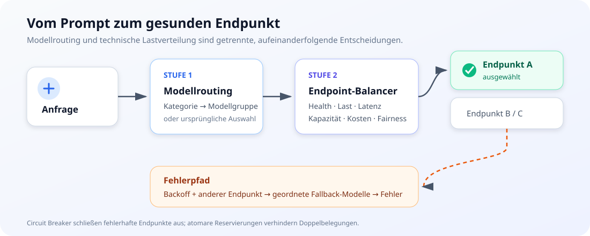
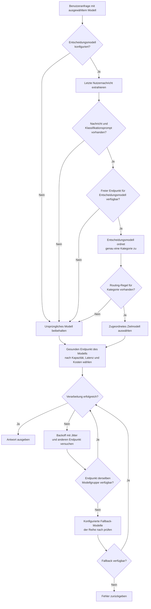
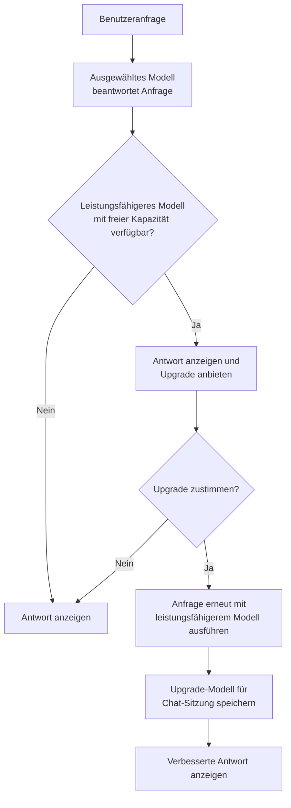
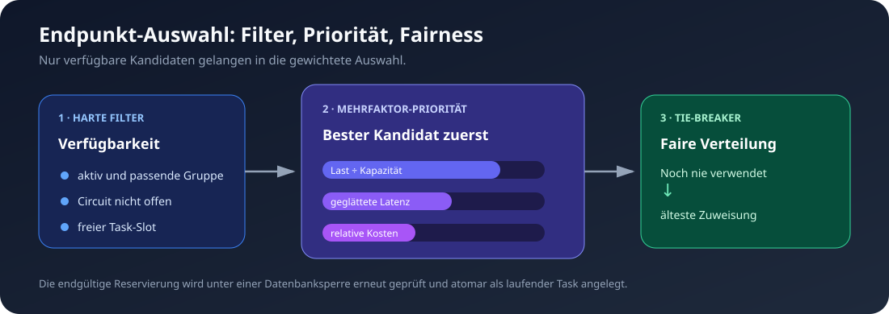
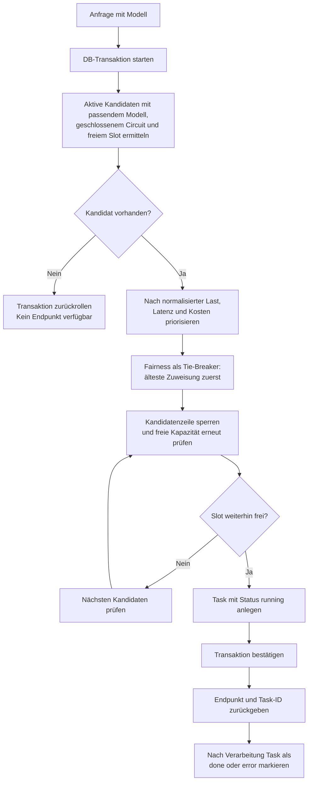
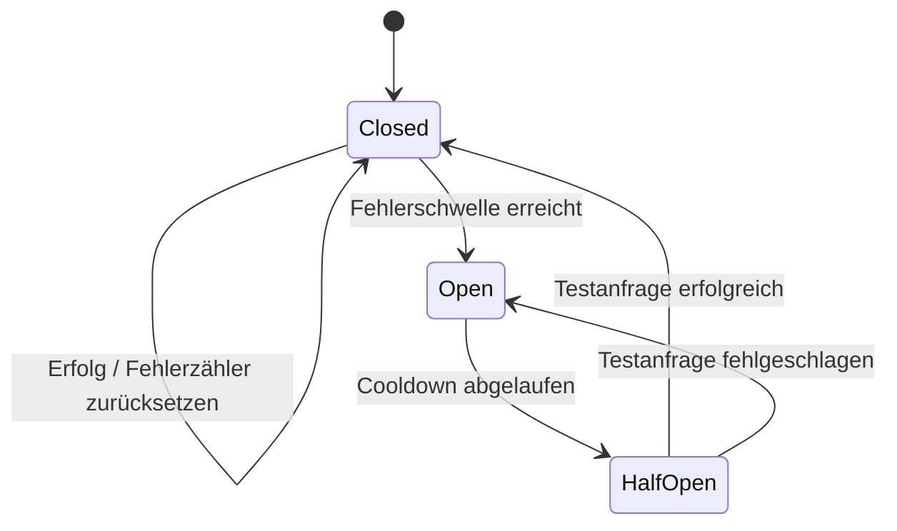

# LLMInt / KHWF KI

LLMInt ist eine framework-freie PHP-/MySQL-Anwendung für den Betrieb einer internen KI-Plattform. Sie stellt Chat, Routing und Lastverteilung, Dokument-RAG, Bildgenerierung, Benutzerverwaltung sowie Betriebsmonitoring in einer Oberfläche bereit.

## Inhaltsverzeichnis

- [Funktionen](#funktionen)
- [Architektur](#architektur)
- [Modellrouting und Entscheidungsfindung](#modellrouting-und-entscheidungsfindung)
- [Intelligence Upgrade](#intelligence-upgrade)
- [Intelligenzgruppe direkt ansprechen](#intelligenzgruppe-direkt-ansprechen)
- [Lastverteilung](#lastverteilung)
- [Voraussetzungen](#voraussetzungen)
- [Schnellstart mit Docker](#schnellstart-mit-docker)
- [Klassische Installation](#klassische-installation)
- [Erstkonfiguration](#erstkonfiguration)
- [Hybrid-RAG](#hybrid-rag)
- [Prompt Security](#prompt-security)
- [API](#api)
- [Betrieb und Sicherheit](#betrieb-und-sicherheit)
- [Troubleshooting](#troubleshooting)
- [Lizenz](#lizenz)

## Funktionen

- **Chat mit Streaming:** Server-Sent Events und persistente Chat-Sitzungen pro Benutzer.
- **Routing und Lastverteilung:** optionale semantische Klassifikation, kategoriebasierte Modellwahl und konfigurierbare Fallback-Ketten; gesunde Endpunkte werden anhand von Auslastung, Kapazität, Latenz, Kosten und Fairness ausgewählt.
- **Direkte Modellwahl:** angemeldete Benutzer sprechen mit dem Präfix `@@35b` eine Intelligenzgruppe direkt an; die Auswahl überschreibt Benutzer- und Standardmodelle und bleibt im Chat aktiv.
- **Intelligence Upgrade:** beantwortet einfache Anfragen zunächst ressourcenschonend und bietet bei freier Kapazität optional ein leistungsfähigeres Modell für eine erneute Bearbeitung an.
- **Hybrid-RAG:** Dokument-Upload mit Text-Extraktion, Chunking, BM25-Suche, optionalen Embeddings, Reciprocal Rank Fusion und Reranking.
- **Chat-Tools:** Websuche mit SearXNG, Dokumentabfrage sowie Bildgenerierung mit AUTOMATIC1111 oder ComfyUI.
- **Authentifizierung:** lokale Konten, Selbstregistrierung und E-Mail-Verifikation, Passwort-Reset, LDAP/Active Directory sowie optionales Kerberos-basiertes Windows-SSO.
- **OpenAI-kompatible API:** Modellliste und Chat Completions, wahlweise mit den Chat-Tools.
- **Monitoring:** Endpunktlast, Tokenverbrauch, aktive Clients (als Wolke mit Hostname bzw. IP-Adresse rund um die Clients-Kachel), Such- und Generierungsjobs sowie optionale SSH-Systemmetriken. Das Dashboard lässt sich per **⛶ Vollbild** auf die volle Browserfenstergröße vergrößern.
- **Prompt Security:** mehrstufige Prüfung von Chat-Eingaben mit konfigurierbaren Regeln, Bewertung und Protokollierung.

## Architektur

| Ebene | Komponenten |
|---|---|
| Web | `index.php`, Anmeldung und Registrierung |
| API | `api/chat.php`, Routing, RAG, Uploads, Bildgenerierung und OpenAI-Endpunkte |
| Administration | `admin/` für Endpunkte, Benutzer, Einstellungen, API-Keys und Statistik |
| Persistenz | MySQL oder MariaDB; das Schema wird idempotent durch `setup.php` und `db.php` erweitert |
| Externe Dienste | OpenAI-kompatible LLM-/Embedding-Endpunkte, optional SearXNG, LDAP, SMTP, AUTOMATIC1111 und ComfyUI |

Wichtige Komponenten:

- `api/balancer.php` wählt LLM-Endpunkte und erfasst deren Task-Lifecycle.
- `api/sd_balancer.php` und `api/comfy_balancer.php` wenden dieselben Balancer-Grundsätze auf die Bildgenerierung an.
- `lib/balancer_engine.php` bündelt Circuit Breaker, Backoff, Fallback-Ketten, verwaiste Tasks und die konfigurierbaren Balancer-Einstellungen.
- `api/embedding.php` erstellt Embeddings, führt Ähnlichkeitssuche und optionales Reranking aus.
- `api/upload_document.php` verarbeitet Uploads und legt Dokument-Chunks an.
- `lib/prompt_security.php` prüft Chat-Anfragen vor der Weiterleitung an das LLM.
- `setup.php` richtet die initialen Tabellen ein und erstellt bei einer leeren Datenbank den Standardadministrator.

## Modellrouting und Entscheidungsfindung

Das Routing arbeitet in zwei Stufen: Zuerst bestimmt LLMInt die passende Modellgruppe, danach wählt der Balancer innerhalb dieser Gruppe einen geeigneten Endpunkt. Ist ein Entscheidungsmodell konfiguriert, bewertet es die letzte Nutzernachricht anhand der konfigurierten Kategorien und priorisierten Entscheidungsregeln. Eine Routing-Regel ordnet die erkannte Kategorie einem Zielmodell zu. Fehlt eine Zuordnung, ist das Entscheidungsmodell nicht verfügbar oder kann keine Nachricht klassifiziert werden, bleibt die ursprünglich angeforderte Modellauswahl erhalten.





**Vorteile**

- **Passende Modellwahl:** Fachliche, kreative oder allgemeine Anfragen können an jeweils geeignete Modellgruppen geleitet werden.
- **Effizienter Ressourceneinsatz:** Leistungsfähige oder spezialisierte Modelle werden gezielt genutzt, statt jede Anfrage gleich zu behandeln.
- **Konfigurierbare Entscheidungen:** Kategorien, Prioritäten und Modellzuordnungen werden im Admin-Bereich gepflegt und lassen sich ohne Codeänderung anpassen.
- **Robuster Betrieb:** Bei fehlender Klassifikation oder Kapazität wird die Benutzeranfrage weiterhin mit dem ursprünglich gewählten Modell verarbeitet.
- **Geordnete Fallbacks:** Schlägt ein Endpunkt fehl und ist kein weiterer Endpunkt derselben Modellgruppe frei, werden konfigurierte Ersatzmodelle in der vorgegebenen Reihenfolge geprüft.
- **Fähigkeits- und Spezialisierungsdaten:** Endpunkte können für Tool Calling und Kategorien gekennzeichnet werden; Upgrade-Vorschläge berücksichtigen die fachliche Spezialisierung.
- **Faire Auslastung:** Nach der Modellentscheidung verteilt der Balancer Anfragen auf freie, gesunde Endpunkte und bevorzugt bei Gleichstand lange nicht genutzte Endpunkte.

## Intelligence Upgrade

Das Intelligence Upgrade verbindet angemessenen Ressourceneinsatz mit der Möglichkeit, bei anspruchsvolleren Aufgaben mehr Modellleistung zu nutzen. Eine Anfrage wird zunächst mit dem ausgewählten Modell beantwortet. Ist ein leistungsfähigeres Modell mit freier Kapazität verfügbar, erhält der Benutzer anschließend ein optionales Upgrade-Angebot. Nach Zustimmung wird dieselbe Anfrage mit dem vorgeschlagenen Modell erneut ausgeführt; die Auswahl gilt anschließend 20 Minuten lang für die aktuelle Chat-Sitzung.



**Vorteile**

- **Ressourcenschonend:** Für einfache Fragen reicht ein kleines Modell; leistungsfähige Modelle bleiben für komplexe Aufgaben verfügbar.
- **Bessere Antwortqualität bei Bedarf:** Benutzer können bei anspruchsvollen Fragen gezielt eine erneute Bearbeitung mit höherer Modellintelligenz anfordern.
- **Transparente Entscheidung:** Das Upgrade erfolgt nur nach Zustimmung und nur, wenn ein geeigneter Endpunkt Kapazität hat.
- **Passende Spezialisierung:** Bei erkannter Kategorie werden nur allgemeine oder zur Kategorie passende Upgrade-Modelle vorgeschlagen.

Damit ein Modell berücksichtigt wird, muss seine Modellbezeichnung eine Intelligenzstufe wie `8b` oder `70b` enthalten, beispielsweise `modell-8b` oder `modell 70b`. In der Administration kann bei **Systemmeldungen** der Text des Upgrade-Angebots angepasst werden.

## Intelligenzgruppe direkt ansprechen

Angemeldete Benutzer können in der Chat-Eingabezeile mit dem Präfix `@@` eine Intelligenzgruppe direkt ansprechen, zum Beispiel `@@35b Fasse den Text zusammen.` Die Gruppe entspricht der Allgemeindefinition der Modellintelligenz (Gesamtparameterzahl im Modellnamen, etwa `35b`) und wird auf ein Modell abgebildet, das von einem aktiven Endpunkt bereitgestellt wird.

- Wird eine gültige Gruppe eingegeben, ersetzt die Eingabezeile das Präfix sofort durch eine Pille, die sich mit `×` wieder entfernen lässt.
- Die gewählte Gruppe überschreibt Benutzer-Standardmodelle, das Standardmodell und die regelbasierte Modellauswahl.
- Die Gruppe bleibt für den aktuellen Chat aktiv, bis sie entfernt oder ein neuer Chat gestartet wird.
- Existiert zur angegebenen Gruppe kein Modell auf einem aktiven Endpunkt, wird die Anfrage mit einem Hinweis auf die verfügbaren Gruppen abgewiesen.
- Das Feature lässt sich in der Administration unter **Anfragenhandling** mit der Option **Direkte Modellwahl über Intelligenzgruppen aktivieren** ein- und ausschalten (Standard: aktiviert). Ist es deaktiviert, wird das Präfix nicht ausgewertet und bleibt Teil der Nachricht.

## Lastverteilung

Die LLM-, AUTOMATIC1111- und ComfyUI-Balancer verwenden die gemeinsame Engine aus `lib/balancer_engine.php`. Die maximale Anzahl paralleler Tasks je Endpunkt ist über `balancer_max_concurrent` konfigurierbar und beträgt standardmäßig vier.

Die Auswahl erfolgt in einer festen Prioritätsfolge:

1. Nur aktive Endpunkte der benötigten Modellgruppe beziehungsweise Bild-Engine werden berücksichtigt.
2. Endpunkte mit offenem Circuit Breaker oder ohne freien Task-Slot werden ausgeschlossen.
3. Die laufenden Tasks werden durch das individuelle `capacity_weight` des Endpunkts normalisiert; leistungsfähigere Endpunkte können dadurch mehr Verkehr übernehmen.
4. Danach fließen die geglättete Latenz und das relative `cost_weight` mit konfigurierbaren Gewichtungen ein.
5. Bei Gleichstand entsteht durch die älteste letzte Zuweisung ein Round-Robin-Effekt; noch nie verwendete Endpunkte kommen zuerst.





### Ausfallsicherheit

- **Circuit Breaker:** Nach standardmäßig drei aufeinanderfolgenden Fehlern wird ein Endpunkt für 30 Sekunden aus dem Routing genommen. Danach prüft eine einzelne Half-Open-Anfrage die Erholung. Erfolg schließt den Circuit, ein weiterer Fehler öffnet ihn erneut. In den Endpunkt-Details des Dashboards lässt sich der Circuit Breaker über die Schaltfläche **♻ Circuit zurücksetzen** manuell schließen, ohne den Cooldown abzuwarten.
- **Endpunkt pausieren:** In den Endpunkt-Details des Dashboards lässt sich ein Endpunkt über die Schaltfläche **⏸ Pausieren** aus dem Routing nehmen; laufende Aufgaben bleiben davon unberührt. **▶ Fortsetzen** gibt ihn wieder frei und setzt dabei den Circuit Breaker zurück.
- **Retry und Backoff:** Ein fehlgeschlagener LLM-Aufruf kann auf bis zu zwei weiteren Endpunkten wiederholt werden. Exponentielles Backoff mit optionalem Full Jitter verhindert gleichzeitige Retry-Spitzen.
- **Fallback-Ketten:** Ist beim Retry kein Endpunkt derselben Modellgruppe verfügbar, prüft LLMInt die unter `balancer_fallback_chains` hinterlegten Ersatzmodelle der Reihe nach.
- **Verwaiste Tasks:** Lange im Status `running` verbliebene Tasks werden nach einem konfigurierbaren Timeout als Fehler abgeschlossen und blockieren keinen Slot dauerhaft.
- **Atomare Reservierung:** `SELECT ... FOR UPDATE` und eine erneute Kapazitätsprüfung unter der Datenbanksperre verhindern die Doppelbelegung eines Slots.



Die Parameter werden unter **Administration → Balancer & Routing** gepflegt:

| Einstellung | Standard | Zweck |
|---|---:|---|
| `balancer_max_concurrent` | `4` | parallele Tasks je Endpunkt |
| `balancer_circuit_fail_threshold` | `3` | Fehler bis zum Öffnen des Circuit Breakers |
| `balancer_circuit_cooldown_seconds` | `30` | Wartezeit bis zur Half-Open-Testanfrage |
| `balancer_backoff_base_ms` / `balancer_backoff_max_ms` | `200` / `8000` | Grenzen des exponentiellen Backoffs |
| `balancer_backoff_jitter` | aktiv | zufällige Verteilung der Retry-Verzögerung |
| `balancer_orphan_timeout_seconds` | `300` | Timeout für verwaiste Tasks |
| `balancer_weight_latency` / `balancer_weight_cost` / `balancer_weight_capacity` | `0,35` / `0,25` / `0,40` | Gewichtung der Auswahlfaktoren |
| `balancer_fallback_chains` | `{}` | geordnete Ersatzmodelle als JSON-Objekt |

## Voraussetzungen

| Komponente | Erforderlich für |
|---|---|
| PHP 8.0+ mit `curl`, `pdo_mysql`, `mbstring` und `fileinfo` | klassische Installation |
| MySQL oder MariaDB mit `utf8mb4` | Persistenz |
| OpenAI-/LM-Studio-kompatibler Chat-Endpunkt | Chat |
| Docker und Docker Compose | Docker-Installation |
| `pdftotext` (Poppler) | PDF-Extraktion für RAG |
| Embedding-Endpunkt | semantische Suche |
| SearXNG, AUTOMATIC1111, ComfyUI, LDAP, SMTP | jeweilige optionale Integration |

Das Docker-Image enthält zusätzlich LDAP-, XML-, ZIP- und Internationalisierungs-Unterstützung sowie Poppler und Kerberos/GSSAPI-Komponenten.

## Schnellstart mit Docker

1. Konfiguration anlegen:

   ```bash
   cp .env.example .env
   ```

2. In `.env` mindestens die Standardpasswörter ändern:

   ```dotenv
   DB_NAME=llmint
   DB_USER=llmint
   DB_PASS=ein-starkes-datenbankpasswort
   DB_ROOT_PASS=ein-starkes-rootpasswort
   HTTP_PORT=8080
   PMA_PORT=8081
   PMA_BASIC_AUTH_USER=admin
   PMA_BASIC_AUTH_PASSWORD=ein-starkes-passwort
   TZ=Europe/Berlin
   ```

3. Container bauen und starten:

   ```bash
   docker compose up -d --build
   ```

   Der Web-Container wartet auf MySQL und führt anschließend `setup.php` aus. Das Setup ist idempotent und kann deshalb bei Containerstarts erneut laufen.

4. Anwendung öffnen:

   | Dienst | Adresse |
   |---|---|
   | Chat | `http://localhost:8080` |
   | Administration | `http://localhost:8080/admin/login.php` |
   | phpMyAdmin | `http://localhost:8081` |

   phpMyAdmin ist zusätzlich durch HTTP Basic Auth geschützt. Danach ist weiterhin die Datenbankanmeldung erforderlich.

Persistente Docker-Volumes:

- `db_data` für die Datenbank
- `doc_uploads` für hochgeladene Dokumente
- `sd_output` für generierte Bilder

Häufige Befehle:

```bash
docker compose logs -f web
docker compose restart web
docker compose down
docker compose down -v # entfernt auch Volumes und damit Daten
```

## Klassische Installation

1. Repository klonen und eine Datenbank anlegen:

   ```bash
   git clone https://github.com/dareinelt/LLMInt.git
   cd LLMInt
   ```

   ```sql
   CREATE DATABASE llmint CHARACTER SET utf8mb4 COLLATE utf8mb4_unicode_ci;
   ```

2. Datenbankverbindung als Umgebungsvariablen setzen:

   ```bash
   export DB_HOST=127.0.0.1
   export DB_PORT=3306
   export DB_NAME=llmint
   export DB_USER=llmint
   export DB_PASS='ein-starkes-passwort'
   ```

   Ohne Variablen verwendet die Anwendung `localhost`, Port `3306`, Datenbank `llmint`, Benutzer `root` und ein leeres Passwort.

3. Initialisieren:

   ```bash
   php setup.php
   ```

   Bei einer leeren Datenbank wird der Benutzer `admin` mit dem Passwort `admin` angelegt. Das Passwort sofort ändern und `setup.php` nach der Einrichtung absichern oder entfernen.

## Erstkonfiguration

Nach der Anmeldung unter `/admin/login.php`:

1. Passwort des Administrators ändern.
2. Mindestens einen LLM-Endpunkt mit Basis-URL, Timeout und `default_model` anlegen.
3. Das globale Standardmodell konfigurieren.
4. Optional Routing, Vision-Modell, SearXNG, SMTP und LDAP einrichten.
5. Optional Endpunkte für AUTOMATIC1111, ComfyUI und Embeddings hinzufügen.
6. Optional Hybrid-Suche, Reranker und Prompt Security aktivieren.
7. Verbindungs- und Funktionstests im Admin-Bereich ausführen.

Endpunkte mit demselben `default_model` bilden einen Pool. Das Routing kann eine Nutzeranfrage zuerst einer Kategorie zuordnen und diese über `routing_rules` auf ein Zielmodell abbilden. Ist die Klassifikation nicht verfügbar, wird die ursprüngliche Modellauswahl verwendet. Unter **Balancer & Routing** lassen sich außerdem Kapazitätsgrenzen, Circuit Breaker, Retry-Verhalten, Auswahlgewichtungen und Fallback-Ketten konfigurieren.

## Hybrid-RAG

Dokumente werden über `api/upload_document.php` hochgeladen. Unterstützt werden Text- und Markdown-Dateien, PDFs sowie PNG, JPG, WEBP und GIF. PDFs werden mit `pdftotext` extrahiert; Bilddateien können über ein konfiguriertes Vision-Modell analysiert werden.

Die Pipeline speichert Chunks in `document_chunks` und kann sie für teamweiten Kontext global freigeben. Bei aktivierten Embeddings wird nach dem Chunking eine OpenAI-kompatible Embedding-API aufgerufen. Die Suche kombiniert dann:

1. BM25-Keyword-Treffer
2. Cosine Similarity über gespeicherte Embeddings
3. Reciprocal Rank Fusion
4. optionales Reranking

Ist ein Embedding-Endpunkt oder Reranker nicht erreichbar, fällt die Anwendung auf die vorherige Suchstufe zurück. Relevante Einstellungen sind `embedding_enabled`, `hybrid_search_enabled`, `bm25_weight`, `embedding_weight`, `embedding_cache_enabled`, `reranker_enabled`, `reranker_endpoint` und `reranker_top_k`.

## Prompt Security

Vor dem LLM-Aufruf wertet `api/chat.php` die letzte Nutzernachricht mit `lib/prompt_security.php` aus. Das Modul unterstützt regelbasierte Erkennung, konfigurierbare Schwellwerte, passive oder aktive Entscheidungen und optional einen KI-Klassifikator. Ereignisse werden in `prompt_security_logs` gespeichert, sofern die Protokollierung aktiviert ist.

Die Verwaltung ist unter `admin/prompt_security.php` verfügbar. Dort lassen sich Regeln, Schwellwerte, Protokollierung und das Verhalten bei Fehlern konfigurieren.

## API

### Chat und Sitzungen

| Pfad | Methode | Zweck |
|---|---|---|
| `api/chat.php` | POST | Chat-Request einschließlich Routing und Tools |
| `api/models.php` | GET | Modelle eines Endpunkts |
| `api/chat_sessions.php?action=list` | GET | Sitzungen des aktuellen Benutzers |
| `api/chat_sessions.php?action=load` | GET | Sitzung laden |
| `api/chat_sessions.php?action=delete` | POST/GET | Sitzung löschen |

### OpenAI-kompatible Endpunkte

| Pfad | Methode | Zweck |
|---|---|---|
| `api/openai/v1/models` | GET | aktive LLMInt-Modellgruppen |
| `api/openai/v1/chat/completions` | POST | Chat Completions ohne Tools |
| `api/openai-tools/v1/models` | GET | aktive LLMInt-Modellgruppen |
| `api/openai-tools/v1/chat/completions` | POST | Chat Completions mit Web-, RAG- und Bild-Tools |

Die Endpunkte erwarten einen API-Key im `Authorization: Bearer ...`-Header. API-Keys werden als Hash gespeichert und im Admin-Bereich verwaltet.

```python
from openai import OpenAI

client = OpenAI(
    base_url="https://server.example/api/openai/v1",
    api_key="sk-...",
)

response = client.chat.completions.create(
    model="modellname",
    messages=[{"role": "user", "content": "Hallo"}],
)
print(response.choices[0].message.content)
```

### Weitere Endpunkte

| Bereich | Endpunkte |
|---|---|
| Dokumente | `api/upload_document.php`, `api/document_status.php`, `api/rebuild_embeddings.php` |
| Bildgenerierung | `api/sd_generate.php`, `api/sd_checkpoints.php`, `api/comfy_generate.php`, `api/comfy_checkpoints.php` |
| Integrationen | `api/test_searxng.php`, `api/test_ldap.php`, `api/test_smtp.php` |
| Benutzer und Status | `api/verify_email.php`, `api/reset_password.php`, `api/admin_user_action.php`, `api/heartbeat.php` |

## Betrieb und Sicherheit

- `setup.php` nach erfolgreicher Einrichtung nicht öffentlich erreichbar lassen.
- Alle Standardpasswörter in `.env` und das initiale Admin-Passwort vor dem produktiven Einsatz ändern.
- Den Admin-Bereich nur über vertrauenswürdige Netze zugänglich machen.
- API-Keys, LDAP-Bind-Passwörter, SMTP-Zugangsdaten und Kerberos-Dateien nicht in das Repository einchecken.
- Speicherbedarf von `doc_uploads` und `sd_output` sowie die Log-Aufbewahrung regelmäßig prüfen.
- Nach einem Wechsel des Embedding-Modells fehlende Embeddings über den Admin-Bereich neu berechnen und bei Bedarf den Embedding-Cache leeren.

## Troubleshooting

| Problem | Prüfen |
|---|---|
| Datenbankfehler oder Setup-Hinweis | DB-Umgebungsvariablen, Datenbankrechte und `php setup.php` |
| Keine Modelle verfügbar | Endpunkt-URL, Netzwerkpfad, Modellgruppe und Timeout |
| Endpunkt erhält keine Anfragen | Aktivierung, Modellgruppe, freie Slots, Circuit-Status und Cooldown prüfen |
| Unerwartetes Fallback-Modell | `balancer_fallback_chains` und Routing-Regeln unter **Balancer & Routing** prüfen |
| Dokument-Upload schlägt fehl | Upload-Recht, Dateityp/-größe, Schreibrechte und bei PDFs `pdftotext` |
| Keine Embeddings | `embedding_enabled`, aktiver Embedding-Endpunkt, Endpunkt-URL und Admin-Statistik |
| LDAP-Login oder SMTP-Versand fehlschlägt | Konfiguration und die jeweiligen Testendpunkte |
| Keine SSH-Metriken | PHP-Erweiterung `ssh2`, Endpunktzugangsdaten und `lm-sensors` auf dem Zielhost |

## Lizenz

MIT
