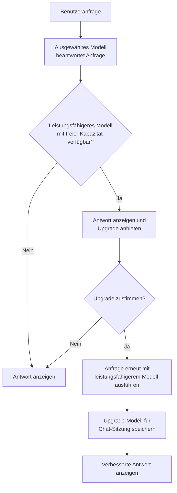
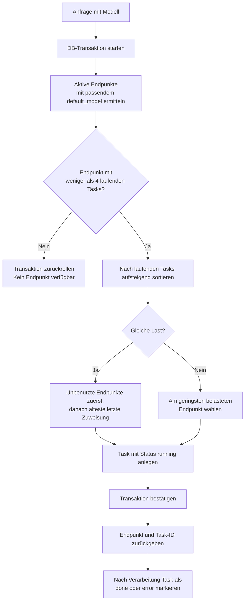

# LLMInt / KHWF KI

LLMInt ist eine framework-freie PHP-/MySQL-Anwendung für den Betrieb einer internen KI-Plattform. Sie stellt Chat, Routing und Lastverteilung, Dokument-RAG, Bildgenerierung, Benutzerverwaltung sowie Betriebsmonitoring in einer Oberfläche bereit.

## Inhaltsverzeichnis

- [Funktionen](#funktionen)
- [Architektur](#architektur)
- [Intelligence Upgrade](#intelligence-upgrade)
- [Lastverteilung](#lastverteilung)
- [Voraussetzungen](#voraussetzungen)
- [Schnellstart mit Docker](#schnellstart-mit-docker)
- [Klassische Installation](#klassische-installation)
- [Erstkonfiguration](#erstkonfiguration)
- [Hybrid-RAG](#hybrid-rag)
- [Prompt Security](#prompt-security)
- [API](#api)
- [Betrieb und Sicherheit](#betrieb-und-sicherheit)
- [Troubleshooting](#troubleshooting)
- [Lizenz](#lizenz)

## Funktionen

- **Chat mit Streaming:** Server-Sent Events und persistente Chat-Sitzungen pro Benutzer.
- **Routing und Lastverteilung:** optionale semantische Klassifikation; aktive Endpunkte derselben Modellgruppe werden nach aktueller Last und Fairness ausgewählt. Pro Endpunkt sind standardmäßig bis zu vier parallele Tasks zulässig.
- **Intelligence Upgrade:** beantwortet einfache Anfragen zunächst ressourcenschonend und bietet bei freier Kapazität optional ein leistungsfähigeres Modell für eine erneute Bearbeitung an.
- **Hybrid-RAG:** Dokument-Upload mit Text-Extraktion, Chunking, BM25-Suche, optionalen Embeddings, Reciprocal Rank Fusion und Reranking.
- **Chat-Tools:** Websuche mit SearXNG, Dokumentabfrage sowie Bildgenerierung mit AUTOMATIC1111 oder ComfyUI.
- **Authentifizierung:** lokale Konten, Selbstregistrierung und E-Mail-Verifikation, Passwort-Reset, LDAP/Active Directory sowie optionales Kerberos-basiertes Windows-SSO.
- **OpenAI-kompatible API:** Modellliste und Chat Completions, wahlweise mit den Chat-Tools.
- **Monitoring:** Endpunktlast, Tokenverbrauch, aktive Clients, Such- und Generierungsjobs sowie optionale SSH-Systemmetriken.
- **Prompt Security:** mehrstufige Prüfung von Chat-Eingaben mit konfigurierbaren Regeln, Bewertung und Protokollierung.

## Architektur

| Ebene | Komponenten |
|---|---|
| Web | `index.php`, Anmeldung und Registrierung |
| API | `api/chat.php`, Routing, RAG, Uploads, Bildgenerierung und OpenAI-Endpunkte |
| Administration | `admin/` für Endpunkte, Benutzer, Einstellungen, API-Keys und Statistik |
| Persistenz | MySQL oder MariaDB; das Schema wird idempotent durch `setup.php` und `db.php` erweitert |
| Externe Dienste | OpenAI-kompatible LLM-/Embedding-Endpunkte, optional SearXNG, LDAP, SMTP, AUTOMATIC1111 und ComfyUI |

Wichtige Komponenten:

- `api/balancer.php` wählt LLM-Endpunkte und erfasst deren Task-Lifecycle.
- `api/embedding.php` erstellt Embeddings, führt Ähnlichkeitssuche und optionales Reranking aus.
- `api/upload_document.php` verarbeitet Uploads und legt Dokument-Chunks an.
- `lib/prompt_security.php` prüft Chat-Anfragen vor der Weiterleitung an das LLM.
- `setup.php` richtet die initialen Tabellen ein und erstellt bei einer leeren Datenbank den Standardadministrator.

## Intelligence Upgrade

Das Intelligence Upgrade verbindet angemessenen Ressourceneinsatz mit der Möglichkeit, bei anspruchsvolleren Aufgaben mehr Modellleistung zu nutzen. Eine Anfrage wird zunächst mit dem ausgewählten Modell beantwortet. Ist ein leistungsfähigeres Modell mit freier Kapazität verfügbar, erhält der Benutzer anschließend ein optionales Upgrade-Angebot. Nach Zustimmung wird dieselbe Anfrage mit dem vorgeschlagenen Modell erneut ausgeführt; die Auswahl gilt anschließend für die aktuelle Chat-Sitzung.



**Vorteile**

- **Ressourcenschonend:** Für einfache Fragen reicht ein kleines Modell; leistungsfähige Modelle bleiben für komplexe Aufgaben verfügbar.
- **Bessere Antwortqualität bei Bedarf:** Benutzer können bei anspruchsvollen Fragen gezielt eine erneute Bearbeitung mit höherer Modellintelligenz anfordern.
- **Transparente Entscheidung:** Das Upgrade erfolgt nur nach Zustimmung und nur, wenn ein geeigneter Endpunkt Kapazität hat.
- **Passende Spezialisierung:** Bei erkannter Kategorie werden nur allgemeine oder zur Kategorie passende Upgrade-Modelle vorgeschlagen.

Damit ein Modell berücksichtigt wird, muss seine Modellbezeichnung eine Intelligenzstufe wie `8b` oder `70b` enthalten, beispielsweise `modell-8b` oder `modell 70b`. In der Administration kann bei **Systemmeldungen** der Text des Upgrade-Angebots angepasst werden.

## Lastverteilung

`api/balancer.php` wählt für ein angefordertes Modell den verfügbaren Endpunkt mit der geringsten Last. Bei gleicher Last erhält der Endpunkt den Vorzug, der am längsten keine Aufgabe erhalten hat; noch nie verwendete Endpunkte werden zuerst gewählt. Die Auswahl und das Anlegen der Aufgabe erfolgen innerhalb einer Datenbanktransaktion, damit parallele Anfragen keinen Endpunkt doppelt belegen.



## Voraussetzungen

| Komponente | Erforderlich für |
|---|---|
| PHP 8.0+ mit `curl`, `pdo_mysql`, `mbstring` und `fileinfo` | klassische Installation |
| MySQL oder MariaDB mit `utf8mb4` | Persistenz |
| OpenAI-/LM-Studio-kompatibler Chat-Endpunkt | Chat |
| Docker und Docker Compose | Docker-Installation |
| `pdftotext` (Poppler) | PDF-Extraktion für RAG |
| Embedding-Endpunkt | semantische Suche |
| SearXNG, AUTOMATIC1111, ComfyUI, LDAP, SMTP | jeweilige optionale Integration |

Das Docker-Image enthält zusätzlich LDAP-, XML-, ZIP- und Internationalisierungs-Unterstützung sowie Poppler und Kerberos/GSSAPI-Komponenten.

## Schnellstart mit Docker

1. Konfiguration anlegen:

   ```bash
   cp .env.example .env
   ```

2. In `.env` mindestens die Standardpasswörter ändern:

   ```dotenv
   DB_NAME=llmint
   DB_USER=llmint
   DB_PASS=ein-starkes-datenbankpasswort
   DB_ROOT_PASS=ein-starkes-rootpasswort
   HTTP_PORT=8080
   PMA_PORT=8081
   PMA_BASIC_AUTH_USER=admin
   PMA_BASIC_AUTH_PASSWORD=ein-starkes-passwort
   TZ=Europe/Berlin
   ```

3. Container bauen und starten:

   ```bash
   docker compose up -d --build
   ```

   Der Web-Container wartet auf MySQL und führt anschließend `setup.php` aus. Das Setup ist idempotent und kann deshalb bei Containerstarts erneut laufen.

4. Anwendung öffnen:

   | Dienst | Adresse |
   |---|---|
   | Chat | `http://localhost:8080` |
   | Administration | `http://localhost:8080/admin/login.php` |
   | phpMyAdmin | `http://localhost:8081` |

   phpMyAdmin ist zusätzlich durch HTTP Basic Auth geschützt. Danach ist weiterhin die Datenbankanmeldung erforderlich.

Persistente Docker-Volumes:

- `db_data` für die Datenbank
- `doc_uploads` für hochgeladene Dokumente
- `sd_output` für generierte Bilder

Häufige Befehle:

```bash
docker compose logs -f web
docker compose restart web
docker compose down
docker compose down -v # entfernt auch Volumes und damit Daten
```

## Klassische Installation

1. Repository klonen und eine Datenbank anlegen:

   ```bash
   git clone https://github.com/dareinelt/LLMInt.git
   cd LLMInt
   ```

   ```sql
   CREATE DATABASE llmint CHARACTER SET utf8mb4 COLLATE utf8mb4_unicode_ci;
   ```

2. Datenbankverbindung als Umgebungsvariablen setzen:

   ```bash
   export DB_HOST=127.0.0.1
   export DB_PORT=3306
   export DB_NAME=llmint
   export DB_USER=llmint
   export DB_PASS='ein-starkes-passwort'
   ```

   Ohne Variablen verwendet die Anwendung `localhost`, Port `3306`, Datenbank `llmint`, Benutzer `root` und ein leeres Passwort.

3. Initialisieren:

   ```bash
   php setup.php
   ```

   Bei einer leeren Datenbank wird der Benutzer `admin` mit dem Passwort `admin` angelegt. Das Passwort sofort ändern und `setup.php` nach der Einrichtung absichern oder entfernen.

## Erstkonfiguration

Nach der Anmeldung unter `/admin/login.php`:

1. Passwort des Administrators ändern.
2. Mindestens einen LLM-Endpunkt mit Basis-URL, Timeout und `default_model` anlegen.
3. Das globale Standardmodell konfigurieren.
4. Optional Routing, Vision-Modell, SearXNG, SMTP und LDAP einrichten.
5. Optional Endpunkte für AUTOMATIC1111, ComfyUI und Embeddings hinzufügen.
6. Optional Hybrid-Suche, Reranker und Prompt Security aktivieren.
7. Verbindungs- und Funktionstests im Admin-Bereich ausführen.

Endpunkte mit demselben `default_model` bilden einen Pool. Das Routing kann eine Nutzeranfrage zuerst einer Kategorie zuordnen und diese über `routing_rules` auf ein Zielmodell abbilden. Ist die Klassifikation nicht verfügbar, wird die ursprüngliche Modellauswahl verwendet.

## Hybrid-RAG

Dokumente werden über `api/upload_document.php` hochgeladen. Unterstützt werden Text- und Markdown-Dateien, PDFs sowie PNG, JPG, WEBP und GIF. PDFs werden mit `pdftotext` extrahiert; Bilddateien können über ein konfiguriertes Vision-Modell analysiert werden.

Die Pipeline speichert Chunks in `document_chunks` und kann sie für teamweiten Kontext global freigeben. Bei aktivierten Embeddings wird nach dem Chunking eine OpenAI-kompatible Embedding-API aufgerufen. Die Suche kombiniert dann:

1. BM25-Keyword-Treffer
2. Cosine Similarity über gespeicherte Embeddings
3. Reciprocal Rank Fusion
4. optionales Reranking

Ist ein Embedding-Endpunkt oder Reranker nicht erreichbar, fällt die Anwendung auf die vorherige Suchstufe zurück. Relevante Einstellungen sind `embedding_enabled`, `hybrid_search_enabled`, `bm25_weight`, `embedding_weight`, `embedding_cache_enabled`, `reranker_enabled`, `reranker_endpoint` und `reranker_top_k`.

## Prompt Security

Vor dem LLM-Aufruf wertet `api/chat.php` die letzte Nutzernachricht mit `lib/prompt_security.php` aus. Das Modul unterstützt regelbasierte Erkennung, konfigurierbare Schwellwerte, passive oder aktive Entscheidungen und optional einen KI-Klassifikator. Ereignisse werden in `prompt_security_logs` gespeichert, sofern die Protokollierung aktiviert ist.

Die Verwaltung ist unter `admin/prompt_security.php` verfügbar. Dort lassen sich Regeln, Schwellwerte, Protokollierung und das Verhalten bei Fehlern konfigurieren.

## API

### Chat und Sitzungen

| Pfad | Methode | Zweck |
|---|---|---|
| `api/chat.php` | POST | Chat-Request einschließlich Routing und Tools |
| `api/models.php` | GET | Modelle eines Endpunkts |
| `api/chat_sessions.php?action=list` | GET | Sitzungen des aktuellen Benutzers |
| `api/chat_sessions.php?action=load` | GET | Sitzung laden |
| `api/chat_sessions.php?action=delete` | POST/GET | Sitzung löschen |

### OpenAI-kompatible Endpunkte

| Pfad | Methode | Zweck |
|---|---|---|
| `api/openai/v1/models` | GET | aktive LLMInt-Modellgruppen |
| `api/openai/v1/chat/completions` | POST | Chat Completions ohne Tools |
| `api/openai-tools/v1/models` | GET | aktive LLMInt-Modellgruppen |
| `api/openai-tools/v1/chat/completions` | POST | Chat Completions mit Web-, RAG- und Bild-Tools |

Die Endpunkte erwarten einen API-Key im `Authorization: Bearer ...`-Header. API-Keys werden als Hash gespeichert und im Admin-Bereich verwaltet.

```python
from openai import OpenAI

client = OpenAI(
    base_url="https://server.example/api/openai/v1",
    api_key="sk-...",
)

response = client.chat.completions.create(
    model="modellname",
    messages=[{"role": "user", "content": "Hallo"}],
)
print(response.choices[0].message.content)
```

### Weitere Endpunkte

| Bereich | Endpunkte |
|---|---|
| Dokumente | `api/upload_document.php`, `api/document_status.php`, `api/rebuild_embeddings.php` |
| Bildgenerierung | `api/sd_generate.php`, `api/sd_checkpoints.php`, `api/comfy_generate.php`, `api/comfy_checkpoints.php` |
| Integrationen | `api/test_searxng.php`, `api/test_ldap.php`, `api/test_smtp.php` |
| Benutzer und Status | `api/verify_email.php`, `api/reset_password.php`, `api/admin_user_action.php`, `api/heartbeat.php` |

## Betrieb und Sicherheit

- `setup.php` nach erfolgreicher Einrichtung nicht öffentlich erreichbar lassen.
- Alle Standardpasswörter in `.env` und das initiale Admin-Passwort vor dem produktiven Einsatz ändern.
- Den Admin-Bereich nur über vertrauenswürdige Netze zugänglich machen.
- API-Keys, LDAP-Bind-Passwörter, SMTP-Zugangsdaten und Kerberos-Dateien nicht in das Repository einchecken.
- Speicherbedarf von `doc_uploads` und `sd_output` sowie die Log-Aufbewahrung regelmäßig prüfen.
- Nach einem Wechsel des Embedding-Modells fehlende Embeddings über den Admin-Bereich neu berechnen und bei Bedarf den Embedding-Cache leeren.

## Troubleshooting

| Problem | Prüfen |
|---|---|
| Datenbankfehler oder Setup-Hinweis | DB-Umgebungsvariablen, Datenbankrechte und `php setup.php` |
| Keine Modelle verfügbar | Endpunkt-URL, Netzwerkpfad, Modellgruppe und Timeout |
| Dokument-Upload schlägt fehl | Upload-Recht, Dateityp/-größe, Schreibrechte und bei PDFs `pdftotext` |
| Keine Embeddings | `embedding_enabled`, aktiver Embedding-Endpunkt, Endpunkt-URL und Admin-Statistik |
| LDAP-Login oder SMTP-Versand fehlschlägt | Konfiguration und die jeweiligen Testendpunkte |
| Keine SSH-Metriken | PHP-Erweiterung `ssh2`, Endpunktzugangsdaten und `lm-sensors` auf dem Zielhost |

## Lizenz

MIT
