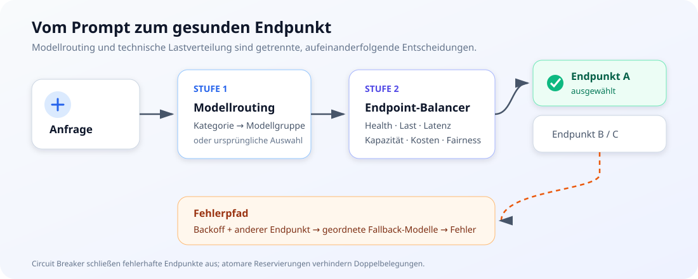
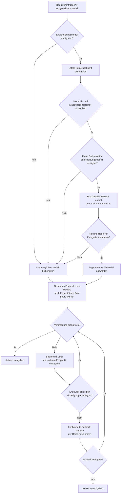
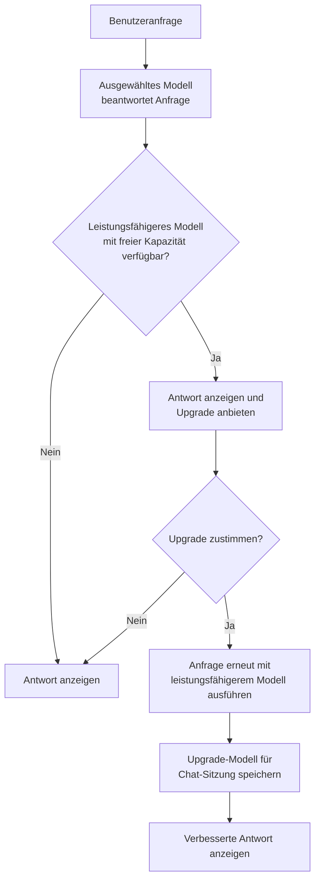
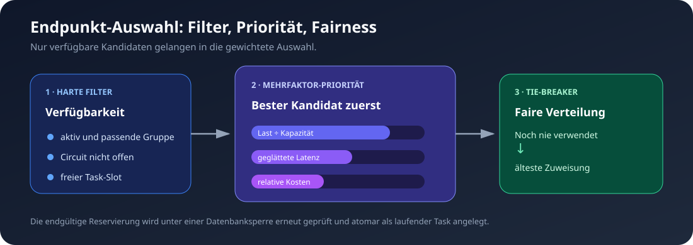
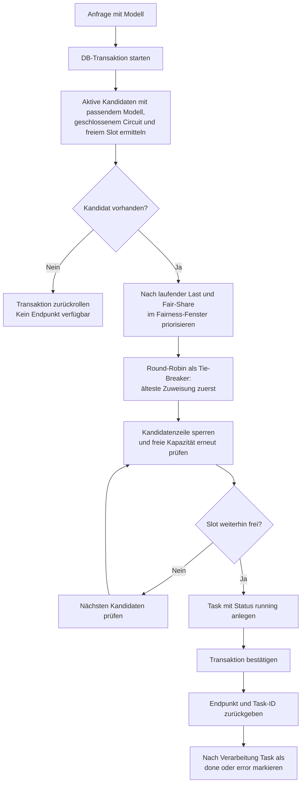
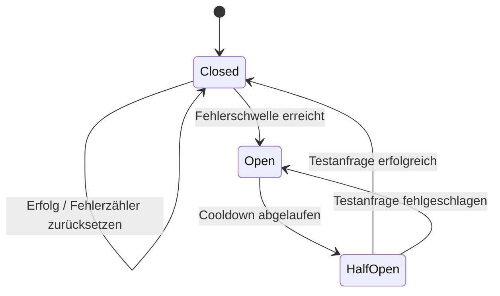
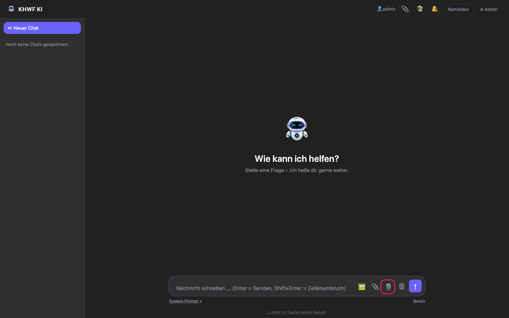
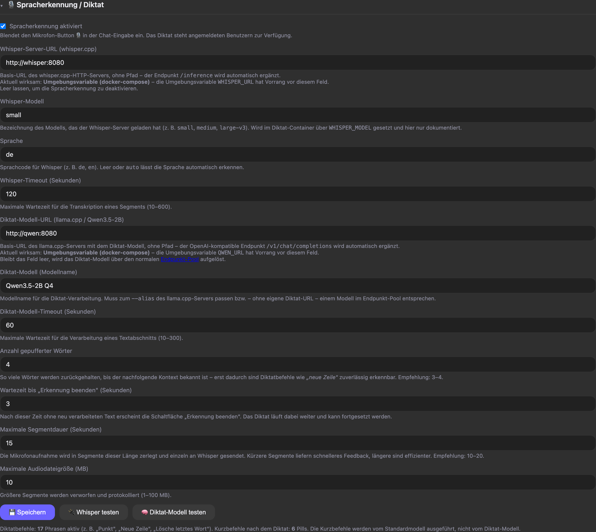
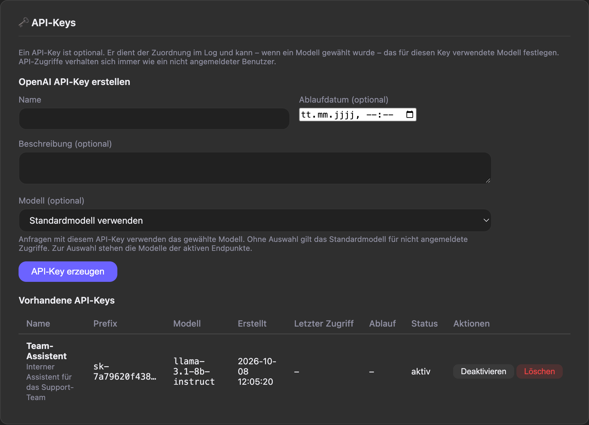

# LLMInt / KHWF KI

LLMInt ist eine framework-freie PHP-/MySQL-Anwendung für den Betrieb einer internen KI-Plattform. Sie stellt Chat, Routing und Lastverteilung, Dokument-RAG, Bildgenerierung, Benutzerverwaltung sowie Betriebsmonitoring in einer Oberfläche bereit.

Weitere Dokumente im Repository:

| Dokument | Zielgruppe |
|---|---|
| `README.md` | Betrieb, Installation, Konfiguration und Funktionsüberblick |
| `description.md` | detaillierte Architektur- und Funktionsreferenz für Entwicklung und Coding-Agenten |
| `docs/architecture.md` | Systemarchitektur, Datenflüsse und Diagramme (ergänzt `description.md`) |
| `docs/functions.md` | vollständige Funktionsreferenz je Datei |
| `docs/agent_index.md` | kompakte Navigationshilfe für Coding-Agenten |
| `Demo.md` | nicht-technische Erklärung für Entscheider und Fachbereiche |

## Inhaltsverzeichnis

- [Funktionen](#funktionen)
- [Architektur](#architektur)
- [Repository-Struktur](#repository-struktur)
- [Modellrouting und Entscheidungsfindung](#modellrouting-und-entscheidungsfindung)
- [Intelligence Upgrade](#intelligence-upgrade)
- [Intelligenzgruppe direkt ansprechen](#intelligenzgruppe-direkt-ansprechen)
- [Reasoning per Prompt aktivieren](#reasoning-per-prompt-aktivieren)
- [Prompt-Funktionen per Präfix aktivieren](#prompt-funktionen-per-präfix-aktivieren)
- [Lastverteilung](#lastverteilung)
- [Voraussetzungen](#voraussetzungen)
- [Schnellstart mit Docker](#schnellstart-mit-docker)
- [Klassische Installation](#klassische-installation)
- [Betrieb hinter lanpa](#betrieb-hinter-lanpa)
- [Erstkonfiguration](#erstkonfiguration)
- [Hybrid-RAG](#hybrid-rag)
- [Prompt Security](#prompt-security)
- [Spracherkennung und Diktat](#spracherkennung-und-diktat)
- [API](#api)
- [Datenmodell](#datenmodell)
- [Entwicklung](#entwicklung)
- [Betrieb und Sicherheit](#betrieb-und-sicherheit)
- [Troubleshooting](#troubleshooting)
- [Lizenz](#lizenz)

## Funktionen

- **Chat mit Streaming:** Server-Sent Events und persistente Chat-Sitzungen pro Benutzer.
- **Routing und Lastverteilung:** optionale semantische Klassifikation, kategoriebasierte Modellwahl und konfigurierbare Fallback-Ketten; gesunde Endpunkte werden anhand von Auslastung, Kapazität und Fair-Share ausgewählt.
- **Direkte Modellwahl:** angemeldete Benutzer sprechen mit dem Präfix `@@35b` eine Intelligenzgruppe direkt an; die Auswahl überschreibt Benutzer- und Standardmodelle und bleibt im Chat aktiv.
- **Reasoning auf Abruf:** Thinking/Reasoning ist standardmäßig deaktiviert und wird mit dem Präfix `!!` für den jeweiligen Prompt eingeschaltet (Anzeige als 💡-Pille in der Eingabezeile).
- **Prompt-Funktionen:** Präfixe wie `/table`, `/tldr` oder `/eli5` schalten für den jeweiligen Prompt eine feste Systemprompt-Ergänzung frei (z. B. Tabellenformat, Kurz-Zusammenfassung, kindgerechte Erklärung); Anzeige als eigene Pille je aktiver Funktion, mehrere Funktionen lassen sich kombinieren.
- **Intelligence Upgrade:** beantwortet einfache Anfragen zunächst ressourcenschonend und bietet bei freier Kapazität optional ein leistungsfähigeres Modell für eine erneute Bearbeitung an.
- **Hybrid-RAG:** privater Dokument-Upload (Office, PDF, Text, Bilder) mit Text-Extraktion, Chunking, BM25-Suche, optionalen Embeddings, Reciprocal Rank Fusion und Reranking.
- **Zentrale Wissensdatenbank:** teamweites Wissen aus [docvecwizard](https://github.com/dareinelt/docvecwizard) – wahlweise live über dessen REST-API/Milvus oder per Export-Import in eine eigene Milvus-Instanz im Compose-Stack; wird bei jeder Chat-Anfrage herangezogen und im Admin-Dashboard visualisiert.
- **Chat-Tools:** Websuche mit SearXNG (`search_web`) inklusive Nachladen ganzer Seiteninhalte (`web_fetch`), Dokumentabfrage sowie Bildgenerierung mit AUTOMATIC1111 oder ComfyUI.
- **Authentifizierung:** lokale Konten, Selbstregistrierung und E-Mail-Verifikation, Passwort-Reset, LDAP/Active Directory sowie optionales Kerberos-basiertes Windows-SSO – direkt im Container oder über den `auth`-Container von lanpa.
- **Betrieb hinter lanpa:** optional unter `https://<lanpa-host>/ki/` mit dem zentral in lanpa verwalteten Zertifikat (siehe [Betrieb hinter lanpa](#betrieb-hinter-lanpa)).
- **OpenAI-kompatible API:** externe Applikationen nutzen LLMInt als Reverse-Proxy (Chat Completions, wahlweise mit den Chat-Tools); sie verhalten sich wie nicht angemeldete Benutzer, durchlaufen Routing und Lastverteilung wie ein direkter Zugriff und werden im Log mit `[API]` gekennzeichnet.
- **Monitoring:** Endpunktlast, Tokenverbrauch, aktive Clients (als Wolke mit Hostname bzw. IP-Adresse rund um die Clients-Kachel), Such- und Generierungsjobs sowie optionale SSH-Systemmetriken. Die Lastverteilungs-Grafik lässt sich per **⛶ Vollbild** auf die volle Browserfenstergröße vergrößern (kein Browser-Vollbild, Beenden per Button oder Esc).
- **Endpunkte technische Verwaltung:** jeder LLM-Endpunkt lässt sich mit einer [quickinfo](https://github.com/dareinelt/quickinfo)-Instanz koppeln (Server-URL + API-Schlüssel der Management-Board-API). Die Seite `admin/endpoint_tech.php` zeigt je Endpunkt in einer Zeile Modell, Ø Token/s, CPU-/GPU-Last, CPU-/GPU-Temperatur (mit 24h-Min./Max.) sowie RAM-/VRAM-Auslastung; ein Klick auf die Zeile öffnet quickinfo im neuen Tab.
- **Nutzungsstatistik:** Liniendiagramm im Adminbereich (retinatauglich, umschaltbar auf 3, 7, 14, 30, 90, 180 Tage oder ein Jahr) mit Clients, angemeldeten Nutzern, durchgeführten Tasks, Websuchen und fehlgeschlagenen Tasks je Tag.
- **Prompt Security:** mehrstufige Prüfung von Chat-Eingaben mit konfigurierbaren Regeln, Bewertung und Protokollierung.
- **Spracherkennung und Diktat:** Diktat per Mikrofon-Button direkt in das Eingabefeld – Whisper transkribiert in Segmenten, ein lokales Qwen3.5-2B formuliert die Fragmente aus und wandelt gesprochene Diktatbefehle („Punkt", „Neue Zeile", „Lösche letztes Wort") in Zeichen und Formatierung um; nach dem Sprechen schlägt die Oberfläche passende Befehle als Pillen zur Korrektur vor.

## Architektur

| Ebene | Komponenten |
|---|---|
| Web | `index.php`, Anmeldung und Registrierung |
| API | `api/chat.php`, Routing, RAG, Uploads, Bildgenerierung und OpenAI-Endpunkte |
| Administration | `admin/` für Endpunkte, Benutzer, Einstellungen, API-Keys und Statistik |
| Persistenz | MySQL oder MariaDB; das Schema wird idempotent durch `setup.php` und `db.php` erweitert |
| Externe Dienste | OpenAI-kompatible LLM-/Embedding-Endpunkte, optional SearXNG, LDAP, SMTP, AUTOMATIC1111 und ComfyUI; für das Diktat zusätzlich die mitgelieferten Container `whisper` (whisper.cpp) und `qwen` (llama.cpp mit Qwen3.5-2B Q4) |

Wichtige Komponenten:

- `api/balancer.php` wählt LLM-Endpunkte und erfasst deren Task-Lifecycle.
- `api/sd_balancer.php` und `api/comfy_balancer.php` wenden dieselben Balancer-Grundsätze auf die Bildgenerierung an.
- `lib/balancer_engine.php` bündelt Circuit Breaker, Backoff, Fallback-Ketten, verwaiste Tasks und die konfigurierbaren Balancer-Einstellungen.
- `api/embedding.php` erstellt Embeddings, führt Ähnlichkeitssuche und optionales Reranking aus.
- `api/upload_document.php` verarbeitet Uploads und legt Dokument-Chunks an; `api/doc_convert.php`, `api/pdf_render.php` und `api/vision.php` kapseln Konverter-Dienst, PDF-Rendering und Vision-Analyse.
- `lib/prompt_security.php` prüft Chat-Anfragen vor der Weiterleitung an das LLM.
- `lib/speech_dictation.php` kapselt das Diktat: Whisper-Aufruf, Diktatbefehle und
  Befehls-Pillen, Prompt für das Diktat-Modell, deterministischer Regel-Fallback sowie der
  Chat-Completion-Aufruf an das lokale Qwen3.5-2B.
- `setup.php` richtet die initialen Tabellen ein und erstellt bei einer leeren Datenbank den Standardadministrator.

Es gibt bewusst kein Framework, keinen Router, keinen Paketmanager und keinen Build-Schritt: Jede URL entspricht einer PHP-Datei, Abhängigkeiten werden über `require_once` geladen, und Frontend-CSS/-JavaScript liegen inline in `index.php` beziehungsweise `admin/index.php`. Eine vollständige technische Referenz mit Funktions-, Tabellen- und Einstellungsnamen enthält [`description.md`](description.md); eine grafisch aufbereitete Architekturübersicht mit Diagrammen bietet [`docs/architecture.md`](docs/architecture.md), eine vollständige Funktionsreferenz [`docs/functions.md`](docs/functions.md) und eine kompakte Navigationshilfe für Coding-Agenten [`docs/agent_index.md`](docs/agent_index.md).

## Repository-Struktur

| Pfad | Inhalt |
|---|---|
| `index.php` | Chat-Oberfläche mit Streaming, Sitzungsliste, Upload-Dialog und Bildanhängen |
| `login.php`, `register.php`, `logout.php` | Anmeldung, Selbstregistrierung mit E-Mail-Verifikation, Abmeldung |
| `sso.php`, `sso_fallback.php` | Windows-SSO über den Reverse-Proxy von lanpa und Rückfallseite ohne Domänenanmeldung |
| `db.php` | Datenbankverbindung, idempotentes Laufzeitschema, Einstellungen, Logging, Chat-Sitzungen, Intelligenzgruppen |
| `config.php` | leitet `LMSTUDIO_BASE_URL` und `LMSTUDIO_TIMEOUT` aus Endpunkten beziehungsweise Einstellungen ab |
| `setup.php` | Erstinstallation: Tabellen, Migrationen, Standardeinstellungen, Standardadministrator |
| `api/` | JSON- und SSE-Endpunkte sowie die Bibliotheken für Balancer und Embeddings |
| `lib/` | Balancer-Engine, Prompt Security, Spracherkennung/Diktat (`speech_dictation.php`), OpenAI-Hilfsfunktionen, LDAP-Anbindung, SMTP-Client, Routing-Prompt, Reverse-Proxy-Unterstützung |
| `admin/` | Administration, Dashboard-Livedaten, Nutzungsstatistik, SSH-Systemmetriken, API-Keys, Prompt Security |
| `docker/`, `Dockerfile`, `docker-compose.yml` | Container-Setup inklusive phpMyAdmin mit HTTP Basic Auth sowie der Dienste `whisper` und `qwen` für das Diktat |
| `Dockerfile.whisper`, `docker-compose.test.yml` | nativer whisper.cpp-Build für arm64-Hosts und der zugehörige Compose-Override (siehe [Spracherkennung und Diktat](#spracherkennung-und-diktat)) |
| `docker-compose.lanpa.yml` | optionaler Override für den Betrieb hinter dem `auth`-Container von lanpa |
| `docconvert/` | Python/FastAPI-Container zur Konvertierung von Office- und Textdateien in strukturierte Chunks |
| `doc_uploads/`, `sd_output/` | Laufzeitdaten für hochgeladene Dokumente und generierte Bilder |
| `assets/`, `docs/`, `ressources/` | Bilder der Oberfläche, Diagramme der Dokumentation, Beispiel-Systemprompt |

## Modellrouting und Entscheidungsfindung

Das Routing arbeitet in zwei Stufen: Zuerst bestimmt LLMInt die passende Modellgruppe, danach wählt der Balancer innerhalb dieser Gruppe einen geeigneten Endpunkt. Ist ein Entscheidungsmodell konfiguriert, bewertet es die letzte Nutzernachricht anhand der konfigurierten Kategorien und priorisierten Entscheidungsregeln. Eine Routing-Regel ordnet die erkannte Kategorie einem Zielmodell zu. Fehlt eine Zuordnung, ist das Entscheidungsmodell nicht verfügbar oder kann keine Nachricht klassifiziert werden, bleibt die ursprünglich angeforderte Modellauswahl erhalten.




```mermaid
flowchart TD
    A[Benutzeranfrage mit ausgewähltem Modell] --> B{Entscheidungsmodell<br/>konfiguriert?}
    B -- Nein --> H[Ursprüngliches Modell beibehalten]
    B -- Ja --> C[Letzte Nutzernachricht extrahieren]
    C --> D{Nachricht und<br/>Klassifikationsprompt vorhanden?}
    D -- Nein --> H
    D -- Ja --> E{Freier Endpunkt für<br/>Entscheidungsmodell verfügbar?}
    E -- Nein --> H
    E -- Ja --> F[Entscheidungsmodell ordnet<br/>genau eine Kategorie zu]
    F --> G{Routing-Regel für<br/>Kategorie vorhanden?}
    G -- Nein --> H
    G -- Ja --> I[Zugeordnetes Zielmodell auswählen]
    H --> J[Gesunden Endpunkt des Modells<br/>nach Kapazität und Fair-Share wählen]
    I --> J
    J --> K{Verarbeitung erfolgreich?}
    K -- Ja --> L[Antwort ausgeben]
    K -- Nein --> M[Backoff mit Jitter<br/>und anderen Endpunkt versuchen]
    M --> N{Endpunkt derselben<br/>Modellgruppe verfügbar?}
    N -- Ja --> K
    N -- Nein --> O[Konfigurierte Fallback-Modelle<br/>der Reihe nach prüfen]
    O --> P{Fallback verfügbar?}
    P -- Ja --> K
    P -- Nein --> Q[Fehler zurückgeben]
```

**Vorteile**

- **Passende Modellwahl:** Fachliche, kreative oder allgemeine Anfragen können an jeweils geeignete Modellgruppen geleitet werden.
- **Effizienter Ressourceneinsatz:** Leistungsfähige oder spezialisierte Modelle werden gezielt genutzt, statt jede Anfrage gleich zu behandeln.
- **Konfigurierbare Entscheidungen:** Kategorien, Prioritäten und Modellzuordnungen werden im Admin-Bereich gepflegt und lassen sich ohne Codeänderung anpassen.
- **Robuster Betrieb:** Bei fehlender Klassifikation oder Kapazität wird die Benutzeranfrage weiterhin mit dem ursprünglich gewählten Modell verarbeitet.
- **Geordnete Fallbacks:** Schlägt ein Endpunkt fehl und ist kein weiterer Endpunkt derselben Modellgruppe frei, werden konfigurierte Ersatzmodelle in der vorgegebenen Reihenfolge geprüft.
- **Fähigkeits- und Spezialisierungsdaten:** Endpunkte können für Tool Calling und Kategorien gekennzeichnet werden; Upgrade-Vorschläge berücksichtigen die fachliche Spezialisierung.
- **Faire Auslastung:** Nach der Modellentscheidung verteilt der Balancer Anfragen auf freie, gesunde Endpunkte und bevorzugt bei Gleichstand lange nicht genutzte Endpunkte.

## Intelligence Upgrade

Das Intelligence Upgrade verbindet angemessenen Ressourceneinsatz mit der Möglichkeit, bei anspruchsvolleren Aufgaben mehr Modellleistung zu nutzen. Eine Anfrage wird zunächst mit dem ausgewählten Modell beantwortet. Ist ein leistungsfähigeres Modell mit freier Kapazität verfügbar, erhält der Benutzer anschließend ein optionales Upgrade-Angebot. Nach Zustimmung wird dieselbe Anfrage mit dem vorgeschlagenen Modell erneut ausgeführt; die Auswahl gilt anschließend 20 Minuten lang für die aktuelle Chat-Sitzung.


```mermaid
flowchart TD
    A[Benutzeranfrage] --> B[Ausgewähltes Modell<br/>beantwortet Anfrage]
    B --> C{Leistungsfähigeres Modell<br/>mit freier Kapazität verfügbar?}
    C -- Nein --> D[Antwort anzeigen]
    C -- Ja --> E[Antwort anzeigen und<br/>Upgrade anbieten]
    E --> F{Upgrade zustimmen?}
    F -- Nein --> D
    F -- Ja --> G[Anfrage erneut mit<br/>leistungsfähigerem Modell ausführen]
    G --> H[Upgrade-Modell für<br/>Chat-Sitzung speichern]
    H --> I[Verbesserte Antwort anzeigen]
```

**Vorteile**

- **Ressourcenschonend:** Für einfache Fragen reicht ein kleines Modell; leistungsfähige Modelle bleiben für komplexe Aufgaben verfügbar.
- **Bessere Antwortqualität bei Bedarf:** Benutzer können bei anspruchsvollen Fragen gezielt eine erneute Bearbeitung mit höherer Modellintelligenz anfordern.
- **Transparente Entscheidung:** Das Upgrade erfolgt nur nach Zustimmung und nur, wenn ein geeigneter Endpunkt Kapazität hat.
- **Passende Spezialisierung:** Bei erkannter Kategorie werden nur allgemeine oder zur Kategorie passende Upgrade-Modelle vorgeschlagen.

Damit ein Modell berücksichtigt wird, muss seine Modellbezeichnung eine Intelligenzstufe wie `8b` oder `70b` enthalten, beispielsweise `modell-8b` oder `modell 70b`. In der Administration kann bei **Systemmeldungen** der Text des Upgrade-Angebots angepasst werden.

## Intelligenzgruppe direkt ansprechen

Angemeldete Benutzer können in der Chat-Eingabezeile mit dem Präfix `@@` eine Intelligenzgruppe direkt ansprechen, zum Beispiel `@@35b Fasse den Text zusammen.` Die Gruppe entspricht der Allgemeindefinition der Modellintelligenz (Gesamtparameterzahl im Modellnamen, etwa `35b`) und wird auf ein Modell abgebildet, das von einem aktiven Endpunkt bereitgestellt wird.

- Wird eine gültige Gruppe eingegeben, ersetzt die Eingabezeile das Präfix sofort durch eine Pille, die sich mit `×` wieder entfernen lässt.
- Die gewählte Gruppe überschreibt Benutzer-Standardmodelle, das Standardmodell und die regelbasierte Modellauswahl.
- Die Gruppe bleibt für den aktuellen Chat aktiv, bis sie entfernt oder ein neuer Chat gestartet wird.
- Existiert zur angegebenen Gruppe kein Modell auf einem aktiven Endpunkt, wird die Anfrage mit einem Hinweis auf die verfügbaren Gruppen abgewiesen.
- Das Feature lässt sich in der Administration unter **Anfragenhandling** mit der Option **Direkte Modellwahl über Intelligenzgruppen aktivieren** ein- und ausschalten (Standard: aktiviert). Ist es deaktiviert, wird das Präfix nicht ausgewertet und bleibt Teil der Nachricht.

## Reasoning per Prompt aktivieren

Thinking/Reasoning ist standardmäßig deaktiviert: Anfragen werden ohne Denkschritte an das Modell geschickt (der am Endpunkt konfigurierte `reasoning_effort` wird nicht übertragen, hybride Chat-Templates erhalten `chat_template_kwargs.enable_thinking = false`), und eventuell dennoch gelieferte Reasoning-Tokens werden nicht angezeigt.

- Beginnt ein Prompt mit `!!`, wird das Reasoning für genau diesen Prompt aktiviert, zum Beispiel `!! Wie viele Möglichkeiten gibt es?`.
- Das Präfix wird – analog zur direkten Modellwahl per `@@` – sofort durch eine Pille mit dem Symbol einer eingeschalteten Glühlampe (💡) ersetzt, die sich mit `×` wieder entfernen lässt.
- Nach dem Absenden wird die Aktivierung automatisch zurückgesetzt; der nächste Prompt läuft wieder ohne Reasoning.
- Das Präfix wird serverseitig aus der Nachricht entfernt und erreicht das Modell nicht.

## Prompt-Funktionen per Präfix aktivieren

Analog zur direkten Modellwahl per `@@` und zum Reasoning per `!!` lassen sich häufig gebrauchte Anweisungen für Format, Länge, Stil oder Vorgehensweise über ein `/kommando`-Präfix am Anfang des Prompts aktivieren. Jedes erkannte Präfix wird sofort durch eine eigene, mit `×` entfernbare Pille ersetzt; mehrere Präfixe lassen sich hintereinander eingeben (z. B. `/tldr /list Fasse den Text zusammen.`), um mehrere Funktionen gleichzeitig zu kombinieren. Nach dem Absenden werden die aktiven Funktionen automatisch zurückgesetzt.

Technisch ergänzt jede aktive Funktion den Systemprompt der laufenden Anfrage um eine feste Anweisung (siehe Tabelle); die Präfixe selbst werden serverseitig nie an das Modell übertragen.

| Präfix | Wirkung |
| --- | --- |
| `/table` | Antwort ausschließlich als Markdown-Tabelle. |
| `/outline` | Übersichtliche, hierarchische Gliederung bzw. Inhaltsverzeichnis. |
| `/list` | Antwort als Aufzählung (Bullet Points). |
| `/checklist` | Umsetzbare To-do-Liste mit Checkboxen. |
| `/steps` | Chronologische Schritt-für-Schritt-Anleitung. |
| `/code` | Antwort ausschließlich als Code-Block. |
| `/json` | Antwort strikt als valides JSON. |
| `/tldr` | Ultrakurze Zusammenfassung in 2–3 Sätzen. |
| `/summary` | Klassische, ausgewogene Zusammenfassung. |
| `/short` (oder `/brief`) | Extrem prägnante Antwort ohne Floskeln. |
| `/expand` | Baut kurze Notizen zu einem detaillierten Text aus. |
| `/eli5` | Erklärung mit einfachen Analogien wie für ein Kind. |
| `/deep` (oder `/adv`) | Akademisches Niveau mit tiefer wissenschaftlicher Analyse. |
| `/tech` | Rein technische Erklärung mit Fachbegriffen und Systemdetails. |
| `/examples` | Erklärung primär anhand praktischer Beispiele. |
| `/human` | Lockerer, menschlich klingender Stil ohne KI-Floskeln. |
| `/expert` (oder `/pro`) | Formeller, professioneller Stil mit Branchen-Fachjargon. |
| `/casual` | Freundlicher, entspannter Ton für Social Media/Chat. |
| `/rewrite` | Formuliert einen bereitgestellten Text stilistisch um. |
| `/proscons` | Analyse der Vor- und Nachteile einer Idee oder Entscheidung. |
| `/brainstorm` | Liste kreativer, unkonventioneller Ideen. |
| `/factcheck` | Prüft eine Behauptung im Text auf ihren Wahrheitsgehalt. |
| `/critic` | Sucht gezielt nach Schwachstellen und logischen Fehlern in einer Argumentation. |

## Lastverteilung

Die LLM-, AUTOMATIC1111- und ComfyUI-Balancer verwenden die gemeinsame Engine aus `lib/balancer_engine.php`. Die maximale Anzahl paralleler Tasks je Endpunkt ist über `balancer_max_concurrent` konfigurierbar und beträgt standardmäßig vier.

Die Auswahl erfolgt in einer festen Prioritätsfolge:

1. Nur aktive Endpunkte der benötigten Modellgruppe beziehungsweise Bild-Engine werden berücksichtigt.
2. Endpunkte mit offenem Circuit Breaker oder ohne freien Task-Slot werden ausgeschlossen.
3. Die laufenden Tasks je Endpunkt werden verglichen; weniger ausgelastete Endpunkte werden bevorzugt.
4. Bei gleicher Auslastung entscheidet der Fair-Share: Der Endpunkt mit den wenigsten Zuweisungen innerhalb des Fairness-Fensters (`balancer_fairness_window_seconds`, Standard 15 Minuten) erhält die Aufgabe.
5. Bei Gleichstand entsteht durch die älteste letzte Zuweisung ein Round-Robin-Effekt; noch nie verwendete Endpunkte kommen zuerst.

Die gemessene Latenz fließt bewusst **nicht** in die Auswahl ein: Alle Endpunkte liegen im selben Subnetz, `avg_latency_ms` ist daher ein rein statistischer Wert für Monitoring und Admin-Ansicht.




```mermaid
flowchart TD
    A[Anfrage mit Modell] --> B[DB-Transaktion starten]
    B --> C[Aktive Kandidaten mit passendem Modell,<br/>geschlossenem Circuit und freiem Slot ermitteln]
    C --> D{Kandidat vorhanden?}
    D -- Nein --> E[Transaktion zurückrollen<br/>Kein Endpunkt verfügbar]
    D -- Ja --> F[Nach laufender Last und Fair-Share<br/>im Fairness-Fenster priorisieren]
    F --> G[Round-Robin als Tie-Breaker:<br/>älteste Zuweisung zuerst]
    G --> H[Kandidatenzeile sperren<br/>und freie Kapazität erneut prüfen]
    H --> I{Slot weiterhin frei?}
    I -- Nein --> J[Nächsten Kandidaten prüfen]
    J --> H
    I -- Ja --> K[Task mit Status running anlegen]
    K --> L[Transaktion bestätigen]
    L --> M[Endpunkt und Task-ID zurückgeben]
    M --> N[Nach Verarbeitung Task als<br/>done oder error markieren]
```

### Ausfallsicherheit

- **Circuit Breaker:** Nach standardmäßig drei aufeinanderfolgenden Fehlern wird ein Endpunkt für 30 Sekunden aus dem Routing genommen. Danach prüft eine einzelne Half-Open-Anfrage die Erholung. Erfolg schließt den Circuit, ein weiterer Fehler öffnet ihn erneut. In den Endpunkt-Details des Dashboards lässt sich der Circuit Breaker über die Schaltfläche **♻ Circuit zurücksetzen** manuell schließen, ohne den Cooldown abzuwarten.
- **Endpunkt pausieren:** In den Endpunkt-Details des Dashboards lässt sich ein Endpunkt über die Schaltfläche **⏸ Pausieren** aus dem Routing nehmen; laufende Aufgaben bleiben davon unberührt. **▶ Fortsetzen** gibt ihn wieder frei und setzt dabei den Circuit Breaker zurück.
- **Retry und Backoff:** Ein fehlgeschlagener LLM-Aufruf kann auf bis zu zwei weiteren Endpunkten wiederholt werden. Exponentielles Backoff mit optionalem Full Jitter verhindert gleichzeitige Retry-Spitzen.
- **Fallback-Ketten:** Ist beim Retry kein Endpunkt derselben Modellgruppe verfügbar, prüft LLMInt die unter `balancer_fallback_chains` hinterlegten Ersatzmodelle der Reihe nach.
- **Verwaiste Tasks:** Lange im Status `running` verbliebene Tasks werden nach einem konfigurierbaren Timeout als Fehler abgeschlossen und blockieren keinen Slot dauerhaft.
- **Atomare Reservierung:** `SELECT ... FOR UPDATE` und eine erneute Kapazitätsprüfung unter der Datenbanksperre verhindern die Doppelbelegung eines Slots.


```mermaid
stateDiagram-v2
    [*] --> Closed
    Closed --> Closed: Erfolg / Fehlerzähler zurücksetzen
    Closed --> Open: Fehlerschwelle erreicht
    Open --> HalfOpen: Cooldown abgelaufen
    HalfOpen --> Closed: Testanfrage erfolgreich
    HalfOpen --> Open: Testanfrage fehlgeschlagen
```

Die Parameter werden unter **Administration → Balancer & Routing** gepflegt:

| Einstellung | Standard | Zweck |
|---|---:|---|
| `balancer_max_concurrent` | `4` | parallele Tasks je Endpunkt |
| `balancer_circuit_fail_threshold` | `3` | Fehler bis zum Öffnen des Circuit Breakers |
| `balancer_circuit_cooldown_seconds` | `30` | Wartezeit bis zur Half-Open-Testanfrage |
| `balancer_backoff_base_ms` / `balancer_backoff_max_ms` | `200` / `8000` | Grenzen des exponentiellen Backoffs |
| `balancer_backoff_jitter` | aktiv | zufällige Verteilung der Retry-Verzögerung |
| `balancer_orphan_timeout_seconds` | `300` | Timeout für verwaiste Tasks |
| `balancer_fairness_window_seconds` | `900` | Zeitfenster für den Fair-Share-Vergleich je Endpunkt |
| `balancer_fallback_chains` | `{}` | geordnete Ersatzmodelle als JSON-Objekt |

## Voraussetzungen

| Komponente | Erforderlich für |
|---|---|
| PHP 8.0+ mit `curl`, `pdo_mysql`, `mbstring` und `fileinfo` | klassische Installation |
| MySQL oder MariaDB mit `utf8mb4` | Persistenz |
| OpenAI-/LM-Studio-kompatibler Chat-Endpunkt | Chat |
| Docker und Docker Compose | Docker-Installation |
| `pdftotext` (Poppler) | PDF-Extraktion für RAG |
| Embedding-Endpunkt | semantische Suche |
| SearXNG, AUTOMATIC1111, ComfyUI, LDAP, SMTP | jeweilige optionale Integration |

Das Docker-Image enthält zusätzlich LDAP-, XML-, ZIP- und Internationalisierungs-Unterstützung sowie Poppler und Kerberos/GSSAPI-Komponenten.

## Schnellstart mit Docker

1. Konfiguration anlegen:

   ```bash
   cp .env.example .env
   ```

2. In `.env` mindestens die Standardpasswörter ändern:

   ```dotenv
   DB_NAME=llmint
   DB_USER=llmint
   DB_PASS=ein-starkes-datenbankpasswort
   DB_ROOT_PASS=ein-starkes-rootpasswort
   HTTP_PORT=8080
   PMA_PORT=8081
   PMA_BASIC_AUTH_USER=admin
   PMA_BASIC_AUTH_PASSWORD=ein-starkes-passwort
   TZ=Europe/Berlin
   ```

3. Container bauen und starten:

   ```bash
   docker compose up -d --build
   ```

   Der Web-Container wartet auf MySQL und führt anschließend `setup.php` aus. Das Setup ist idempotent und kann deshalb bei Containerstarts erneut laufen.

4. Anwendung öffnen:

   | Dienst | Adresse |
   |---|---|
   | Chat | `http://localhost:8080` |
   | Administration | `http://localhost:8080/admin/login.php` |
   | phpMyAdmin | `http://localhost:8081` |

   phpMyAdmin ist zusätzlich durch HTTP Basic Auth geschützt. Danach ist weiterhin die Datenbankanmeldung erforderlich.

Persistente Docker-Volumes:

- `db_data` für die Datenbank
- `doc_uploads` für hochgeladene Dokumente
- `sd_output` für generierte Bilder
- `docconvert_cache` für den Konvertierungs-Cache
- `milvus_data` für die lokale Milvus-Vektordatenbank (Modus `local` der Wissensdatenbank)
- `vector_imports` für docvecwizard-Exportarchive, die serverseitig importiert werden sollen
- `whisper_models` für das GGML-Modell der Spracherkennung (wird nur beim ersten Start geladen)
- `qwen_cache` für das GGUF-Modell der Diktat-Nachbearbeitung (`LLAMA_CACHE`)

Der `milvus`-Service (Standalone mit eingebettetem etcd, ca. 2 GB RAM) wird nur im Modus `local` der Wissensdatenbank benötigt. Wer ausschließlich die docvecwizard-API nutzt, kann ihn mit `docker compose stop milvus` anhalten.

Die Dienste `whisper` und `qwen` werden nur für das Diktat benötigt; ohne sie bleibt der Chat vollständig nutzbar, und die Diktat-Karte im Adminbereich meldet die fehlende Verbindung. Beide veröffentlichen keinen Host-Port und sind ausschließlich im Compose-Netz erreichbar. Details und die Option für arm64-Hosts stehen unter [Spracherkennung und Diktat](#spracherkennung-und-diktat).

Häufige Befehle:

```bash
docker compose logs -f web
docker compose restart web
docker compose down
docker compose down -v # entfernt auch Volumes und damit Daten
```

## Klassische Installation

1. Repository klonen und eine Datenbank anlegen:

   ```bash
   git clone https://github.com/dareinelt/LLMInt.git
   cd LLMInt
   ```

   ```sql
   CREATE DATABASE llmint CHARACTER SET utf8mb4 COLLATE utf8mb4_unicode_ci;
   ```

2. Datenbankverbindung als Umgebungsvariablen setzen:

   ```bash
   export DB_HOST=127.0.0.1
   export DB_PORT=3306
   export DB_NAME=llmint
   export DB_USER=llmint
   export DB_PASS='ein-starkes-passwort'
   ```

   Ohne Variablen verwendet die Anwendung `localhost`, Port `3306`, Datenbank `llmint`, Benutzer `root` und ein leeres Passwort.

3. Initialisieren:

   ```bash
   php setup.php
   ```

   Bei einer leeren Datenbank wird der Benutzer `admin` mit dem Passwort `admin` angelegt. Das Passwort sofort ändern und `setup.php` nach der Einrichtung absichern oder entfernen.

## Betrieb hinter lanpa

LLMInt lässt sich hinter den `auth`-Container von [lanpa](https://github.com/dareinelt/lanpa) stellen und ist dann unter `https://<lanpa-host>/ki/` erreichbar. Vorteile:

- **Zentrale Zertifikatverwaltung:** HTTPS terminiert der `auth`-Container mit dem unter lanpa → Admin → **Zertifikate (HTTPS)** verwalteten Zertifikat; LLMInt braucht weder eigenes Zertifikat noch eigenen DNS-Namen.
- **Windows-SSO ohne eigene Keytab:** Die Kerberos/NTLM-Anmeldung übernimmt der domänenverbundene `auth`-Container. Er verlangt sie nur für `/ki/sso.php` und reicht den erkannten Benutzer im Header `X-Remote-User` weiter.

Ablauf der Anmeldung: Beim ersten Aufruf je Sitzung leitet `index.php` (bzw. `admin/login.php`) einmalig auf `sso.php`. Mit Domänenanmeldung wird der Benutzer wie bisher über LDAP-SSO angelegt bzw. angemeldet; ohne liefert lanpa `sso_fallback.php`, die zurück zur Zielseite führt (Gastzugang bzw. Anmeldeformular). Nach dem Abmelden erfolgt keine automatische Neuanmeldung; über **🪟 Mit Windows-Anmeldung anmelden** auf den Anmeldeseiten lässt sie sich erneut auslösen. Benutzer weiterer Identitätsquellen von lanpa (`X-Remote-Source`) werden nicht übernommen.

**Einrichtung auf demselben Docker-Host:**

1. Gemeinsames Netz einmalig anlegen:

   ```bash
   docker network create --subnet 172.30.251.0/24 llmint-proxy
   ```

2. LLMInt mit dem Override starten (hängt `web` mit dem Alias `llmint-web` an das Netz und setzt `TRUSTED_PROXIES=172.30.251.0/24` sowie `PROXY_SSO_HEADER=X-Remote-User`). Den direkten Port auf localhost beschränken, damit TLS nicht umgangen wird:

   ```bash
   # .env
   HTTP_PORT=127.0.0.1:8080
   COMPOSE_FILE=docker-compose.yml:docker-compose.lanpa.yml

   docker compose up -d
   ```

3. In lanpa `LLMINT_ENABLED=true` und `LLMINT_UPSTREAM=http://llmint-web` setzen (optional `LLMINT_PATH`, Standard `/ki`) und `docker-compose.llmint.yml` in `COMPOSE_FILE` aufnehmen, damit der `auth`-Container an `llmint-proxy` hängt (Details in `docs/llmint.md` von lanpa).
4. Für SSO in LLMInt unter **Einstellungen → LDAP** LDAP aktivieren und **Windows-SSO** einschalten.
5. Optional in lanpa eine Kachel auf `/ki/` anlegen.

**LLMInt auf einem anderen Host:** `LLMINT_UPSTREAM=http://<llmint-host>:8080` in lanpa, in LLMInt `TRUSTED_PROXIES=<IP des lanpa-Hosts>` und `PROXY_SSO_HEADER=X-Remote-User`; den Port per Firewall nur für den lanpa-Host freigeben.

| Variable | Bedeutung |
|---|---|
| `TRUSTED_PROXIES` | IP-Adressen, CIDR-Bereiche oder Hostnamen der Reverse-Proxys (kommagetrennt). Nur von dort werden `X-Forwarded-For/-Proto/-Host/-Prefix` und der SSO-Header übernommen, von allen anderen Absendern verworfen. Leer = bisheriges Verhalten. |
| `PROXY_SSO_HEADER` | Header mit dem vom Proxy angemeldeten Benutzer (lanpa: `X-Remote-User`); wird als `REMOTE_USER` an die vorhandene LDAP-SSO-Logik übergeben. Leer = aus. |
| `LLMINT_PROXY_NETWORK` | Name des gemeinsamen Docker-Netzes in `docker-compose.lanpa.yml` (Standard `llmint-proxy`). |

Technik: `lib/reverse_proxy.php` wird im Container per `auto_prepend_file` (`docker/php.ini`) vor jedem Skript geladen und zusätzlich von `db.php` eingebunden. Es ermittelt die Client-IP aus `X-Forwarded-For` (von rechts, vertrauenswürdige Hops übersprungen), setzt `HTTPS` und das `secure`-Flag des Sitzungscookies und bildet absolute Links (E-Mail-Verifikation, Passwort-Reset, OpenAI-Basis-URL) mit dem Präfix aus `X-Forwarded-Prefix`. Alle übrigen Links der Oberfläche sind relativ und funktionieren unter `/ki/` ohne Anpassung; den Cookie-Pfad schreibt lanpa auf `/ki/` um. Bei klassischer Installation `auto_prepend_file` auf `lib/reverse_proxy.php` setzen, damit das `secure`-Flag greift.

Hinweis: LLMInt läuft unter `/ki/` im selben Origin wie lanpa. Beide Anwendungen verwenden unterschiedliche, `HttpOnly`-gesetzte Sitzungscookies (`PHPSESSID` bzw. `INTRANETSESSID`); generierte Bilder in `sd_output/` werden nur als PNG mit `X-Content-Type-Options: nosniff` ausgeliefert, Dokument-Uploads gar nicht.

## Erstkonfiguration

Nach der Anmeldung unter `/admin/login.php`:

1. Passwort des Administrators ändern.
2. Mindestens einen LLM-Endpunkt mit Basis-URL, Timeout und `default_model` anlegen.
3. Das globale Standardmodell konfigurieren.
4. Optional Routing, Vision-Modell, SearXNG, SMTP und LDAP einrichten.
5. Optional Endpunkte für AUTOMATIC1111, ComfyUI und Embeddings hinzufügen.
6. Optional Hybrid-Suche, Reranker und Prompt Security aktivieren.
7. Verbindungs- und Funktionstests im Admin-Bereich ausführen.

Endpunkte mit demselben `default_model` bilden einen Pool. Das Routing kann eine Nutzeranfrage zuerst einer Kategorie zuordnen und diese über `routing_rules` auf ein Zielmodell abbilden. Ist die Klassifikation nicht verfügbar, wird die ursprüngliche Modellauswahl verwendet. Unter **Balancer & Routing** lassen sich außerdem Kapazitätsgrenzen, Circuit Breaker, Retry-Verhalten und Fallback-Ketten konfigurieren.

## Hybrid-RAG

Dokumente werden über `api/upload_document.php` hochgeladen – entweder über den Upload-Dialog oder direkt im Chat über das Büroklammer-Symbol neben dem Bild-Upload. Unterstützt werden:

- **Office-Dokumente:** Word (`.docx`), Excel (`.xlsx`, `.xlsm`, `.xls`), PowerPoint (`.pptx`) und OpenDocument (`.odt`, `.ods`, `.odp`).
- **Textformate:** `.txt`, `.md`, `.rtf`, `.csv`, `.tsv`, `.json`, `.xml`, `.html`, `.yaml`, `.log`, `.ini`, `.conf`.
- **PDF:** Jede Seite wird mit `pdftoppm` in ein Bild umgewandelt und einzeln vom Vision-Modell gelesen, sodass auch Scans, Tabellen, Formulare und Diagramme erfasst werden. Als Rückfallweg dient die Textebene (`pdftotext`).
- **Bilder:** PNG, JPG, WEBP und GIF werden vom konfigurierten Vision-Modell beschrieben.

Office- und Textdateien konvertiert der separate Container `docconvert` (Python/FastAPI). Er liefert strukturierten Text und strukturbewusste Chunks mit Quellenangabe (Kapitel, Tabellenblatt und Zeilenbereich, Foliennummer) und hält Ergebnisse per Content-Hash in einem temporären TTL-Cache vor. Ist der Dienst nicht erreichbar, verarbeitet ein PHP-Fallback zumindest die reinen Textformate.

Im Chat hochgeladene Dateien werden an die Chat-Sitzung gebunden, als Chip über dem Eingabefeld angezeigt und bei der RAG-Suche bevorzugt. Sie werden standardmäßig **nicht** dauerhaft aufbewahrt: Die Datei wird nur im Rahmen der Chat-Sitzung verarbeitet, die hochgeladene Datei nach der Analyse vom Server gelöscht und außerhalb dieser Sitzung nicht für RAG verwendet. Ein Klick auf den Chip öffnet ein Overlay mit der standardmäßig deaktivierten Option „Diese Datei in meine Wissensdatenbank aufnehmen und für spätere Informationssuche aufbewahren“ (`api/document_retention.php`). Aufbewahrte Dateien listet das Bibliotheks-Overlay (📚 im Kopfbereich) auf; dort lassen sich eigene Dateien löschen. **Alle Nutzer-Uploads sind ausschließlich privat** – eine Freigabe „für alle Nutzer“ gibt es nicht mehr; gemeinsames Wissen kommt aus der zentralen Vektordatenbank (siehe unten). Uploads über den Upload-Dialog (RAG-Workflow) werden wie bisher dauerhaft (privat) gespeichert. Ein Fortschrittsbalken zeigt Upload und anschließende Verarbeitung an. Große Zwischenablage-Inhalte (mehr als 100 Zeilen) werden beim Einfügen mit Strg+V automatisch als Datei „Eingefügter Text“ angehängt, damit nichts verloren geht. Datei- und Bildanhänge stehen ausschließlich angemeldeten Benutzern zur Verfügung.

Die Pipeline speichert Chunks in `document_chunks`. Bei aktivierten Embeddings wird nach dem Chunking eine OpenAI-kompatible Embedding-API aufgerufen. Die Suche kombiniert dann:

1. BM25-Keyword-Treffer
2. Cosine Similarity über gespeicherte Embeddings
3. Reciprocal Rank Fusion
4. optionales Reranking

Ist ein Embedding-Endpunkt oder Reranker nicht erreichbar, fällt die Anwendung auf die vorherige Suchstufe zurück. Relevante Einstellungen sind `embedding_enabled`, `hybrid_search_enabled`, `bm25_weight`, `embedding_weight`, `embedding_cache_enabled`, `reranker_enabled`, `reranker_endpoint` und `reranker_top_k`. Für den Upload selbst kommen `vision_model`, `pdf_vision_enabled`, `pdf_vision_dpi`, `pdf_vision_max_pages` und `upload_max_mb` hinzu.

### Zentrale Wissensdatenbank (docvecwizard / Milvus)

Teamweites Wissen wird nicht mehr von Nutzern hochgeladen, sondern zentral mit [docvecwizard](https://github.com/dareinelt/docvecwizard) aufbereitet und in einer Milvus-Vektordatenbank gehalten. LLMInt bindet diese Wissensbasis über `api/vector_store.php` in **einem von zwei Modi** ein (Admin → „🧠 Wissensdatenbank“, Einstellung `vector_store_mode`):

| Modus | Beschreibung |
|-------|--------------|
| `remote` | LLMInt meldet sich an der REST-API von docvecwizard an (`docvec_api_url`, `docvec_api_username`, `docvec_api_password`) und fragt dessen Milvus-Instanz über `POST /api/search` ab. Die Embeddings erzeugt docvecwizard selbst; LLMInt benötigt dafür keinen eigenen Embedding-Endpunkt. |
| `local` | Ein docvecwizard-**Export** (`.tar.gz` mit `manifest.json`, `checksums/SHA256SUMS`, `documents/<version>/{metadata,chunks,vectors}.json`) wird über die Admin-Oberfläche (`api/vector_import.php`) in die im Compose-Stack mitlaufende Milvus-Instanz (`milvus`-Service, Collection `docvec_<modell>`) und als Volltext nach MySQL (`vector_documents`, `vector_chunks`) importiert. Archive können per Browser hochgeladen oder in das Volume `vector_imports/` gelegt werden. Für die Suche muss ein Embedding-Endpunkt mit demselben Modell wie beim Export aktiv sein. |
| `off` | Keine zentrale Wissensdatenbank; nur private Uploads werden durchsucht. |

Ist ein Modus aktiv, zieht `api/chat.php` **bei jeder Anfrage** die `vector_top_k` besten Treffer (Mindest-Score `vector_min_score`) aus der Vektordatenbank, injiziert sie als Kontext-Systemnachricht und stellt sie zusätzlich dem Tool `query_documents` zur Verfügung. Jede Abfrage wird in `vector_query_logs` protokolliert. Status (online/offline, Dokumente, Vektoren, Abfragen heute, Ø Antwortzeit) erscheint als Kachel in der Dashboard-Grafik der Admin-Oberfläche – bei `remote` mit der URL des API-Endpunkts, bei `local` mit der Milvus-URL. Beide Modi lassen sich in der Admin-Oberfläche vor dem Speichern testen (`api/test_vector_store.php`).

## Prompt Security

Vor dem LLM-Aufruf wertet `api/chat.php` die letzte Nutzernachricht mit `lib/prompt_security.php` aus. Das Modul unterstützt regelbasierte Erkennung, konfigurierbare Schwellwerte, passive oder aktive Entscheidungen und optional einen KI-Klassifikator. Ereignisse werden in `prompt_security_logs` gespeichert, sofern die Protokollierung aktiviert ist.

Die Verwaltung ist unter `admin/prompt_security.php` verfügbar. Dort lassen sich Regeln, Schwellwerte, Protokollierung und das Verhalten bei Fehlern konfigurieren.

## Spracherkennung und Diktat

Der Mikrofon-Button im Eingabefeld (`🎙`) startet das Diktat: Das Mikrofon wird im Browser aufgezeichnet, die Aufnahme in Segmente zerlegt, an den Server geschickt und das Ergebnis direkt in das Eingabefeld geschrieben.



Der Button erscheint nur, wenn die Spracherkennung aktiviert ist. Der rote Rahmen im Screenshot ist keine Oberflächenfunktion, sondern markiert für diese Dokumentation den Button.

### Ablauf

1. **Aufnahme:** Der Browser sammelt Sprache und schneidet ein Segment ab, sobald eine konfigurierte Anzahl Wörter im Puffer liegt oder die Stille größer als das Stopp-Timeout ist. Sehr lange Segmente werden an der Segmentgrenze geteilt, zu große anhand der Byte-Grenze verworfen.
2. **Transkription:** `api/speech_transcribe.php` schickt das Segment als `multipart/form-data` an den `whisper`-Container (`/inference`). Whisper liefert den Rohtext des Fragments.
3. **Nachbearbeitung:** `api/speech_process.php` übergibt das Fragment an das Diktat-Modell (Qwen3.5-2B Q4 über llama.cpp), den bereits im Feld stehenden Text als Kontext. Das Modell entfernt Füllwörter, setzt Groß-/Kleinschreibung und Zeichensetzung und wandelt gesprochene Diktatbefehle in Zeichen um; die Zeilenumbrüche setzt die Pipeline selbst.
4. **Pillen:** Nach dem Beenden der Erkennung bietet die Oberfläche die konfigurierten Schnellbefehle als Pillen an. Diese werden **nicht** vom Diktat-Modell, sondern vom regulären Standardmodell über `api/chat.php` ausgeführt.

Die erkannten Texte werden nicht gespeichert; im Log steht nur eine Längenangabe (`speechDictationLogText()`).

### Diktatbefehle

Standardmäßig sind diese Phrasen belegt und im Adminbereich erweiterbar:

| Kategorie | Befehle |
|---|---|
| Satzzeichen | „Punkt", „Komma", „Fragezeichen", „Ausrufezeichen", „Doppelpunkt", „Semikolon", „Gedankenstrich", „Bindestrich", „Prozent" |
| Klammern | „Klammer auf", „Klammer zu" |
| Anführung | „Anführungszeichen auf", „Anführungszeichen zu" |
| Umbruch | „Neue Zeile", „Neuer Absatz" |
| Löschen | „Lösche letztes Wort", „Lösche letzten Satz" |

Die Umwandlung übernimmt das Diktat-Modell anhand des konfigurierten Prompts; die Befehlsliste wird dabei aus den Einstellungen in den Prompt injiziert. Nur wenn das Modell nicht erreichbar ist, greift `speechDictationApplyCommands()` als deterministischer Regel-Fallback, damit kein erkannter Text verloren geht. Die Antwort enthält in diesem Fall `fallback: true` und einen Hinweis, der im Adminbereich als Warnung protokolliert wird.

### Diktat-Modell

Das Diktat nutzt bewusst ein kleines, lokales Modell (Qwen3.5-2B Q4) statt eines großen Chat-Modells: Die Aufgabe ist eng umrissen, die Latenz soll niedrig bleiben und der Text verlässt den Server nicht. Vier Punkte sind dafür entscheidend und im Code fest hinterlegt:

- **Reasoning ist hart abgeschaltet.** Der Aufruf sendet neben `chat_template_kwargs.enable_thinking=false` zusätzlich llama.cpps natives `reasoning_budget: 0`. Ohne das zweite Feld ignorieren manche llama.cpp-Builds das Jinja-Flag, das Modell füllt den Token-Puffer mit einem Denkblock und die Antwort kommt leer zurück.
- **Der Prompt ist auf das Modell zugeschnitten.** Die Regeln stehen als kurze Stichpunkte, die Befehlsliste ist zu einer Zeile gruppiert (`speechDictationPromptCommandList()`) und es gibt sechs Beispiele. Ausführlichere Varianten wurden gemessen und waren messbar schlechter.
- **Zeilenumbrüche macht nicht das Modell.** `speechDictationSplitAtBreaks()` schneidet „Neue Zeile" und „Neuer Absatz" heraus, bevor das Modell das Fragment sieht, und `speechDictationProcessFragment()` setzt die Umbrüche danach fest wieder ein. Das Modell verbraucht das Befehlswort zwar zuverlässig, schreibt an die Stelle aber ein Leerzeichen statt eines Umbruchs – deshalb listet der Prompt nur die übrigen Befehle (`speechDictationPromptCommandList(false)`) und verlangt eine einzige Zeile.
- **Kontext und Satzgrenzen setzt die Pipeline deterministisch.** Der bereits geschriebene Text steht in der Systemnachricht (`speechDictationBuildSystemMessage()`) – in der Nutzernachricht wiederholt das Modell ihn im Ergebnis. Weil jedes Segment eine eigene Completion ist, stellt `speechDictationMatchLeadingCase()` die klein diktierte Groß-/Kleinschreibung wieder her und `speechDictationDropInventedSentenceEnd()` entfernt ein abschließendes Satzzeichen, das nicht diktiert wurde.

Der Systemprompt ist unter **Verwaltung → 🎙️ Spracherkennung / Diktat** editierbar; das Feld `speech_dictation_prompt` ist standardmäßig leer und verwendet dann `speechDictationDefaultPrompt()`.

### Administration

Die Karte **🎙️ Spracherkennung / Diktat** bündelt Aktivierung, Sprache, Whisper-Modell und Timeouts, die Puffer- und Segmentgrenzen, die Modell-URLs sowie den Prompt und die Befehlsliste.



Über die beiden Buttons lässt sich die Verbindung zu den Containern direkt prüfen (`api/speech_health.php`):


Einstellungen (URL, Token und Timeout zusätzlich per `.env` vorbelegbar):

| Einstellung | Bedeutung |
|---|---|
| `speech_dictation_enabled` | Diktat ein- oder ausschalten |
| `speech_dictation_language` | Sprache für die Erkennung (`de`, `auto`, …) |
| `speech_dictation_whisper_url`, `speech_dictation_whisper_model`, `speech_dictation_whisper_timeout`, `speech_dictation_whisper_token` | Adresse, ggml-Modell, Timeout und optionaler Token des Whisper-Dienstes |
| `speech_dictation_qwen_url`, `speech_dictation_qwen_model`, `speech_dictation_qwen_timeout`, `speech_dictation_qwen_token` | Adresse, Modell-ID, Timeout und optionaler Token des Diktat-Modells |
| `speech_dictation_buffer_words` | Wörter im Puffer, bevor ein Segment abgeschnitten wird (Empfehlung 3–4) |
| `speech_dictation_stop_timeout_seconds` | Stille bis zum automatischen Beenden der Erkennung |
| `speech_dictation_max_segment_seconds` | Maximale Länge eines Segments (Empfehlung 10–20) |
| `speech_dictation_max_audio_mb` | Obergrenze für die Dateigröße eines Segments |
| `speech_dictation_prompt` | Systemprompt des Diktat-Modells (leer = Standard) |
| `speech_dictation_commands`, `speech_dictation_pills` | Diktatbefehle und Schnellbefehl-Pillen als JSON |

Die Umgebungsvariablen `WHISPER_URL`, `WHISPER_TOKEN`, `WHISPER_TIMEOUT`, `QWEN_URL`, `QWEN_TOKEN` und `QWEN_TIMEOUT` haben Vorrang vor den Datenbankwerten; bei den beiden URL-Feldern zeigt die Karte unter „Aktuell wirksam" an, woher der Wert stammt.

### Container

`docker-compose.yml` startet zwei zusätzliche Dienste. Beide sind ausschließlich im Compose-Netz erreichbar und veröffentlichen keinen Host-Port:

- **`whisper`** – `ghcr.io/ggml-org/whisper.cpp`, HTTP-Server auf Port 8080 (`/inference`, `/health`). Das GGML-Modell wird beim ersten Start in das Volume `whisper_models` geladen. Standardmodell ist `small`: Es liefert für deutsche Sprache brauchbare Ergebnisse und bleibt beim Download und Speicherbedarf klein.
- **`qwen`** – `ghcr.io/ggml-org/llama.cpp` mit dem OpenAI-kompatiblen Server auf Port 8080 (`/v1/chat/completions`, `/health`). Das GGUF wird beim ersten Start von Hugging Face geholt und im Volume `qwen_cache` zwischengespeichert.

Der Start dauert beim ersten Mal einige Minuten: Whisper lädt das Modell (Healthcheck-`start_period` 300 s), llama.cpp rund 1,1 GB Gewichte (600 s). Der Web-Container wartet nur auf den *Start* beider Dienste, damit der Chat nicht blockiert – ist ein Dienst noch nicht bereit, meldet das Diktat einen Fehler und das Admin-Feld zeigt den Verbindungstest als fehlgeschlagen. Ohne die Dienste bleibt der Chat vollständig nutzbar.

#### arm64-Hosts (Apple Silicon)

Das offizielle whisper.cpp-Image wird nur für `linux/amd64` veröffentlicht. Unter Emulation bricht die Transkription auf arm64-Hosts mit `SIGILL` ab. Deshalb gibt es `Dockerfile.whisper` und den Override `docker-compose.test.yml`, der whisper.cpp nativ für arm64 baut:

```bash
docker compose -f docker-compose.yml -f docker-compose.test.yml up -d
```

Der Override ersetzt das Upstream-Image durch den lokalen Build, setzt `platform` zurück und lässt Milvus, phpMyAdmin und den Konverter weg, damit der Stack auf einem Laptop schnell startet. Auf einem amd64-Host kann derselbe Befehl ohne Override verwendet werden.

Der Build setzt bewusst `-DGGML_NATIVE=OFF` und wählt die Architektur explizit über `WHISPER_ARM_ARCH` (`armv8.2-a+fp16+dotprod`): Die Linux-VM von Docker Desktop sieht die Host-CPU nicht, `-mcpu=native` landet deshalb auf einem Basis-armv8-a ohne FP16-Vektorbefehle und der Build scheitert mit „target specific option mismatch". Für andere arm64-Hardware lässt sich der Wert per `--build-arg` überschreiben.

## API

### Chat und Sitzungen

| Pfad | Methode | Zweck |
|---|---|---|
| `api/chat.php` | POST | Chat-Request einschließlich Routing und Tools |
| `api/models.php` | GET | Modelle eines Endpunkts |
| `api/chat_sessions.php?action=list` | GET | Sitzungen des aktuellen Benutzers |
| `api/chat_sessions.php?action=load` | GET | Sitzung laden |
| `api/chat_sessions.php?action=delete` | POST/GET | Sitzung löschen |

### OpenAI-kompatible Endpunkte

| Pfad | Methode | Zweck |
|---|---|---|
| `api/openai/v1/models` | GET | Key-Modell bzw. Gast-Standardmodell (ohne Key das Standardmodell) |
| `api/openai/v1/chat/completions` | POST | Chat Completions ohne Tools |
| `api/openai-tools/v1/models` | GET | Key-Modell bzw. Gast-Standardmodell (ohne Key das Standardmodell) |
| `api/openai-tools/v1/chat/completions` | POST | Chat Completions mit Web-, RAG- und Bild-Tools |

LLMInt arbeitet für externe Applikationen als Reverse-Proxy vor den LLM-Endpunkten. Per API zugreifende Applikationen verhalten sich wie ein **nicht angemeldeter Benutzer**:

- Es wird keine PHP-Sitzung verwendet; ein mitgesendetes Session-Cookie wird ignoriert. Bildanhänge, Intelligenzgruppen (`@@…`) und benutzerbezogene Dokumente stehen daher – wie für Gäste – nicht zur Verfügung.
- Das Feld `model` der Anfrage wird ignoriert. Jede Anfrage startet mit dem am API-Key hinterlegten Modell (siehe Admin-Bereich → **Verwaltung → 🗝️ API-Keys**); ist dort keines gesetzt oder wird die Anfrage ohne gültigen Key gestellt, gilt das Gast-Standardmodell (Einstellung `default_model`). Ein am Key hinterlegtes Modell wird nur verwendet, solange es von einem aktiven Endpunkt angeboten wird – sonst greift das Standardmodell. Danach greifen Prompt Security, Entscheidungsmodell/Routing, Balancer, Fallback und Warteschlange genau wie bei einem direkten Zugriff. Reasoning lässt sich per `!!`-Präfix oder `reasoning_effort` aktivieren.
- Ein API-Key im Header `Authorization: Bearer <key>` ist optional. Unbekannte, deaktivierte oder abgelaufene Keys (z. B. Platzhalter, die manche Clients zwingend senden) werden wie ein Zugriff ohne Key behandelt; ein gültiger Key dient der Zuordnung im Log und kann optional ein festes Modell festlegen, nicht der Anmeldung als Key-Besitzer.
- Alle Log-Einträge einer API-Anfrage tragen das Präfix `[API]` bzw. `[API · Key „Name“]` und werden im Log-Viewer als Badge hervorgehoben; ein Eintrag „Zugriff über OpenAI-kompatible API …“ protokolliert Client-IP, Tool-Modus, angefordertes und verwendetes Modell sowie die Herkunft des Modells (API-Key-Modell oder Standardmodell).

Die Basis-URLs zum Kopieren zeigt der Admin-Bereich unter **Verwaltung → 🔌 OpenAI-API**, die Keys verwaltet die Karte **Verwaltung → 🗝️ API-Keys** im selben Tab wie alle anderen Einstellungen. API-Keys werden als Hash gespeichert; beim Erstellen lässt sich das zu verwendende Modell aus den Modellen der aktiven Endpunkte auswählen. Die alte Seite `admin/api_keys.php` leitet auf diese Karte weiter.



Im Screenshot zeigt das Formular „OpenAI API-Key erstellen“ in der Dashboard-Karte **🗝️ API-Keys** das Dropdown **Modell (optional)** – zur Auswahl stehen die Standard-Modelle aller aktiven Endpunkte; die Option „Standardmodell verwenden“ lässt den Key ohne feste Modellbindung. Darunter listet „Vorhandene API-Keys“ in der Spalte **Modell** das fest gebundene Modell bzw. den Hinweis „Standardmodell“.

```python
from openai import OpenAI

client = OpenAI(
    base_url="https://server.example/api/openai/v1",
    api_key="sk-...",  # optional; ohne Key einen beliebigen Platzhalter angeben
)

response = client.chat.completions.create(
    model="khwf-ki",  # wird ignoriert, es gilt das Modell des API-Keys bzw. das Gast-Standardmodell
    messages=[{"role": "user", "content": "Hallo"}],
)
print(response.choices[0].message.content)
```

### Weitere Endpunkte

| Bereich | Endpunkte |
|---|---|
| Dokumente | `api/upload_document.php`, `api/document_status.php`, `api/document_retention.php`, `api/document_delete.php`, `api/rebuild_embeddings.php` |
| Wissensdatenbank (Admin) | `api/vector_import.php` (docvecwizard-Export importieren / Archive auflisten), `api/test_vector_store.php` (Verbindungstest Remote-API oder Milvus) |
| Bildgenerierung | `api/sd_generate.php`, `api/sd_checkpoints.php`, `api/comfy_generate.php`, `api/comfy_checkpoints.php` |
| Integrationen | `api/test_searxng.php`, `api/test_ldap.php`, `api/test_smtp.php` |
| Benutzer und Status | `api/verify_email.php`, `api/reset_password.php`, `api/admin_user_action.php`, `api/heartbeat.php` |
| Spracherkennung und Diktat | `api/speech_config.php` (Konfiguration und CSRF für die Oberfläche), `api/speech_transcribe.php` (Audiodatei → Rohtext), `api/speech_process.php` (Fragment → bereinigter Text), `api/speech_health.php` (Verbindungstest, `target=whisper\|qwen\|both`) |
| Administration | `admin/load_stats.php`, `admin/refresh_sys_stats.php`, `admin/usage_stats.php` (Nutzungsstatistik, Parameter `days`) |

### Anfrageformat von `api/chat.php`

Der Endpunkt erwartet einen JSON-Body und antwortet mit JSON oder – bei `"stream": true` – mit `text/event-stream`.

| Feld | Bedeutung |
|---|---|
| `model`, `messages` | Modellname und Nachrichtenverlauf im OpenAI-Format; Bildanhänge als `image_url`-Teile |
| `stream`, `temperature`, `max_tokens`, `top_p`, `stop`, `stream_options` | übliche Generierungsparameter |
| `session_id` | speichert den Verlauf in `conversation_sessions` |
| `intelligence_group` | Intelligenzgruppe für die aktuelle Sitzung |
| `force_search_query` | erzwingt eine Websuche vor dem Modellaufruf |
| `intelligence_upgrade_accepted`, `action` | Annahme beziehungsweise Ablehnung (`decline_intelligence_upgrade`) des Upgrade-Angebots |

Beim Streaming werden zusätzlich zu den OpenAI-Chunks folgende Frames gesendet: `{"status":"queued", ...}` während der Wartezeit auf einen freien Slot, `{"error": "..."}` bei Fehlern, `{"type":"intelligence_upgrade", ...}` für das Upgrade-Angebot, `{"type":"response_details", ...}` mit Endpunkt, Dauer, Quellen und Kontextauslastung sowie abschließend `[DONE]`. Über die OpenAI-kompatiblen Pfade entfallen die LLMInt-spezifischen Frames.

### Tools des Chat-Modells

| Tool | Voraussetzung | Parameter |
|---|---|---|
| `search_web` | konfiguriertes SearXNG | `query` |
| `web_fetch` | konfiguriertes SearXNG | `url`, optional `max_chars` (500–20000, Standard 6000) |
| `generate_image` | aktiver AUTOMATIC1111-Endpunkt | `prompt`, optional `negative_prompt`, `width`, `height` |
| `generate_image_comfy` | aktiver ComfyUI-Endpunkt | wie `generate_image` |
| `query_documents` | vorhandene Dokument-Uploads | `query` |

Tools werden nur an Endpunkte gesendet, die als Tool-Calling-fähig markiert sind.

## Datenmodell

Das Schema wird idempotent angelegt: `setup.php` führt die Erstinstallation inklusive der Tabelle `users` aus, `db.php` stellt bei jedem Start über `ensureRuntimeSchema()` alle Laufzeittabellen und Migrationen sicher.

| Gruppe | Tabellen |
|---|---|
| Konfiguration und Konten | `settings`, `users`, `api_keys` (optionales Modell je Key) |
| LLM-Betrieb | `endpoints`, `tasks`, `endpoint_sys_stats`, `app_logs` |
| Chat und Routing | `conversation_sessions`, `routing_categories`, `routing_rules`, `search_logs` |
| Dokumente und Embeddings | `document_uploads`, `document_chunks`, `embedding_endpoints`, `embedding_cache`, `embedding_logs` |
| Zentrale Wissensdatenbank | `vector_documents`, `vector_chunks`, `vector_imports`, `vector_query_logs` (Vektoren selbst liegen in Milvus) |
| Bildgenerierung | `sd_endpoints`, `sd_tasks`, `comfy_endpoints`, `comfy_tasks` |
| Monitoring | `active_clients`, `client_count_log`, `client_count_daily`, `user_login_log` |
| Sicherheit | `prompt_security_rules`, `prompt_security_logs` |

## Entwicklung

- Voraussetzung ist lediglich PHP mit den genannten Erweiterungen sowie eine Datenbank; Composer, npm oder ein Build-Schritt werden nicht benötigt.
- Änderungen am Schema gehören nach `ensureRuntimeSchema()` in `db.php`, damit bestehende Installationen automatisch migrieren; die Erstinstallation wird in `setup.php` ergänzt.
- Neue Einstellungen erhalten ein Formular mit `action`-Wert in `admin/index.php` und werden über `getSetting()` beziehungsweise `setSetting()` verwendet.
- Neue HTTP-Endpunkte werden als eigene Datei unter `api/` angelegt, binden `db.php` ein und prüfen Sitzung, Rolle und CSRF-Token wie die bestehenden Endpunkte.
- Neue Chat-Tools benötigen eine Definition, eine Verfügbarkeitsprüfung und einen Zweig in der Tool-Schleife von `api/chat.php`.
- Datenbankzugriffe erfolgen ausschließlich über vorbereitete PDO-Statements, Ausgaben werden mit `htmlspecialchars()` maskiert, Meldungen sind auf Deutsch, Protokollierung erfolgt über `writeLog()`.
- Vor dem Commit sollten geänderte Dateien mit `php -l` geprüft werden. Details zu Funktionen, Tabellen und Einstellungsschlüsseln stehen in [`description.md`](description.md), [`docs/architecture.md`](docs/architecture.md) und [`docs/functions.md`](docs/functions.md).

## Betrieb und Sicherheit

- `setup.php` nach erfolgreicher Einrichtung nicht öffentlich erreichbar lassen.
- Alle Standardpasswörter in `.env` und das initiale Admin-Passwort vor dem produktiven Einsatz ändern.
- Den Admin-Bereich nur über vertrauenswürdige Netze zugänglich machen.
- API-Keys, LDAP-Bind-Passwörter, SMTP-Zugangsdaten und Kerberos-Dateien nicht in das Repository einchecken.
- Speicherbedarf von `doc_uploads` und `sd_output` sowie die Log-Aufbewahrung regelmäßig prüfen.
- Nach einem Wechsel des Embedding-Modells fehlende Embeddings über den Admin-Bereich neu berechnen und bei Bedarf den Embedding-Cache leeren.

## Troubleshooting

| Problem | Prüfen |
|---|---|
| Datenbankfehler oder Setup-Hinweis | DB-Umgebungsvariablen, Datenbankrechte und `php setup.php` |
| Keine Modelle verfügbar | Endpunkt-URL, Netzwerkpfad, Modellgruppe und Timeout |
| Endpunkt erhält keine Anfragen | Aktivierung, Modellgruppe, freie Slots, Circuit-Status und Cooldown prüfen |
| Unerwartetes Fallback-Modell | `balancer_fallback_chains` und Routing-Regeln unter **Balancer & Routing** prüfen |
| Dokument-Upload schlägt fehl | Upload-Recht, Dateityp/-größe, Schreibrechte und bei PDFs `pdftotext` |
| Keine Embeddings | `embedding_enabled`, aktiver Embedding-Endpunkt, Endpunkt-URL und Admin-Statistik |
| LDAP-Login oder SMTP-Versand fehlschlägt | Konfiguration und die jeweiligen Testendpunkte |
| Hinter lanpa: falsche Client-IP, Links ohne `/ki/` oder kein SSO | `TRUSTED_PROXIES` muss die Adresse des `auth`-Containers abdecken, `PROXY_SSO_HEADER=X-Remote-User`, LDAP und Windows-SSO in den Einstellungen aktiv |
| Keine SSH-Metriken | PHP-Erweiterung `ssh2`, Endpunktzugangsdaten und `lm-sensors` auf dem Zielhost |
| Diktat-Button fehlt | `speech_dictation_enabled`, Adminbereich → **🎙️ Spracherkennung / Diktat**; der Button erscheint nur bei aktivierter Erkennung |
| Diktat liefert Rohtext ohne Befehlsauswertung | Verbindungstest in der Admin-Karte: ist das Diktat-Modell nicht erreichbar, greift der Regel-Fallback (Antwort mit `fallback: true`); Modell-ID, URL und Timeout prüfen |
| Diktat-Modell antwortet leer oder bricht mitten im Satz ab | Das Modell hat Thinking aktiviert und den Token-Puffer damit gefüllt; `lib/speech_dictation.php` sendet deshalb `reasoning_budget: 0` – bei eigenen Aufrufen ebenfalls setzen |
| Whisper bricht mit `SIGILL` ab | arm64-Host mit emuliertem amd64-Image; `Dockerfile.whisper` und `docker-compose.test.yml` verwenden (siehe [Spracherkennung und Diktat](#spracherkennung-und-diktat)) |
| Whisper- oder Qwen-Container bleibt unhealthy | Erster Start lädt die Modelle (300 s bzw. 600 s `start_period`); Fortschritt mit `docker compose logs -f whisper` bzw. `-f qwen` prüfen |
| Erkennung schneidet mitten im Satz ab | `speech_dictation_buffer_words` und `speech_dictation_stop_timeout_seconds` erhöhen; `max_segment_seconds` prüfen |

## Lizenz

MIT
