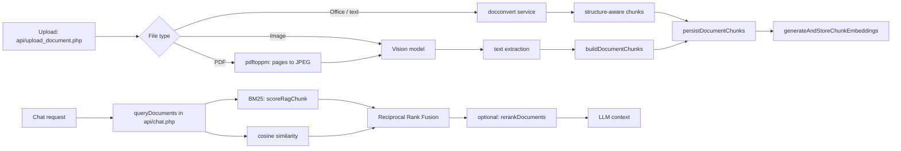

# agent_index.md — Agent Navigation Index

Quick-reference for coding agents to navigate the LLMInt codebase without reading every
file. For deeper detail see [`architecture.md`](architecture.md) (system design, data
flow, diagrams) and [`functions.md`](functions.md) (full function reference). The
German-language [`description.md`](../description.md) at the repository root remains
the original, prose-style architecture reference, and [`README.md`](../README.md) is the
operator-facing manual.

> **Working rules for agents**: no framework, no Composer, no build step, no test runner
> for the PHP app. Each URL maps directly to a PHP file. All SQL uses prepared PDO
> statements, all output is escaped with `htmlspecialchars()`. Keep changes surgical and
> follow the existing patterns in the file you touch.

---

## Project Overview

**LLMInt** (internally also "KHWF KI") – A self-hosted PHP/MySQL chat front end for local
LLMs (LM Studio, vLLM, llama.cpp, Ollama) with multi-endpoint load balancing, hybrid RAG,
a central Milvus knowledge base, image generation (AUTOMATIC1111 / ComfyUI),
prompt-injection protection, LDAP/Windows-SSO login, and an OpenAI-compatible API.

- **Language**: PHP 8.2+ (no framework, no Composer, no build step; PHP 8.0+ works for a
  classic install)
- **Database**: MySQL/MariaDB via PDO, `utf8mb4` / `utf8mb4_unicode_ci`
- **Frontend**: Server-rendered HTML with inline CSS and vanilla JS in `index.php` and
  `admin/index.php` (no external JS dependencies)
- **Architecture**: No router — each URL maps directly to a PHP file; `api/*.php` are the
  JSON/SSE endpoints, `lib/*.php` are shared libraries
- **Runtime containers**: `web` (PHP 8.2 Apache), `db` (MySQL 8.0), `docconvert`
  (Python/FastAPI document converter), `milvus` (vector DB for the local knowledge base),
  `phpmyadmin`
- **Entry points**:
  - `index.php` – Chat UI (~5,300 lines)
  - `admin/index.php` – Admin dashboard (~8,400 lines)
  - `api/*.php` – JSON/SSE endpoints
  - `login.php`, `register.php`, `logout.php` – user auth; `admin/login.php`,
    `admin/logout.php` – admin auth
  - `sso.php`, `sso_fallback.php` – proxy SSO entry point and fallback page
  - `setup.php` – one-time installer / migration runner (also called by the container
    entrypoint)

---

## Core Files & Responsibilities

| File | Purpose |
|---|---|
| `db.php` | PDO singleton (`getDb()`), `ensureRuntimeSchema()` (idempotent migrations), settings, logging, routing categories/rules, chat sessions, intelligence groups, model resolution, roles/CSRF helpers (~2,100 lines) |
| `config.php` | Derives `LMSTUDIO_BASE_URL` / `LMSTUDIO_TIMEOUT` from the first active endpoint (legacy settings fallback) |
| `setup.php` | One-time installer: tables, seed settings, default admin; re-runs migrations |
| `index.php` | Chat UI: streaming, session list, upload/library overlay, image attachments, prefixes (`@@`, `!!`, `/cmd`), welcome screen |
| `lib/balancer_engine.php` | Shared balancer logic (LLM, SD, ComfyUI): circuit breaker, fallback chains, fairness, health columns, orphan cleanup |
| `lib/healthcheck.php` | Active `/models` probing of LLM endpoints; drives `index.php` maintenance-mode fallback |
| `lib/prompt_security.php` | Prompt-injection detection: rules, normalization, scoring, optional AI classifier, logging, retention |
| `lib/openai_api.php` | OpenAI API key handling, payload/message normalization, error formatting, anonymous API request setup |
| `lib/ldap_auth.php` | LDAP bind, user sync/provisioning, Kerberos/Windows SSO (direct or via reverse proxy) |
| `lib/reverse_proxy.php` | Running behind a reverse proxy (lanpa `auth` container, `/ki/`): `TRUSTED_PROXIES`, client IP, HTTPS detection, `X-Forwarded-Prefix`, proxy SSO header (`PROXY_SSO_HEADER`), `appPublicBaseUrl()`; loaded via `auto_prepend_file` and `db.php` |
| `lib/mailer.php` | Custom SMTP client (no PHPMailer): registration/verification and password-reset mail |
| `lib/quickinfo.php` | Client for the quickinfo Management-Board API (`/api/v1/*`) used for live CPU/GPU/RAM/VRAM metrics |
| `lib/prompt.txt` | Seed/fallback routing categories (imported into `routing_categories`) |
| `api/chat.php` | **Main chat pipeline** (~3,650 lines): prompt security → routing → balancer → tools (search, web fetch, RAG, vector store, image gen) → streaming → token accounting |
| `api/balancer.php` | `pickEndpointForModel()`, `completeTask()`, upgrade suggestions, model availability, intelligence scoring |
| `api/embedding.php` | Embeddings: generation, cache, cosine similarity, reranking, chunk embeddings |
| `api/upload_document.php` | File upload, format routing (docconvert / PDF→images+vision / vision), chunking, persistence |
| `api/doc_convert.php` | HTTP client + config for the `docconvert` Python service, plain-text PHP fallback |
| `api/pdf_render.php` | `pdftoppm`/`pdfinfo`/`pdftotext` wrappers: PDF pages → JPEG + per-page text layer |
| `api/vision.php` | `analyzeImageWithVision()` – shared vision-model call incl. balancer + task accounting |
| `api/vector_store.php` | Central knowledge base library (~920 lines): docvecwizard remote client and local Milvus search/status/import support, context building, query logging |
| `api/vector_import.php` | Admin import of docvecwizard export archives (`*.tar.gz`) into Milvus + MySQL |
| `api/document_retention.php` | Toggles `document_uploads.is_library` ("Bibliothek") for a chat-attached document |
| `api/document_status.php` / `api/document_delete.php` / `api/rebuild_embeddings.php` | Upload status, deletion (with chunks), embedding rebuild |
| `api/chat_sessions.php` | `action=list\|load\|delete` for a user's conversation sessions |
| `api/heartbeat.php` | Presence heartbeat → `active_clients`, `client_count_log`, `client_count_daily` |
| `api/models.php` | Query the models of an endpoint |
| `api/healthcheck.php` | Aggregated health status of all LLM endpoints |
| `api/sd_balancer.php` / `api/sd_generate.php` / `api/sd_checkpoints.php` | AUTOMATIC1111 image generation |
| `api/comfy_balancer.php` / `api/comfy_generate.php` / `api/comfy_checkpoints.php` | ComfyUI image generation |
| `api/openai/v1/**` | OpenAI-compatible endpoints **without** tools |
| `api/openai-tools/v1/**` | OpenAI-compatible endpoints **with** tools |
| `api/openai_common/*.php` | Shared request handling for both OpenAI endpoint families |
| `api/test_searxng.php`, `api/test_ldap.php`, `api/test_smtp.php`, `api/test_vector_store.php` | Admin connection tests |
| `api/admin_user_action.php` | Admin user management actions |
| `api/verify_email.php`, `api/reset_password.php` | Token-based email verification and password reset |
| `docconvert/` | Python/FastAPI container converting Office & text files into structured chunks (TTL disk cache); unit tests in `docconvert/tests/` |
| `admin/index.php` | Admin UI: endpoints, routing, balancer, RAG/embeddings, vector store, LDAP/SMTP, users, logs, OpenAI API keys, usage statistics |
| `admin/prompt_security.php` | Prompt security dashboard, rule management, logs, settings |
| `admin/load_stats.php` | Live dashboard stats (JSON), incl. `vector_store` status |
| `admin/usage_stats.php` | Daily usage statistics JSON (clients, users, tasks, failures, searches) for the chart |
| `admin/refresh_sys_stats.php` | SSH system metrics per endpoint |
| `admin/endpoint_tech.php` | quickinfo pairing per endpoint + live technical overview (CPU/GPU/RAM/VRAM, temps) |
| `admin/quickinfo_stats.php` | JSON live metrics of all paired quickinfo instances |
| `admin/api_keys.php` | Legacy redirect to the `#api-keys-card` section of `admin/index.php` |
| `admin/login.php`, `admin/logout.php` | Admin login (own entry point) and logout |
| `docker/` | Apache config, PHP ini, entrypoint, phpMyAdmin Basic-Auth config, Milvus etcd config |
| `docker-compose.lanpa.yml` | Optional override to publish LLMInt behind lanpa's `auth` container under `/ki/` |

Full function-level detail for every file above: [`functions.md`](functions.md).

---

## Chat Pipeline (`api/chat.php` → `streamChatCompletionRequest()`)

Order of operations for a normal chat request:

1. **Bootstrap** – session, `db.php`, request body (JSON or OpenAI-normalized override).
2. **Prompt security** – `psEvaluate()` (unless disabled) → `allow` / `warn` / `block`;
   blocked requests return early, warned ones get a notice.
3. **Model resolution** – explicit model → intelligence group (`@@<score>`) →
   reasoning effort (`!!`) → routing classifier (`routing_decision_model` +
   `routing_categories` / `routing_rules`) → user default → guest default.
4. **Knowledge context** – private uploads (`queryUploadedDocuments()`) and/or the central
   vector store (`vectorStoreSearch()`); hits are injected as system context and exposed
   via the `query_documents` tool.
5. **Endpoint selection** – `pickEndpointForModel()` with fallback chains and circuit
   breaker state; a `tasks` row is reserved (`running`).
6. **Tool loop** – the model may call tools; each call is executed server-side and the
   result fed back until the model answers (bounded loop).
7. **Streaming** – SSE via `ensureSseHeaders()` / `emitSseData()`
   (`content`, `tool`, `sources`, `response_details`, `intelligence_upgrade`, `done`,
   `error`); non-streaming replies use `emitSyntheticStream()`.
8. **Accounting** – `completeTask()` finishes the task with token counters and
   `tokens_per_second`; `logResponseFinished()` / `logToolInvoked()` / `logToolResult()`
   write `app_logs`.

### Tools exposed to the LLM

| Tool name | Factory | Purpose |
|---|---|---|
| `search_web` | `createSearchToolDefinition()` | SearXNG web search (`runSearxngSearch()`, logged in `search_logs`) |
| `web_fetch` | `createWebFetchToolDefinition()` | Fetch and extract readable text from a URL (`fetchWebPage()`) |
| `query_documents` | `createDocumentQueryToolDefinition()` | RAG over private uploads **and** the central vector store |
| `generate_image` | `createImageGenerationToolDefinition()` | AUTOMATIC1111 (`callSdGenerate()`) |
| `generate_image_comfy` | `createComfyToolDefinition()` | ComfyUI (`callComfyGenerate()`) |

Tools are only offered when the selected endpoint reports `supports_tool_calling` and the
caller allows tools (the `api/openai/v1/**` family always disables them).

### Frontend prompt prefixes (`index.php`)

| Prefix | Meaning | JS entry point |
|---|---|---|
| `@@<n>` | Intelligence group (model alias by intelligence score) | `applyGroupPrefixFromInput()`, `renderGroupPill()` |
| `!!` | Force reasoning for a single prompt | `applyReasoningPrefixFromInput()`, `renderReasoningPill()` |
| `/cmd` | Fixed prompt command (e.g. `/table`, `/tldr`, `/eli5`) | `PROMPT_COMMANDS`, `resolveCommand()`, `renderCommandPills()` |

---

## Balancer, Resilience & Model Selection

- **Selection** (`api/balancer.php` → `pickEndpointForModel()`): filters by model
  (`canonicalModelName()` / `equivalentActiveModelNames()`), endpoint activity, category
  specialization, and capability flags; then applies fairness ordering
  (`balancerFairnessOrderBySql()`) and concurrency limits (`balancer_max_concurrent`).
- **Circuit breaker** (`lib/balancer_engine.php`): per-endpoint `circuit_state`
  (`closed` / `open` / `half_open`), `consecutive_failures`, `cooldown_until`,
  `circuit_opened_at`. `recordEndpointOutcome()` updates state;
  `maybeHalfOpenCircuit()` probes after cooldown; `resetEndpointCircuit()` /
  `setEndpointPaused()` are admin actions.
- **Backoff/retry**: `computeBackoffDelayMs()` + `backoffSleep()` using
  `balancer_backoff_base_ms`, `balancer_backoff_max_ms`, `balancer_backoff_jitter`.
- **Fallbacks**: `getFallbackChain()` / `saveFallbackChains()` (JSON in
  `balancer_fallback_chains`) are consulted when no endpoint of the requested model group
  is available.
- **Orphans**: `cleanupOrphanedTasks()` marks stale `running` tasks as `error` after
  `balancer_orphan_timeout_seconds`.
- **Latency**: `avg_latency_ms` / `last_latency_ms` are maintained per endpoint.
- **Health**: `lib/healthcheck.php` → `probeLlmEndpoints()` / `isAnyLlmEndpointHealthy()`;
  `api/healthcheck.php` exposes it and `index.php` shows a maintenance notice.
- **Upgrades**: `getUpgradeModelSuggestionForRequestedModel()` proposes a stronger model
  for hard prompts; the UI shows an accept prompt (`showUpgradePrompt()`), the accepted
  model is stored in `conversation_sessions.upgrade_model`.

---

## Hybrid RAG (private uploads)



- **Routes**: Office/text → `docconvert` (`api/doc_convert.php`, `convertPlainTextLocally()`
  fallback); PDF → page images + vision (`analyzePdfWithVision()` in
  `api/upload_document.php`), `pdftotext` fallback per page; images → `api/vision.php`.
- **Chunking**: `buildDocumentChunks()` / `persistDocumentChunks()` with
  `rag_chunk_chars` / `rag_chunk_overlap`.
- **Search**: BM25 + embedding cosine similarity fused by reciprocal rank, optionally
  reranked (`rerankDocuments()`).
- **Chat-attached files**: a `session_id` on upload stores
  `document_uploads.chat_session_id`; those chunks get a BM25 boost and
  `buildChatDocumentSystemPrompt()` points the model at the attachments.
- **Ephemeral vs. library**: chat uploads are ephemeral by default; the overlay
  (`api/document_retention.php`) can keep one in the personal library
  (`is_library = 1`).
- **Privacy invariant**: `document_uploads.is_global_rag` is always `0` — user uploads are
  never shared. Team knowledge comes only from the central vector store.
- **Maintenance**: `api/document_status.php`, `api/document_delete.php`,
  `api/rebuild_embeddings.php`.

---

## Central Knowledge Base (docvecwizard / Milvus)

`api/vector_store.php` binds the central knowledge base in one of two modes
(`vector_store_mode`):

- **`remote`** – docvecwizard REST API: `docvecEnsureSession()` logs in
  (`POST /api/login`, cookie `docvec_sid`, `X-CSRF-Token`), `docvecSearch()` calls
  `POST /api/search {query, limit}`, `docvecStatus()` calls `GET /api/status`. Embeddings
  are produced by docvecwizard; no local embedding endpoint is needed.
- **`local`** – `api/vector_import.php` extracts a docvecwizard export archive
  (`PharData`, path/size checks), verifies `checksums/SHA256SUMS`, creates the collection
  `docvec_<slug>` via the Milvus REST API v2 (COSINE/AUTOINDEX, schema identical to
  docvecwizard), inserts vectors in batches, and writes chunk text/metadata to MySQL
  (`vector_documents`, `vector_chunks`) in a transaction; each run is recorded in
  `vector_imports`. Strategies: `skip` (existing document versions) or `overwrite`.
  Search embeds the query with `generateEmbeddingAuto()` (model must match the export)
  and `milvusSearch()` returns IDs whose text is loaded from `vector_chunks`.
- **Chat integration**: when a mode is active, every request searches the last user
  message (`vector_top_k`, `vector_min_score`); hits become a context system message
  (`buildVectorContextSystemPrompt()`) and are also returned by the `query_documents`
  tool (`vectorHitsToToolResults()`).
- **Dashboard**: `vectorStoreStatus()` (20 s cache in the `vector_store_status_cache`
  setting) and `vectorQueryStats()` flow through `admin/load_stats.php` (`vector_store`).
- **Admin**: `save_vector_store_settings`, `vector_store_reset_local` actions; connection
  test via `api/test_vector_store.php` (`mode=remote|local`).

---

## Prompt Security Pipeline

`lib/prompt_security.php`, invoked from `api/chat.php` before the model call:

```
psLoadRules() → psNormalise() → psMatchRules() → psComputeScore()
   → optional psAiEvaluate() + psAiLabelToScore() → psDecide() (allow/warn/block) → psLog()
```

- `psNormalise()` strips zero-width characters and decodes HTML/URL/Base64 heuristics.
- `psAiEvaluate()` optionally calls a secondary classifier
  (`harmless`/`prompt_injection`/`jailbreak`/`data_exfiltration`/`unknown`).
- Decisions and thresholds come from `prompt_security_*` settings; `psPurgeLogs()` prunes
  `prompt_security_logs` by `prompt_security_log_retention_days`.
- Managed via `admin/prompt_security.php` (dashboard, rules, logs, settings).

---

## Auth, Sessions & Reverse Proxy

- **Session keys**: `$_SESSION['admin_id']` (user id) and `$_SESSION['admin_user']`
  (username) are set by `login.php`, `admin/login.php` and `sso.php`. `currentUserRole()`,
  `isCurrentUserAdmin()`, `requireAdminOrRedirect()`, `requireAdminOrJson403()` gate
  access.
- **CSRF**: `$_SESSION['csrf_token']`, verified with `hash_equals()` on all state-changing
  POSTs.
- **Local auth**: `login.php` / `register.php` (self-registration with email verification
  via `api/verify_email.php`); password reset via `api/reset_password.php`.
- **LDAP/AD**: `ldapAuthenticate()`, `ldapProvisionUser()`, `ldapFetchUserInfo()`,
  `ldapTestConnection()`; settings `ldap_*`.
- **Windows SSO**: `sso.php` uses the proxy-authenticated user header
  (`ldapProxySsoEnabled()` / `ldapSsoLogin()`); `sso_fallback.php` is the ErrorDocument
  page shown when the domain login is missing.
- **Reverse proxy** (`lib/reverse_proxy.php`): `reverseProxyApply()` runs early and
  rewrites client IP/HTTPS/prefix handling based on `TRUSTED_PROXIES`;
  `appPublicBaseUrl()` builds absolute URLs (used by the OpenAI endpoints); the proxy SSO
  header name comes from `PROXY_SSO_HEADER`.
- **Anonymous API clients**: `api/openai*/**` deliberately start **no** PHP session
  (`openaiBeginAnonymousApiRequest()`), so a browser session can never be inherited.

---

## OpenAI-Compatible API

| Path | Tools | Auth |
|---|---|---|
| `api/openai/v1/models`, `api/openai/v1/chat/completions` | no | anonymous; optional API key |
| `api/openai-tools/v1/models`, `api/openai-tools/v1/chat/completions` | yes | anonymous; optional API key |

Both families share `api/openai_common/*.php` + `lib/openai_api.php`. With an API key the
request is attributed in the logs and an optional pinned model (`api_keys.model`) is used;
otherwise the guest default model applies. Log prefix is `[API]`. Strict mode
(`LLMINT_OPENAI_STRICT_MODE`) disables LLMInt-specific payload extensions.

---

## Key Functions by Domain

See [`functions.md`](functions.md) for signatures and descriptions. Quick lookup by
domain:

- **Database & settings** (`db.php`): `getDb()`, `ensureRuntimeSchema()`,
  `getSetting()`/`setSetting()`, `writeLog()`/`purgeOldLogs()`, `getClientIp()`,
  `loadRoutingCategories()`/`loadRoutingRules()`/`saveRoutingCategory()`,
  `buildRoutingPrompt()`, `saveConversationSession()`/`loadConversationSession()`,
  `listUserConversations()`, `listIntelligenceGroups()`,
  `resolveIntelligenceGroupModel()`, `resolveUserModel()`, `listActiveEndpointModels()`,
  `getGuestDefaultModel()`, `getGlobalSystemPrompt()`,
  `buildCurrentDateTimeSystemPrompt()`, `recordUserLogin()`, `currentUserRole()`,
  `isCurrentUserAdmin()`, `requireAdminOrRedirect()`, `requireAdminOrJson403()`.
- **Chat pipeline** (`api/chat.php`): `streamChatCompletionRequest()` (main entry),
  `create*ToolDefinition()`, `runSearxngSearch()`, `fetchWebPage()`, `queryDocuments()`,
  `queryUploadedDocuments()`, `callSdGenerate()`, `callComfyGenerate()`,
  `ensureSseHeaders()`, `emitSseData()`, `emitSyntheticStream()`, `emitResponseDetailsSse()`,
  `emitIntelligenceUpgradeSse()`, `estimateTokenCount()`, `resolveContextLimits()`,
  `mergeSystemMessages()`, `stripImageContentParts()`, `buildResponseDetails()`,
  `logToolInvoked()`/`logToolResult()`/`logResponseFinished()`, `computeTokensPerSecond()`.
- **Balancer** (`lib/balancer_engine.php`, `api/balancer.php`):
  `pickEndpointForModel()`, `completeTask()`, `getFallbackChain()`/`saveFallbackChains()`,
  `recordEndpointOutcome()`, `maybeHalfOpenCircuit()`, `resetEndpointCircuit()`,
  `setEndpointPaused()`, `cleanupOrphanedTasks()`, `computeBackoffDelayMs()`,
  `getUpgradeModelSuggestionForRequestedModel()`, `modelIntelligenceScore()`,
  `canonicalModelName()`, `equivalentActiveModelNames()`.
- **Healthcheck / maintenance mode** (`lib/healthcheck.php`): `probeLlmEndpoints()`,
  `isAnyLlmEndpointHealthy()`.
- **Embeddings** (`api/embedding.php`): `generateEmbeddingAuto()`, `pickEmbeddingEndpoint()`,
  `cosineSimilarity()`, `getCachedQueryEmbedding()`/`setCachedQueryEmbedding()`,
  `rerankDocuments()`, `generateAndStoreChunkEmbeddings()`.
- **Documents / RAG** (`api/upload_document.php`, `api/doc_convert.php`,
  `api/pdf_render.php`): `normalizeDocumentText()`, `buildDocumentChunks()`,
  `persistDocumentChunks()`, `analyzePdfWithVision()`, `resolveUploadKind()`,
  `docConvertMimeMap()`, `convertDocumentViaService()`, `convertPlainTextLocally()`,
  `renderPdfPagesToImages()`, `extractPdfPageText()`.
- **Central knowledge base** (`api/vector_store.php`, `api/vector_import.php`):
  `vectorStoreMode()`, `vectorStoreSearch()`, `localVectorSearch()`, `docvecSearch()`,
  `milvusSearch()`, `milvusCreateCollection()`, `milvusInsert()`,
  `vectorStoreStatus()`, `vectorQueryStats()`, `buildVectorContextSystemPrompt()`,
  `vectorHitsToToolResults()`, `viExtract()`, `viVerifyChecksums()`, `viListServerFiles()`.
- **Prompt security** (`lib/prompt_security.php`): `psEvaluate()` (main entry),
  `psLoadRules()`, `psNormalise()`, `psMatchRules()`, `psComputeScore()`, `psAiEvaluate()`,
  `psDecide()`, `psLog()`, `psPurgeLogs()`.
- **Auth** (`lib/ldap_auth.php`, `login.php`, `register.php`, `sso.php`): `ldapEnabled()`,
  `ldapSsoEnabled()`, `ldapProxySsoEnabled()`, `ldapSsoLogin()`, `ldapAuthenticate()`,
  `ldapProvisionUser()`, `ldapTestConnection()`.
- **Reverse proxy** (`lib/reverse_proxy.php`): `reverseProxyApply()`,
  `reverseProxyIsTrusted()`, `reverseProxySsoEnabled()`, `appPublicBaseUrl()`.
- **Mail** (`lib/mailer.php`): `sendMail()`, `mailerFromSettings()`.
- **OpenAI API** (`lib/openai_api.php`): `openaiAuthenticateApiRequest()`,
  `openaiNormalizeChatPayload()`, `openaiNormalizeMessages()`, `openaiSendError()`,
  `openaiResolveApiKeyModel()`, `openaiAvailableModels()`.
- **Image generation**: `pickSdEndpoint()`/`completeSdTask()` (`api/sd_balancer.php`),
  `pickComfyEndpoint()`/`completeComfyTask()` (`api/comfy_balancer.php`).
- **Vision** (`api/vision.php`): `analyzeImageWithVision()`, `visionModelName()`,
  `visionModelConfigured()`.
- **Metrics** (`lib/quickinfo.php`): `quickinfoTestPairing()`, `quickinfoCollectMetrics()`,
  `quickinfoBuildMetricRow()`.

---

## HTTP Endpoint Overview

| Path | Method | Auth | Purpose |
|---|---|---|---|
| `api/chat.php` | POST | session optional | Chat incl. routing, tools, streaming |
| `api/chat_sessions.php` | GET/POST | session | `action=list\|load\|delete` |
| `api/models.php` | GET | – | Models of an endpoint |
| `api/heartbeat.php` | POST | – | Presence token |
| `api/healthcheck.php` | GET | – | Aggregated LLM endpoint health |
| `api/document_status.php` | GET | session | Upload status (optionally `session_id`-filtered) |
| `api/upload_document.php` | POST | session + CSRF | Document upload (Office, text, PDF, image) |
| `api/document_delete.php` | POST | session + CSRF | Remove an upload incl. chunks |
| `api/document_retention.php` | POST | session + CSRF | Toggle "keep in library" for a document |
| `api/rebuild_embeddings.php` | POST | admin + CSRF | Recompute embeddings |
| `api/vector_import.php` | GET/POST | admin + CSRF | List/import docvecwizard export archives |
| `api/test_vector_store.php` | POST | admin | Connection test (`mode=remote\|local`) |
| `api/sd_generate.php`, `api/comfy_generate.php` | POST | session | Image generation |
| `api/sd_checkpoints.php`, `api/comfy_checkpoints.php` | GET | – | Available checkpoints |
| `api/test_searxng.php`, `api/test_ldap.php`, `api/test_smtp.php` | GET/POST | admin | Connection tests |
| `api/admin_user_action.php` | POST | admin + CSRF | User management |
| `api/verify_email.php`, `api/reset_password.php` | GET/POST | token | Email verification, password reset |
| `api/openai*/v1/models`, `api/openai*/v1/chat/completions` | GET/POST | anonymous (API key optional) | OpenAI-compatible API |
| `admin/load_stats.php`, `admin/usage_stats.php`, `admin/quickinfo_stats.php` | GET | admin session | Dashboard JSON |

`api/balancer.php`, `api/sd_balancer.php`, `api/comfy_balancer.php`, `api/embedding.php`
and `api/vector_store.php` are pure libraries — they are `require`d, never called directly.

---

## Database Schema (Key Tables)

Tables are created in `setup.php` (first install) and kept current by
`ensureRuntimeSchema()` in `db.php` (idempotent, per-process). Grouped by domain:

**Core / configuration**
| Table | Purpose |
|---|---|
| `settings` | Key-value config (`setting_key`, `setting_value`) |
| `users` | Accounts: username, password hash, email + verification tokens, role (user/admin), auth_source, can_upload_documents, default_model, requires_password_change, ldap_dn |
| `api_keys` | OpenAI API key hashes per user (optional pinned `model`, expiry, `last_used_at`) |
| `app_logs` | Application log |
| `user_login_log` | Login history (feeds usage statistics) |

**LLM endpoints & balancing**
| Table | Purpose |
|---|---|
| `endpoints` | LLM endpoints: base_url, default_model, timeout, is_active, capabilities (`supports_tool_calling`, `supports_vision`, `is_llamacpp`, `reasoning_effort`, `specialized_for_category`, `max_context`, `context_limit_per_slot`), SSH + quickinfo pairing, balancer health (`circuit_state`, `consecutive_failures`, `cooldown_until`, `circuit_opened_at`, `avg_latency_ms`, `last_latency_ms`) |
| `tasks` | LLM request lifecycle: endpoint_id, model, status, token counters, `tokens_per_second` |
| `endpoint_sys_stats` | SSH system metrics per endpoint |
| `active_clients`, `client_count_log`, `client_count_daily` | Presence tracking (heartbeat → live samples → daily aggregates) |
| `search_logs` | SearXNG search history |

**Image generation**
| Table | Purpose |
|---|---|
| `sd_endpoints`, `sd_tasks` | AUTOMATIC1111 endpoints & jobs |
| `comfy_endpoints`, `comfy_tasks` | ComfyUI endpoints & jobs |

**Private RAG (uploads)**
| Table | Purpose |
|---|---|
| `document_uploads` | Upload metadata: status, extracted_text, chunk_count, `is_global_rag` (always 0), `is_library`, `chat_session_id`, `embedding_status` |
| `document_chunks` | Chunks incl. optional `embedding`, `embedding_dimension`, `embedding_model` |
| `embedding_endpoints`, `embedding_cache`, `embedding_logs` | Embedding servers, query-embedding cache, metrics |

**Central knowledge base**
| Table | Purpose |
|---|---|
| `vector_documents` | Imported documents (document/version UUID, embedding model/dimension, `collection_name`, `import_id`) |
| `vector_chunks` | Chunk text + page ranges, linked to `vector_documents` |
| `vector_imports` | Import runs (status, strategy, counts, manifest) |
| `vector_query_logs` | Knowledge-base query metrics (mode, duration, hits, status) |

**Chat, routing & security**
| Table | Purpose |
|---|---|
| `conversation_sessions` | Chat history (session_id, user_id, title, messages JSON, model, `upgrade_model`, `upgrade_accepted_at`, `group_label`, `group_model`) |
| `routing_categories`, `routing_rules` | Category definitions and category → model mapping |
| `prompt_security_rules`, `prompt_security_logs` | Security rules and logged events |

Note: `vector_store_status_cache` is **not** a table — it is a `settings` key used as a
20-second cache for the dashboard status.

Full data model description: [`architecture.md`](architecture.md#4-datenmodell-überblick).

---

## Configuration Keys (`settings` table)

| Group | Keys |
|---|---|
| Model defaults | `default_model`, `new_user_default_model`, `vision_model`, `streaming_enabled` |
| Prompt content | `global_system_prompt`, `intelligence_upgrade_message`, `login_banner_enabled`, `login_banner_text` |
| Intelligence groups | `intelligence_group_enabled` |
| Routing | `routing_decision_model` (+ `routing_categories` / `routing_rules` tables) |
| Balancer / resilience | `balancer_max_concurrent`, `balancer_circuit_fail_threshold`, `balancer_circuit_cooldown_seconds`, `balancer_orphan_timeout_seconds`, `balancer_fairness_window_seconds`, `balancer_backoff_base_ms`, `balancer_backoff_max_ms`, `balancer_backoff_jitter`, `balancer_fallback_chains` |
| Embeddings / hybrid search | `embedding_enabled`, `embedding_model`, `embedding_timeout`, `embedding_dimensions`, `embedding_cache_enabled`, `embedding_cache_ttl_days`, `hybrid_search_enabled`, `bm25_weight`, `embedding_weight` |
| Reranker | `reranker_enabled`, `reranker_endpoint`, `reranker_model`, `reranker_timeout`, `reranker_top_k` |
| Document upload / chunking | `pdf_vision_enabled`, `pdf_vision_dpi`, `pdf_vision_max_pages`, `upload_max_mb`, `rag_chunk_chars`, `rag_chunk_overlap` |
| docconvert service | `docconvert_enabled`, `docconvert_url`, `docconvert_token`, `docconvert_timeout` |
| Central knowledge base | `vector_store_mode`, `vector_top_k`, `vector_min_score`, `docvec_api_url`, `docvec_api_username`, `docvec_api_password`, `docvec_api_timeout`, `docvec_api_verify_tls`, `milvus_url`, `milvus_metrics_url`, `milvus_token`, `milvus_timeout`, `milvus_collection`, `vector_store_status_cache` (runtime cache) |
| Web search | `searxng_base_url` |
| Mail | `smtp_host`, `smtp_port`, `smtp_encryption`, `smtp_auth`, `smtp_user`, `smtp_pass`, `smtp_from_name`, `smtp_from_email` |
| Registration mail | `registration_email_subject`, `registration_email_body`, `registration_email_text` |
| LDAP/AD & SSO | `ldap_enabled`, `ldap_host`, `ldap_port`, `ldap_use_ssl`, `ldap_domain`, `ldap_base_dn`, `ldap_bind_dn`, `ldap_bind_password`, `ldap_user_attr`, `ldap_email_attr`, `ldap_display_name_attr`, `ldap_sspi_enabled` |
| Logging | `log_level`, `log_retention_days` |
| Prompt security | `prompt_security_enabled`, `prompt_security_mode`, `prompt_security_warn_limit`, `prompt_security_score_limit`, `prompt_security_block_message`, `prompt_security_log`, `prompt_security_log_input`, `prompt_security_log_retention_days`, `prompt_security_fail_open`, `prompt_security_ai_enabled`, `prompt_security_ai_endpoint`, `prompt_security_ai_model` |

Legacy keys (still read as fallback): `lmstudio_base_url`, `lmstudio_timeout`,
`endpoints_bootstrapped`.

---

## Important Patterns & Conventions

1. **No router** – A new API endpoint is a new file in `api/` that does
   `require_once __DIR__ . '/../db.php'` and emits JSON or SSE itself.
2. **Settings** – All runtime config lives in the `settings` table; read with
   `getSetting()` (with a sensible default) and write with `setSetting()`. Never hardcode
   operator-tunable values.
3. **Schema migrations** – Add `CREATE TABLE IF NOT EXISTS` / `ALTER TABLE ... ADD COLUMN`
   inside `ensureRuntimeSchema()` in `db.php`, each `ALTER` wrapped in `try { } catch` so
   re-runs are idempotent. Mirror first-install tables in `setup.php`.
4. **SSE streaming** – Use `ensureSseHeaders()`, `emitSseData()`,
   `emitSyntheticStream()`; keep event names consistent with the JS `processSseLine()`.
5. **Balancer health** – Circuit breaker states `closed`/`open`/`half_open`, driven by
   `consecutive_failures` and `cooldown_until`. Always finish a task via `completeTask()`
   so counters and latency stats stay correct.
6. **Intelligence groups** – Model aliases like `@@35b` resolved via
   `resolveIntelligenceGroupModel()`; the group is persisted per session.
7. **Prompt security** – Runs before routing; decisions `allow`, `warn`, `block`.
8. **Tool calling** – Defined in `api/chat.php` via `create*ToolDefinition()`; executed in
   the tool loop inside `streamChatCompletionRequest()`. Only offer tools when the
   endpoint supports them.
9. **Session auth** – `$_SESSION['admin_id']`, `$_SESSION['admin_user']`; CSRF via
   `$_SESSION['csrf_token']` checked with `hash_equals()`.
10. **OpenAI endpoints are anonymous** – No PHP session is started for `api/openai*/**`.
11. **Privacy invariant** – User uploads are always private
    (`document_uploads.is_global_rag = 0`); shared knowledge comes only from the central
    vector store.
12. **No new dependencies** unless strictly necessary; no build tools; all SQL via prepared
    PDO statements; escape output with `htmlspecialchars()`; German UI strings, English
    code/comments.
13. **Line endings / encoding** – Files are UTF-8; German umlauts appear throughout the UI
    strings — keep them intact.

---

## Common Tasks & Where to Look

| Task | File(s) |
|---|---|
| Add new setting | `admin/index.php` (form + `action` handler), read via `getSetting()` at the usage site |
| Add new table/column | `db.php` → `ensureRuntimeSchema()` (idempotent); `setup.php` for first-install tables |
| Add API endpoint | Create `api/new_endpoint.php`, `require_once __DIR__ . '/../db.php'` |
| Modify chat pipeline | `api/chat.php` (main), `api/balancer.php` (model selection) |
| Add tool/function | `api/chat.php` → new `create*ToolDefinition()` + handler in the tool-execution loop |
| Change balancer logic | `lib/balancer_engine.php` (shared), `api/balancer.php` (LLM-specific) |
| Change model routing | `admin/index.php` (`save_routing_settings`, `*_routing_category`), `db.php` (`loadRoutingCategories()`, `buildRoutingPrompt()`) |
| Modify prompt security | `lib/prompt_security.php` (logic), `admin/prompt_security.php` (UI) |
| Add embedding provider | `api/embedding.php` → `pickEmbeddingEndpoint()`, `generateEmbedding()` |
| Modify RAG/chunking | `api/upload_document.php` (routing/chunking), `docconvert/app/*.py` (format parsing), `api/embedding.php` (embeddings), `api/chat.php` → `queryDocuments()` |
| Add a document format | `docconvert/app/converters.py` (parser + `SUPPORTED_FORMATS`), `api/doc_convert.php` (MIME map), `index.php` (accept lists) |
| Change the central knowledge base | `api/vector_store.php` (search/status), `api/vector_import.php` (import), `admin/index.php` (`config-vector-store-card`) |
| Admin UI changes | `admin/index.php` (main, incl. API keys), `admin/prompt_security.php` |
| Add dashboard live data | `admin/load_stats.php` (live), `admin/usage_stats.php` (daily chart) |
| Auth changes | `login.php`, `register.php`, `admin/login.php`, `lib/ldap_auth.php`, `sso.php` |
| Reverse proxy / SSO changes | `lib/reverse_proxy.php`, `sso.php`, `sso_fallback.php`, `docker-compose.lanpa.yml` |
| OpenAI API changes | `lib/openai_api.php`, `api/openai_common/**`, `api/openai*/**` |
| Image generation | `api/sd_*.php`, `api/comfy_*.php`, `lib/balancer_engine.php` |
| Frontend chat behaviour | `index.php` (SSE handling, prefixes, sessions, uploads) |

### Admin POST actions (`admin/index.php`)

`add_endpoint`, `update_endpoint`, `delete_endpoint`, `reset_circuit`,
`toggle_endpoint_pause`, `save_search_settings`, `save_request_handling`,
`save_new_user_model`, `save_balancer_settings`, `save_streaming_settings`,
`save_intelligence_group_settings`, `save_global_system_prompt`, `save_system_messages`,
`save_vision_settings`, `save_smtp_settings`, `save_ldap_settings`, `add_sd_endpoint`,
`update_sd_endpoint`, `delete_sd_endpoint`, `add_comfy_endpoint`, `update_comfy_endpoint`,
`delete_comfy_endpoint`, `save_routing_settings`, `add_routing_category`,
`update_routing_category`, `delete_routing_category`, `import_prompt_txt`,
`save_log_config`, `add_embedding_endpoint`, `update_embedding_endpoint`,
`delete_embedding_endpoint`, `save_hybrid_search_settings`, `save_reranker_settings`,
`save_vector_store_settings`, `vector_store_reset_local`, `create_api_key`,
`toggle_api_key`, `delete_api_key`, `change_password`.

Admin card IDs: `dashboard-card`, `config-endpoints-card`, `config-balancer-card`,
`config-routing-card`, `config-decision-card`, `config-request-handling-card`,
`config-system-messages-card`, `config-searxng-card`, `config-sd-card`,
`config-comfy-card`, `config-vector-store-card`, `config-embedding-card`,
`config-hybrid-search-card`, `config-reranker-card`, `config-global-system-prompt-card`,
`config-smtp-card`, `config-ldap-card`, `log-config-card`, `log-viewer-card`,
`usage-stats-card`, `embedding-stats-card`, `users-card`, `openai-api-card`,
`api-keys-card`, `password-card`.

---

## Docker / Deployment

- `Dockerfile` – PHP 8.2 Apache with extensions (`pdo_mysql`, `gd`, `curl`, `mbstring`,
  `fileinfo`, `ldap`, XML/ZIP, Intl), Poppler (`pdftotext`, `pdftoppm`, `pdfinfo`), and
  Kerberos components; `ENTRYPOINT` is `docker/entrypoint.sh` (waits for the DB, runs
  `setup.php`).
- `docconvert/Dockerfile` – `python:3.12-slim`, FastAPI/Uvicorn with `python-docx`,
  `openpyxl`, `xlrd`, `python-pptx`, `odfpy`, `striprtf`, `beautifulsoup4`/`lxml`; runs as
  an unprivileged user with no published port.
- `docker-compose.yml` – Services `db` (MySQL 8.0 with healthcheck), `web` (`HTTP_PORT`,
  default 8080), `docconvert`, `milvus` (Standalone with embedded etcd + local storage,
  internal only) and `phpmyadmin` (`PMA_PORT`, default 8081, HTTP Basic Auth). Volumes:
  `db_data`, `doc_uploads`, `sd_output`, `docconvert_cache`, `milvus_data`,
  `vector_imports`.
- `docker-compose.lanpa.yml` – optional override that attaches `web` to the external
  `llmint-proxy` network and sets `TRUSTED_PROXIES` / `PROXY_SSO_HEADER` for publishing
  under `https://<lanpa-host>/ki/`.
- `.env.example` – `DB_NAME`, `DB_USER`, `DB_PASS`, `DB_ROOT_PASS`, `HTTP_PORT`,
  `PMA_PORT`, `PMA_BASIC_AUTH_USER`, `PMA_BASIC_AUTH_PASSWORD`, `TZ`, `TRUSTED_PROXIES`,
  `PROXY_SSO_HEADER`, `DOCCONVERT_*`, `MILVUS_*`.

---

## Testing / Linting

- **No automated test suite for the PHP app.**
- **Lint**: `php -l <file>` for a syntax check on every changed file.
- **docconvert**: Python unit tests exist — `pytest docconvert/tests` (from the
  `docconvert/` directory).
- **Manual testing** via browser / `curl` against a running container
  (`docker compose up -d`, then `http://localhost:8080`).

---

## File Tree (Code Only)

```
/
├── index.php              # Chat UI (streaming, sessions, uploads, prefixes)
├── login.php / register.php / logout.php
├── sso.php / sso_fallback.php   # proxy SSO entry + fallback page
├── setup.php              # Installer / migrations
├── config.php             # LMSTUDIO_* constants from endpoint or settings
├── db.php                 # Core DB + schema + helpers
├── description.md         # Detailed architecture/function reference (German)
├── README.md              # Operator docs
├── Demo.md                # Non-technical demo guide
├── docker-compose.yml / docker-compose.lanpa.yml / Dockerfile / .env.example
├── docs/
│   ├── agent_index.md     # This file
│   ├── architecture.md    # System architecture & diagrams
│   ├── functions.md       # Full function reference
│   └── images/            # Diagrams used in README.md
├── admin/
│   ├── index.php          # Admin dashboard (endpoints, routing, RAG, users, API keys)
│   ├── prompt_security.php
│   ├── load_stats.php
│   ├── usage_stats.php    # Daily usage statistics JSON
│   ├── refresh_sys_stats.php
│   ├── endpoint_tech.php  # quickinfo pairing + technical overview
│   ├── quickinfo_stats.php
│   ├── api_keys.php       # legacy redirect to index.php#api-keys-card
│   └── login.php / logout.php
├── api/
│   ├── chat.php           # Main pipeline
│   ├── balancer.php       # Model selection & completion
│   ├── embedding.php      # Embeddings & RAG
│   ├── upload_document.php
│   ├── doc_convert.php    # Client for the docconvert container
│   ├── pdf_render.php     # pdftoppm/pdfinfo helpers (PDF → page images)
│   ├── vision.php         # Shared vision-model image analysis
│   ├── vector_store.php   # Central knowledge base (docvecwizard / Milvus)
│   ├── vector_import.php  # Import docvecwizard export archives
│   ├── chat_sessions.php
│   ├── models.php / heartbeat.php / healthcheck.php
│   ├── reset_password.php / verify_email.php / admin_user_action.php
│   ├── document_status.php / document_delete.php / document_retention.php
│   ├── rebuild_embeddings.php
│   ├── test_ldap.php / test_smtp.php / test_searxng.php / test_vector_store.php
│   ├── sd_balancer.php / sd_generate.php / sd_checkpoints.php
│   ├── comfy_balancer.php / comfy_generate.php / comfy_checkpoints.php
│   └── openai/v1/**, openai-tools/v1/**, openai_common/**
├── lib/
│   ├── balancer_engine.php
│   ├── prompt_security.php
│   ├── openai_api.php
│   ├── ldap_auth.php
│   ├── mailer.php
│   ├── healthcheck.php
│   ├── reverse_proxy.php
│   ├── quickinfo.php
│   └── prompt.txt         # Fallback/seed routing categories
├── docconvert/            # Python/FastAPI converter (app/, tests/)
├── doc_uploads/           # Runtime uploads (protected)
├── sd_output/             # Generated images (protected)
├── vector_imports/        # Staging for docvecwizard export archives (protected)
├── docker/                # Docker configs (apache, php.ini, entrypoint, milvus etcd)
├── ressources/            # Example system prompt
└── assets/                # Static assets (img/)
```

---

## Quick Start for Changes

1. **Read** [`architecture.md`](architecture.md) for the system design and diagrams.
2. **Look up** the relevant function(s) in [`functions.md`](functions.md).
3. **Find** the relevant file from the tables above.
4. **Modify** – follow existing patterns (no framework conventions, German UI strings,
   prepared statements, escaped output).
5. **Schema changes** → add to `ensureRuntimeSchema()` in `db.php` (and `setup.php`).
6. **Test** with `php -l file.php` and a manual browser/`curl` check.

---

*Generated for agent-friendly navigation. Keep updated as the codebase evolves.*
