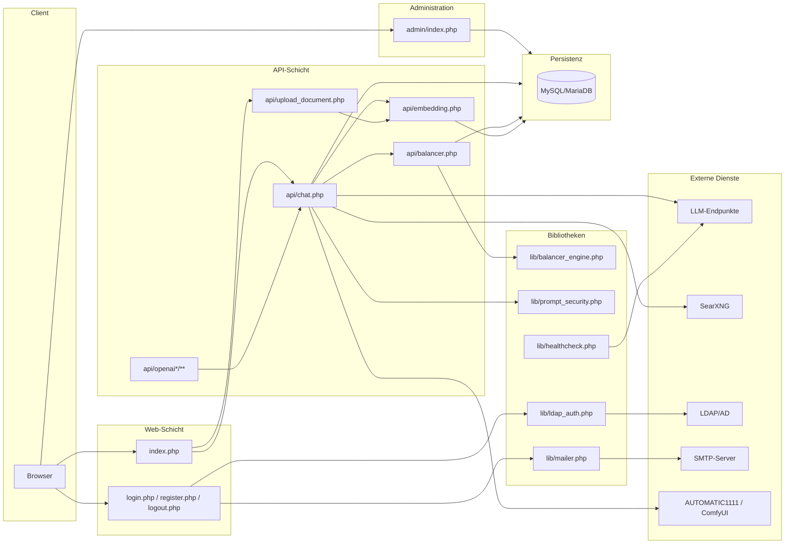
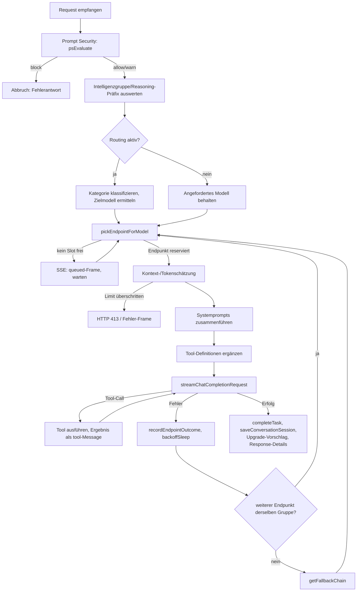
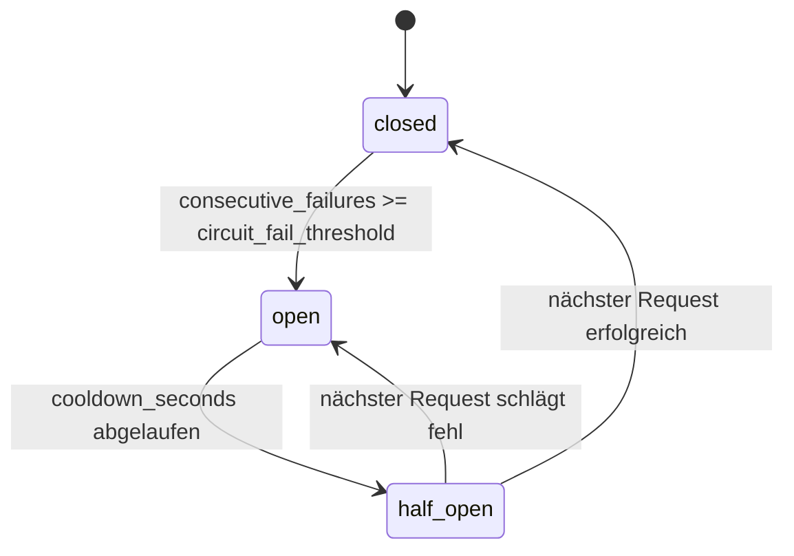
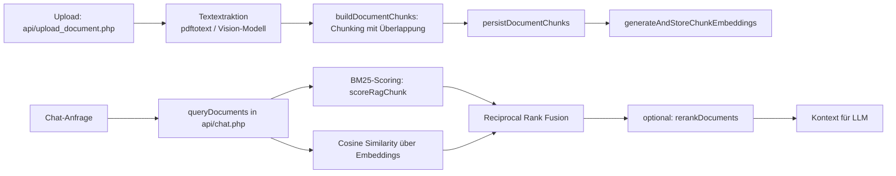

# architecture.md – Systemarchitektur von LLMInt

Dieses Dokument beschreibt den strukturellen Aufbau von LLMInt: Schichten, Laufzeit-
komponenten, Datenfluss und die wichtigsten Entwurfsentscheidungen. Für eine
funktionsgenaue Referenz siehe [`functions.md`](functions.md); für eine kompakte
Navigationshilfe für Coding-Agenten siehe [`agent_index.md`](agent_index.md).

Sprache im Code: Bezeichner überwiegend Englisch, UI-Texte, Log- und Fehlermeldungen
auf Deutsch. Kommentare sind auf Englisch verfasst.

---

## 1. Grundprinzipien

- **Kein Framework, kein Router.** Jede URL entspricht direkt einer PHP-Datei. Neue
  Endpunkte sind neue Dateien unter `api/`, die `../db.php` einbinden.
- **Kein Composer, kein Build-Schritt.** Abhängigkeiten werden ausschließlich über
  `require_once __DIR__ . '/...'` geladen; Frontend-CSS/JS liegt inline in `index.php`
  bzw. `admin/index.php`.
- **Idempotentes Schema.** `ensureRuntimeSchema(PDO $pdo)` in `db.php` legt beim ersten
  `getDb()`-Aufruf pro Prozess alle Laufzeittabellen an und ergänzt fehlende Spalten via
  `ALTER TABLE ... ADD COLUMN` in `try/catch`. Bestehende Installationen migrieren so
  automatisch beim nächsten Request.
- **Einstellungen statt Konstanten.** Laufzeitkonfiguration liegt in der Tabelle
  `settings` (Key-Value) und wird über `getSetting()`/`setSetting()` gelesen/geschrieben.
- **PDO mit Prepared Statements** für sämtliche SQL-Zugriffe; Ausgaben werden mit
  `htmlspecialchars()` escaped.

| Merkmal | Wert |
|---|---|
| Sprache/Laufzeit | PHP 8.2 (Docker-Image `php:8.2-apache`), mindestens PHP 8.0 |
| Framework | keines |
| Persistenz | MySQL/MariaDB über PDO (`utf8mb4`) |
| Frontend | serverseitig gerendertes HTML mit inline CSS/Vanilla-JS |
| Einstiegspunkte | `index.php`, `admin/index.php`, `api/*.php`, `login.php`, `register.php`, `logout.php`, `setup.php` |
| Tests/Linting | keine automatisierten Tests; `php -l <datei>` zur Syntaxprüfung |

---

## 2. Schichtenmodell

| Ebene | Komponenten | Aufgabe |
|---|---|---|
| **Web** | `index.php`, `login.php`, `register.php`, `logout.php` | Chat-Oberfläche, Anmeldung, Selbstregistrierung |
| **API** | `api/chat.php`, `api/balancer.php`, `api/embedding.php`, `api/upload_document.php`, `api/openai*/**`, weitere `api/*.php` | Chat-Pipeline, Routing, RAG, Uploads, Bildgenerierung, OpenAI-kompatible Fassade |
| **Administration** | `admin/index.php`, `admin/prompt_security.php`, `admin/load_stats.php`, `admin/refresh_sys_stats.php`, `admin/api_keys.php` | Endpunkte, Benutzer, Einstellungen, Monitoring, API-Keys |
| **Bibliotheken** | `lib/balancer_engine.php`, `lib/prompt_security.php`, `lib/openai_api.php`, `lib/ldap_auth.php`, `lib/mailer.php`, `lib/healthcheck.php` | Wiederverwendbare Kernlogik, von mehreren Einstiegspunkten eingebunden |
| **Persistenz** | MySQL/MariaDB, Schema aus `setup.php` + `db.php` | Einstellungen, Benutzer, Endpunkte, Tasks, Chunks, Logs |
| **Externe Dienste** | OpenAI-kompatible LLM-/Embedding-Endpunkte, optional SearXNG, LDAP/AD, SMTP, AUTOMATIC1111, ComfyUI | Modellinferenz, Suche, Verzeichnisdienst, Mailversand, Bildgenerierung |



---

## 3. Bootstrapping und Konfiguration

1. Jede Datei bindet `db.php` ein. `getDb()` liefert eine PDO-Singleton-Verbindung aus
   den Umgebungsvariablen `DB_HOST` (Standard `localhost`), `DB_PORT` (`3306`), `DB_NAME`
   (`llmint`), `DB_USER` (`root`), `DB_PASS` (leer).
2. Beim ersten `getDb()`-Aufruf pro Prozess läuft `ensureRuntimeSchema(PDO $pdo)`:
   `CREATE TABLE IF NOT EXISTS` für alle Laufzeittabellen, `ALTER TABLE ... ADD COLUMN`
   in `try/catch` für Migrationen sowie Seeding von Routing-Kategorien und
   Prompt-Security-Regeln.
3. `config.php` definiert die Konstanten `LMSTUDIO_BASE_URL` und `LMSTUDIO_TIMEOUT` aus
   dem ersten aktiven Endpunkt, ersatzweise aus den Einstellungen `lmstudio_base_url` /
   `lmstudio_timeout` (Legacy-Fallback).
4. `setup.php` ist der einmalige Installer: legt `users` sowie alle übrigen Tabellen an,
   seedet Standardeinstellungen und erzeugt bei leerer Datenbank den Administrator
   `admin`/`admin`.

**Konsequenz für Änderungen:** Schemaänderungen gehören ausschließlich in
`ensureRuntimeSchema()` (idempotent), damit bestehende Installationen automatisch
migrieren.

---

## 4. Datenmodell (Überblick)

| Tabelle | Zweck |
|---|---|
| `settings` | Key-Value-Konfiguration (`setting_key`, `setting_value`) |
| `users` | Konten: Anmeldedaten, Rolle (`user`/`admin`), `auth_source` (`local`/`ldap`), Dokument-Upload-Recht, Standardmodell |
| `api_keys` | Hashes der OpenAI-kompatiblen API-Keys je Benutzer |
| `endpoints` | LLM-Endpunkte: `base_url`, `default_model`, `timeout`, `is_active`, Fähigkeiten (Tool Calling, Vision), Balancer-Gesundheit (`circuit_state`, `consecutive_failures`, `cooldown_until`, `avg_latency_ms`) |
| `tasks` | Lebenszyklus jeder LLM-Anfrage (`endpoint_id`, `status`, Tokenzähler, `tokens_per_second`) |
| `endpoint_sys_stats` | per SSH gelesene Systemmetriken je Endpunkt |
| `sd_endpoints`, `sd_tasks` | AUTOMATIC1111-Endpunkte und deren Aufträge |
| `comfy_endpoints`, `comfy_tasks` | ComfyUI-Endpunkte und deren Aufträge |
| `document_uploads` | Upload-Metadaten, Verarbeitungs-/Embedding-Status, `is_global_rag` |
| `document_chunks` | Chunks mit optionalem Embedding (FK auf `document_uploads`, `ON DELETE CASCADE`) |
| `embedding_endpoints` | Embedding-Server (`base_url`, `model`, `timeout`) |
| `embedding_cache` | zwischengespeicherte Query-Embeddings |
| `embedding_logs` | Laufzeit-/Trefferstatistik der Embedding-Aufrufe |
| `conversation_sessions` | Chatverläufe (`session_id`, `messages` als JSON, `model`, `upgrade_model`, `group_label`) |
| `routing_categories`, `routing_rules` | Kategoriedefinitionen und Zuordnung Kategorie → Zielmodell |
| `search_logs` | SearXNG-Suchhistorie |
| `active_clients`, `client_count_log` | Heartbeat-/Präsenztracking |
| `app_logs` | Anwendungslog (`info`/`warning`/`error`) |
| `prompt_security_rules`, `prompt_security_logs` | Sicherheitsregeln und protokollierte Ereignisse |

Details zu Feldnamen und Funktionen, die diese Tabellen lesen/schreiben, siehe
[`functions.md`](functions.md#dbphp).

---

## 5. Authentifizierung, Sitzungen und Rechte

- Angemeldete Benutzer werden über `$_SESSION['admin_user']` (Anzeigename) und
  `$_SESSION['admin_id']` (Benutzer-ID) identifiziert – auch für nicht-administrative
  Benutzer. `$_SESSION['requires_password_change']` erzwingt einen Passwortwechsel.
- Rollenprüfung ausschließlich über `currentUserRole()`, `isCurrentUserAdmin()` sowie die
  Guards `requireAdminOrRedirect()` (HTML) bzw. `requireAdminOrJson403()` (JSON-APIs).
- CSRF-Schutz: `$_SESSION['csrf_token']` wird in `index.php`/`admin/index.php` erzeugt;
  alle Formulare sowie Admin- und Upload-APIs prüfen das Feld `csrf_token`. `login.php`
  verwendet zusätzlich `$_SESSION['login_csrf']`.
- Anmeldereihenfolge (`login.php`, `admin/login.php`): Kerberos-SSO
  (`ldapSsoEnabled()`/`ldapSsoUsername()` über `REMOTE_USER`) → LDAP
  (`ldapAuthenticate()`, danach `ldapProvisionUser()`) → lokale Prüfung mit
  `password_verify()`.
- `register.php` erzeugt ein Verifikationstoken, versendet Mail über `sendMail()` und
  wird durch `api/verify_email.php` abgeschlossen; Passwort-Reset läuft über
  `api/reset_password.php`.
- Dokument-Upload erfordert `users.can_upload_documents = 1`.

---

## 6. Chat-Pipeline (`api/chat.php`)

Zentraler Einstiegspunkt: `POST api/chat.php` mit JSON-Body. Antwort ist JSON oder – bei
`stream: true` – `text/event-stream`.

### 6.1 Ablauf



### 6.2 Tools für das LLM

| Tool | Voraussetzung | Parameter |
|---|---|---|
| `search_web` | `searxng_base_url` gesetzt | `query` (erforderlich) |
| `web_fetch` | wie `search_web` | `url` (erforderlich), `max_chars` (500–20000, Standard 6000) |
| `generate_image` | aktive `sd_endpoints` | `prompt` (erforderlich), `negative_prompt`, `width`, `height` |
| `generate_image_comfy` | aktive `comfy_endpoints` | wie `generate_image` |
| `query_documents` | vorhandene Uploads | `query` (erforderlich) |

Neue Tools benötigen eine `create...ToolDefinition()`-Funktion, eine
Verfügbarkeitsprüfung sowie einen Zweig in der Tool-Ausführungsschleife von
`api/chat.php`.

### 6.3 SSE-Protokoll

Alle Frames werden über `emitSseData()` als `data: <json>` gesendet.

| Frame | Inhalt |
|---|---|
| OpenAI-Chunk | `{id, object:"chat.completion.chunk", created, model, choices:[{index, delta, finish_reason}]}` |
| Warteschlange | `{status:"queued", message:"..."}` |
| Fehler | `{error:"..."}` |
| Upgrade-Angebot | `{type:"intelligence_upgrade", upgrade:{...}}` |
| Antwortdetails | `{type:"response_details", details:{...}}` |
| Ende | `[DONE]` |

Im OpenAI-Strict-Modus (`isOpenAiStrictMode()`, gesetzt durch die OpenAI-Fassaden)
entfallen die LLMInt-spezifischen Frames.

---

## 7. Balancer-Architektur

`lib/balancer_engine.php` ist die gemeinsame Basis für LLM-, AUTOMATIC1111- und
ComfyUI-Endpunkte; die jeweilige Tabelle wird als Parameter übergeben.

### 7.1 Auswahllogik (`pickEndpointForModel()` in `api/balancer.php`)

1. nur aktive Endpunkte mit passendem `default_model` (exakt oder funktional äquivalent
   gemäß `equivalentActiveModelNames()`/`canonicalModelName()` in `db.php`), geschlossenem
   bzw. abgelaufenem Circuit und optional geforderten Fähigkeiten (Tool Calling, Vision),
2. Bewertung aus laufender Auslastung und geglätteter Latenz,
3. Fairness-Tiebreaker über die älteste Zuweisung,
4. Reservierung in einer Transaktion mit `SELECT ... FOR UPDATE` und erneuter
   Kapazitätsprüfung, anschließend `INSERT` in `tasks` mit Status `running`.

Abschluss über `completeTask()`; Bildpfade nutzen `pickSdEndpoint()`/`completeSdTask()`
bzw. `pickComfyEndpoint()`/`completeComfyTask()`.

### 7.2 Circuit Breaker & Resilienz



- `recordEndpointOutcome()` aktualisiert Erfolg/Fehlschlag und die geglättete Latenz (EMA).
- `maybeHalfOpenCircuit()` überführt einen offenen Circuit nach Ablauf des Cooldowns in
  `half_open`.
- `computeBackoffDelayMs()`/`backoffSleep()` implementieren exponentielles Backoff mit
  Jitter zwischen Fehlversuchen.
- `cleanupOrphanedTasks()` markiert Tasks, die den `balancer_orphan_timeout_seconds`
  überschritten haben, als `error` (verwaiste Reservierungen nach Absturz/Timeout).
- `getFallbackChain()`/`saveFallbackChains()` verwalten konfigurierbare Ersatzmodelle je
  Modell, die geprüft werden, wenn kein Endpunkt derselben Modellgruppe verfügbar ist.

---

## 8. Hybrid-RAG-Architektur



- Upload: `api/upload_document.php` prüft Session, `can_upload_documents`, CSRF und
  MIME-Typ (Text/Markdown, PDF, PNG/JPG/WEBP/GIF), speichert nach `doc_uploads/`.
- Embeddings: `generateEmbeddingAuto()`, `pickEmbeddingEndpoint()`,
  `getCachedQueryEmbedding()`/`setCachedQueryEmbedding()` (Cache), Fallback auf reines
  BM25, falls kein Embedding-Endpunkt erreichbar ist.
- Statusabfrage im Frontend: `api/document_status.php`; Neuberechnung über
  `api/rebuild_embeddings.php`.

Relevante Einstellungen: `embedding_enabled`, `embedding_model`, `embedding_timeout`,
`embedding_cache_enabled`, `hybrid_search_enabled`, `bm25_weight`, `embedding_weight`,
`reranker_enabled`, `reranker_endpoint`, `reranker_model`, `reranker_top_k`.

---

## 9. Prompt-Security-Pipeline

`lib/prompt_security.php` wird von `api/chat.php` vor dem Modellaufruf ausgeführt:

```
psLoadRules() → psNormalise() → psMatchRules() → psComputeScore()
   → optional psAiEvaluate() + psAiLabelToScore() → psDecide() (allow/warn/block) → psLog()
```

- `psNormalise()` entfernt Zero-Width-Zeichen, dekodiert HTML/URL/Base64-Heuristiken.
- `psAiEvaluate()` ruft optional einen sekundären KI-Klassifikator auf
  (`harmless`/`prompt_injection`/`jailbreak`/`data_exfiltration`/`unknown`).
- `psPurgeLogs()` entfernt alte Einträge aus `prompt_security_logs` nach Aufbewahrungsfrist.
- Verwaltung über `admin/prompt_security.php` (Dashboard, Regeln, Logs, Einstellungen).

---

## 10. Frontend-Architektur (`index.php`)

- Aufbau: PHP-Bootstrap (Session, Einstellungen, Modellliste) → `<style>` → HTML →
  `<script>`. Kein Build-Schritt, keine externen JS-Abhängigkeiten.
- Chat senden: `sendMessage()` baut das Nachrichtenarray (inkl. Bildanhängen als
  `image_url`-Parts) und ruft `executeStreamingRequest()` auf (`fetch('api/chat.php')`,
  Body-Lesen über `getReader()`).
- SSE-Verarbeitung: `processSseLine()` → `updateStreamingBubble()` →
  `renderBubbleContent()` → `renderMarkdown()` (eigener Markdown-Renderer inkl. Tabellen,
  Codeblöcken, `renderMath()`/`extractMath()`/`reinsertMath()`).
- Zusatzanzeigen: `setSourcePillsForBubble()` (Web-Quellen),
  `setResponseDetailsForBubble()`/`buildContextCircleHtml()` (Kontextauslastung),
  `showUpgradePrompt()` (Intelligence Upgrade), `thinkingRobotHtml()`/
  `tickThinkingRobot()` (Wartezustand).
- Sitzungen: `generateSessionId()`, `refreshSessionList()`, `loadSession()`,
  `restoreCurrentSession()`, `deleteSession()`, `startNewChat()` gegen
  `api/chat_sessions.php?action=list|load|delete`.
- Intelligenzgruppen: `applyGroupPrefixFromInput()`, `renderGroupPill()`,
  `setActiveGroup()`, `removeActiveGroup()`.
- Reasoning: `applyReasoningPrefixFromInput()`, `renderReasoningPill()`; das
  `!!`-Präfix aktiviert Reasoning für genau einen Prompt (💡-Pille).
- Prompt-Funktionen: `applyCommandPrefixFromInput()`, `renderCommandPills()`,
  `resolveCommand()`; `/kommando`-Präfixe (`PROMPT_COMMANDS`, z. B. `/table`, `/tldr`,
  `/eli5`) hängen je eine feste Anweisung an den Systemprompt an.
- Dokumente: `openUploadModal()`, `setFile()`, Upload per `FormData` inkl.
  `csrf_token` an `api/upload_document.php`, Statusanzeige über `loadStatus()`/
  `renderUploads()`.
- Präsenz: `sendHeartbeat()` gegen `api/heartbeat.php`.

---

## 11. Administration (`admin/index.php`)

`admin/index.php` verarbeitet alle Änderungen als POST mit `action`-Feld und
CSRF-Token, u. a. `add_endpoint`, `update_endpoint`, `delete_endpoint`,
`reset_circuit`, `toggle_endpoint_pause`, `save_balancer_settings`,
`save_routing_settings`, `add_routing_category`, `save_hybrid_search_settings`,
`save_reranker_settings`, `save_smtp_settings`, `save_ldap_settings`,
`add_sd_endpoint`, `add_comfy_endpoint`, `add_embedding_endpoint`, `change_password`
u. v. m. (vollständige Liste in [`functions.md`](functions.md#adminindexphp)).

Die Oberfläche ist in Karten mit stabilen IDs gegliedert (`dashboard-card`,
`config-endpoints-card`, `config-balancer-card`, `config-routing-card`,
`config-sd-card`, `config-comfy-card`, `config-embedding-card`,
`config-hybrid-search-card`, `config-reranker-card`,
`config-global-system-prompt-card`, `config-smtp-card`, `config-ldap-card`,
`log-viewer-card`, `users-card`, `password-card` u. a.).

Ergänzende Dateien: `admin/load_stats.php` (Livedaten für das Dashboard),
`admin/refresh_sys_stats.php` (SSH-Metriken), `admin/api_keys.php` (API-Keys),
`admin/prompt_security.php` (Sicherheitsmodul).

---

## 12. HTTP-Endpunktübersicht

| Pfad | Methode | Auth | Zweck |
|---|---|---|---|
| `api/chat.php` | POST | Session optional | Chat inklusive Routing, Tools, Streaming |
| `api/chat_sessions.php` | GET/POST | Session | `action=list\|load\|delete` |
| `api/models.php` | GET | – | Modelle eines Endpunkts abfragen |
| `api/heartbeat.php` | POST | – | Präsenz-Token melden |
| `api/healthcheck.php` | GET | – | Aggregierter Gesundheitsstatus aller LLM-Endpunkte |
| `api/document_status.php` | GET | Session | Upload-Status des Benutzers |
| `api/upload_document.php` | POST | Session + CSRF | Dokument-Upload |
| `api/rebuild_embeddings.php` | POST | Admin + CSRF | Embeddings neu berechnen |
| `api/sd_generate.php`, `api/comfy_generate.php` | POST | Session | Bildgenerierung |
| `api/sd_checkpoints.php`, `api/comfy_checkpoints.php` | GET | – | verfügbare Checkpoints |
| `api/test_searxng.php`, `api/test_ldap.php`, `api/test_smtp.php` | GET/POST | Admin | Verbindungstests |
| `api/admin_user_action.php` | POST | Admin + CSRF | Benutzerverwaltung |
| `api/verify_email.php`, `api/reset_password.php` | GET/POST | Token | E-Mail-Verifikation, Passwort-Reset |
| `api/openai/v1/models`, `api/openai/v1/chat/completions` | GET/POST | API-Key | OpenAI-kompatibel, ohne Tools |
| `api/openai-tools/v1/models`, `api/openai-tools/v1/chat/completions` | GET/POST | API-Key | OpenAI-kompatibel, mit Tools |

`api/balancer.php`, `api/sd_balancer.php`, `api/comfy_balancer.php` und
`api/embedding.php` sind reine Bibliotheken und werden eingebunden, nicht direkt
aufgerufen.

---

## 13. Betrieb und Container

- `Dockerfile`: Basis `php:8.2-apache`, installiert `pdo_mysql`, `curl`, `mbstring`,
  `fileinfo`, LDAP, XML/ZIP, Intl, Poppler (`pdftotext`) sowie Kerberos-Komponenten;
  `ENTRYPOINT` ist `docker/entrypoint.sh` (wartet auf die Datenbank, ruft `setup.php`
  auf).
- `docker-compose.yml`: Dienste `db` (MySQL 8.0 mit Healthcheck), `web` (Port
  `HTTP_PORT`, Standard 8080) und `phpmyadmin` (Port `PMA_PORT`, Standard 8081, per
  HTTP Basic Auth geschützt). Volumes: `db_data`, `doc_uploads`, `sd_output`.
- `.env.example`: `DB_NAME`, `DB_USER`, `DB_PASS`, `DB_ROOT_PASS`, `HTTP_PORT`,
  `PMA_PORT`, `PMA_BASIC_AUTH_USER`, `PMA_BASIC_AUTH_PASSWORD`, `TZ`.

---

## 14. Weiterführende Dokumente

| Dokument | Inhalt |
|---|---|
| [`agent_index.md`](agent_index.md) | Schnellreferenz für Coding-Agenten (Dateikarte, Konventionen, Aufgaben-Lookup) |
| [`functions.md`](functions.md) | Vollständige Funktionsreferenz je Datei |
| [`../description.md`](../description.md) | Ausführliche, textuelle Architektur- und Funktionsreferenz (Ursprungsdokument) |
| [`../README.md`](../README.md) | Betrieb, Installation, Konfiguration, Funktionsüberblick |
| [`../Demo.md`](../Demo.md) | Nicht-technische Erklärung für Entscheider und Fachbereiche |
