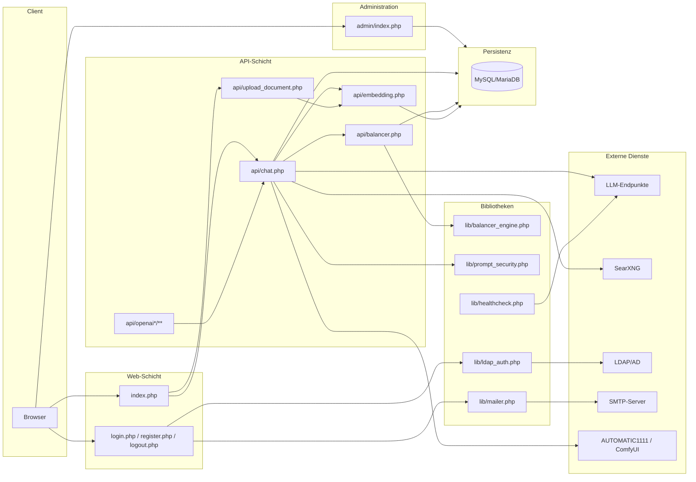
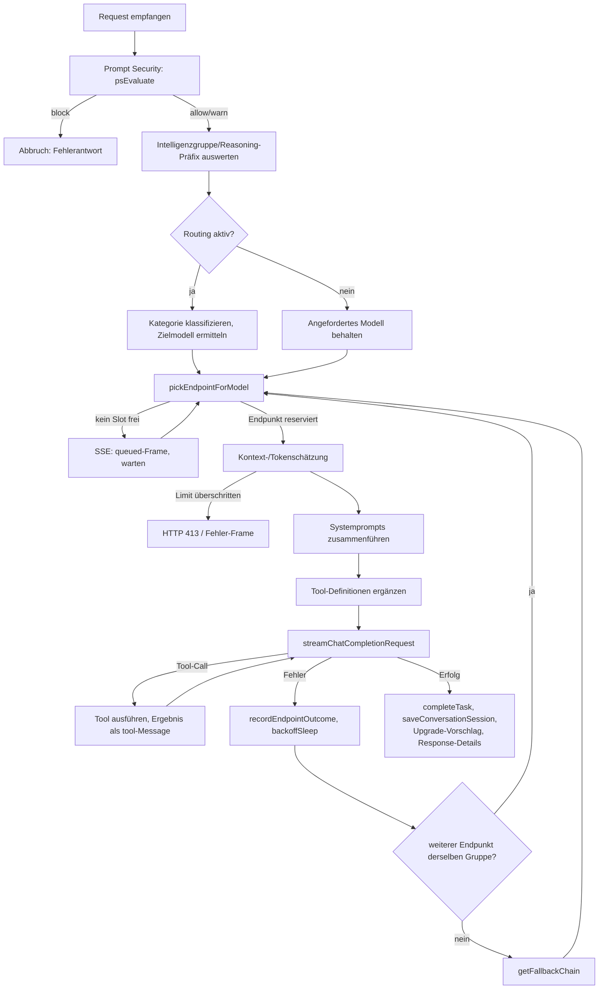
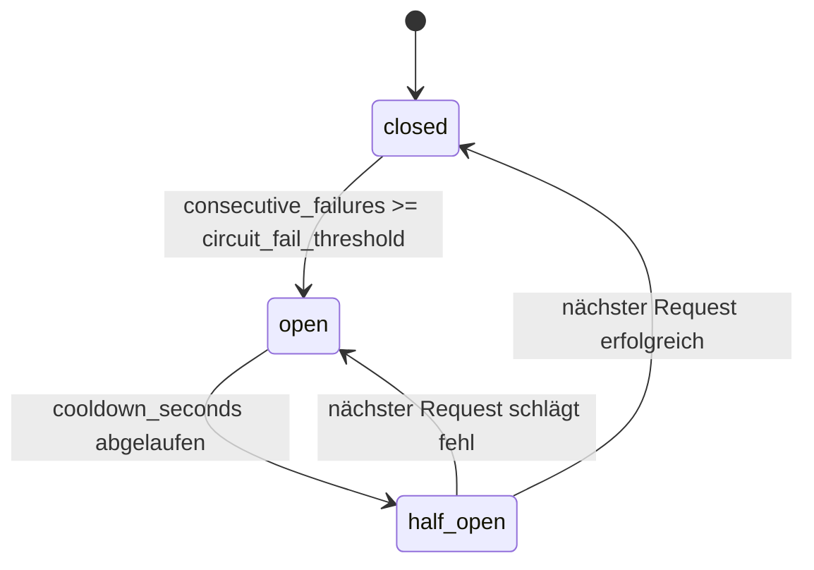
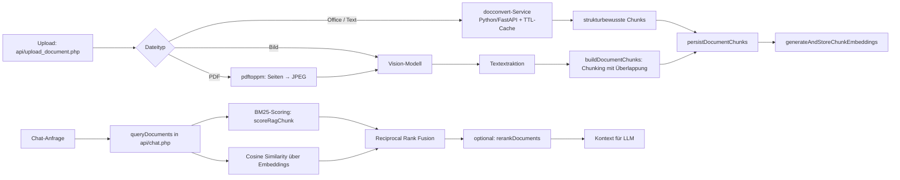
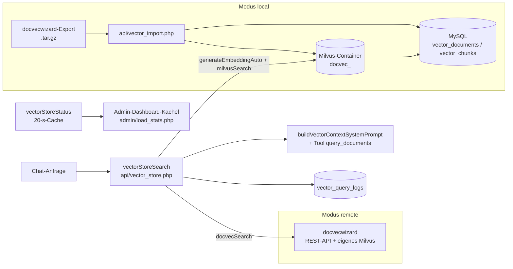

# architecture.md – Systemarchitektur von LLMInt

Dieses Dokument beschreibt den strukturellen Aufbau von LLMInt: Schichten, Laufzeit-
komponenten, Datenfluss und die wichtigsten Entwurfsentscheidungen. Für eine
funktionsgenaue Referenz siehe [`functions.md`](functions.md); für eine kompakte
Navigationshilfe für Coding-Agenten siehe [`agent_index.md`](agent_index.md).

Sprache im Code: Bezeichner überwiegend Englisch, UI-Texte, Log- und Fehlermeldungen
auf Deutsch. Kommentare sind auf Englisch verfasst.

---

## 1. Grundprinzipien

- **Kein Framework, kein Router.** Jede URL entspricht direkt einer PHP-Datei. Neue
  Endpunkte sind neue Dateien unter `api/`, die `../db.php` einbinden.
- **Kein Composer, kein Build-Schritt.** Abhängigkeiten werden ausschließlich über
  `require_once __DIR__ . '/...'` geladen; Frontend-CSS/JS liegt inline in `index.php`
  bzw. `admin/index.php`.
- **Idempotentes Schema.** `ensureRuntimeSchema(PDO $pdo)` in `db.php` legt beim ersten
  `getDb()`-Aufruf pro Prozess alle Laufzeittabellen an und ergänzt fehlende Spalten via
  `ALTER TABLE ... ADD COLUMN` in `try/catch`. Bestehende Installationen migrieren so
  automatisch beim nächsten Request.
- **Einstellungen statt Konstanten.** Laufzeitkonfiguration liegt in der Tabelle
  `settings` (Key-Value) und wird über `getSetting()`/`setSetting()` gelesen/geschrieben.
- **PDO mit Prepared Statements** für sämtliche SQL-Zugriffe; Ausgaben werden mit
  `htmlspecialchars()` escaped.

| Merkmal | Wert |
|---|---|
| Sprache/Laufzeit | PHP 8.2 (Docker-Image `php:8.2-apache`), mindestens PHP 8.0 |
| Framework | keines |
| Persistenz | MySQL/MariaDB über PDO (`utf8mb4`) |
| Frontend | serverseitig gerendertes HTML mit inline CSS/Vanilla-JS |
| Einstiegspunkte | `index.php`, `admin/index.php`, `api/*.php`, `login.php`, `register.php`, `logout.php`, `setup.php` |
| Tests/Linting | keine automatisierten Tests; `php -l <datei>` zur Syntaxprüfung |

---

## 2. Schichtenmodell

| Ebene | Komponenten | Aufgabe |
|---|---|---|
| **Web** | `index.php`, `login.php`, `register.php`, `logout.php` | Chat-Oberfläche, Anmeldung, Selbstregistrierung |
| **API** | `api/chat.php`, `api/balancer.php`, `api/embedding.php`, `api/upload_document.php`, `api/openai*/**`, weitere `api/*.php` | Chat-Pipeline, Routing, RAG, Uploads, Bildgenerierung, OpenAI-kompatible Fassade |
| **Administration** | `admin/index.php`, `admin/prompt_security.php`, `admin/load_stats.php`, `admin/refresh_sys_stats.php`, `admin/api_keys.php`, `admin/endpoint_tech.php`, `admin/quickinfo_stats.php` | Endpunkte, Benutzer, Einstellungen, Monitoring, API-Keys, quickinfo-Pairing |
| **Bibliotheken** | `lib/balancer_engine.php`, `lib/prompt_security.php`, `lib/openai_api.php`, `lib/ldap_auth.php`, `lib/mailer.php`, `lib/healthcheck.php` | Wiederverwendbare Kernlogik, von mehreren Einstiegspunkten eingebunden |
| **Persistenz** | MySQL/MariaDB, Schema aus `setup.php` + `db.php` | Einstellungen, Benutzer, Endpunkte, Tasks, Chunks, Logs |
| **Externe Dienste** | OpenAI-kompatible LLM-/Embedding-Endpunkte, optional SearXNG, LDAP/AD, SMTP, AUTOMATIC1111, ComfyUI | Modellinferenz, Suche, Verzeichnisdienst, Mailversand, Bildgenerierung |


```mermaid
flowchart LR
    subgraph Client
        Browser
    end
    subgraph Web[Web-Schicht]
        Index[index.php]
        Login[login.php / register.php / logout.php]
    end
    subgraph API[API-Schicht]
        Chat[api/chat.php]
        Balancer[api/balancer.php]
        Embedding[api/embedding.php]
        Upload[api/upload_document.php]
        OpenAI[api/openai*/**]
    end
    subgraph Lib[Bibliotheken]
        BalEngine[lib/balancer_engine.php]
        PromptSec[lib/prompt_security.php]
        LdapAuth[lib/ldap_auth.php]
        Mailer[lib/mailer.php]
        Health[lib/healthcheck.php]
    end
    subgraph Admin[Administration]
        AdminIdx[admin/index.php]
    end
    subgraph DB[Persistenz]
        MySQL[(MySQL/MariaDB)]
    end
    subgraph Ext[Externe Dienste]
        LLM[LLM-Endpunkte]
        SearX[SearXNG]
        LDAP[LDAP/AD]
        SMTP[SMTP-Server]
        SD[AUTOMATIC1111 / ComfyUI]
    end

    Browser --> Index
    Browser --> Login
    Browser --> AdminIdx
    Index --> Chat
    Index --> Upload
    Chat --> Balancer
    Chat --> Embedding
    Chat --> PromptSec
    Chat --> SearX
    Chat --> SD
    Balancer --> BalEngine
    Upload --> Embedding
    Login --> LdapAuth
    Login --> Mailer
    Chat --> LLM
    OpenAI --> Chat
    AdminIdx --> DB
    Chat --> DB
    Balancer --> DB
    Embedding --> DB
    Health --> LLM
    LdapAuth --> LDAP
    Mailer --> SMTP
```

---

## 3. Bootstrapping und Konfiguration

1. Jede Datei bindet `db.php` ein. `getDb()` liefert eine PDO-Singleton-Verbindung aus
   den Umgebungsvariablen `DB_HOST` (Standard `localhost`), `DB_PORT` (`3306`), `DB_NAME`
   (`llmint`), `DB_USER` (`root`), `DB_PASS` (leer).
2. Beim ersten `getDb()`-Aufruf pro Prozess läuft `ensureRuntimeSchema(PDO $pdo)`:
   `CREATE TABLE IF NOT EXISTS` für alle Laufzeittabellen, `ALTER TABLE ... ADD COLUMN`
   in `try/catch` für Migrationen sowie Seeding von Routing-Kategorien und
   Prompt-Security-Regeln.
3. `config.php` definiert die Konstanten `LMSTUDIO_BASE_URL` und `LMSTUDIO_TIMEOUT` aus
   dem ersten aktiven Endpunkt, ersatzweise aus den Einstellungen `lmstudio_base_url` /
   `lmstudio_timeout` (Legacy-Fallback).
4. `setup.php` ist der einmalige Installer: legt `users` sowie alle übrigen Tabellen an,
   seedet Standardeinstellungen und erzeugt bei leerer Datenbank den Administrator
   `admin`/`admin`.

**Konsequenz für Änderungen:** Schemaänderungen gehören ausschließlich in
`ensureRuntimeSchema()` (idempotent), damit bestehende Installationen automatisch
migrieren.

---

## 4. Datenmodell (Überblick)

| Tabelle | Zweck |
|---|---|
| `settings` | Key-Value-Konfiguration (`setting_key`, `setting_value`) |
| `users` | Konten: Anmeldedaten, Rolle (`user`/`admin`), `auth_source` (`local`/`ldap`), Dokument-Upload-Recht, Standardmodell |
| `api_keys` | Hashes der OpenAI-kompatiblen API-Keys je Benutzer (optionales, fest am Key hinterlegtes Modell) |
| `endpoints` | LLM-Endpunkte: `base_url`, `default_model`, `timeout`, `is_active`, Fähigkeiten (Tool Calling, Vision), Balancer-Gesundheit (`circuit_state`, `consecutive_failures`, `cooldown_until`, `avg_latency_ms`) |
| `tasks` | Lebenszyklus jeder LLM-Anfrage (`endpoint_id`, `status`, Tokenzähler, `tokens_per_second`) |
| `endpoint_sys_stats` | per SSH gelesene Systemmetriken je Endpunkt |
| `sd_endpoints`, `sd_tasks` | AUTOMATIC1111-Endpunkte und deren Aufträge |
| `comfy_endpoints`, `comfy_tasks` | ComfyUI-Endpunkte und deren Aufträge |
| `document_uploads` | Upload-Metadaten, Verarbeitungs-/Embedding-Status (`is_global_rag` ist immer `0` – Uploads sind privat) |
| `document_chunks` | Chunks mit optionalem Embedding (FK auf `document_uploads`, `ON DELETE CASCADE`) |
| `vector_documents`, `vector_chunks` | aus docvecwizard-Exporten importierte Dokumente/Chunk-Texte (Modus `local`; Vektoren liegen in Milvus) |
| `vector_imports` | Protokoll der Export-Importe (Manifest, Dokument-/Vektorzahlen, Strategie) |
| `vector_query_logs` | jede Wissensdatenbank-Abfrage mit Modus, Trefferzahl, Dauer, Fehler |
| `embedding_endpoints` | Embedding-Server (`base_url`, `model`, `timeout`) |
| `embedding_cache` | zwischengespeicherte Query-Embeddings |
| `embedding_logs` | Laufzeit-/Trefferstatistik der Embedding-Aufrufe |
| `conversation_sessions` | Chatverläufe (`session_id`, `messages` als JSON, `model`, `upgrade_model`, `group_label`) |
| `routing_categories`, `routing_rules` | Kategoriedefinitionen und Zuordnung Kategorie → Zielmodell |
| `search_logs` | SearXNG-Suchhistorie |
| `active_clients`, `client_count_log` | Heartbeat-/Präsenztracking |
| `app_logs` | Anwendungslog (`info`/`warning`/`error`) |
| `prompt_security_rules`, `prompt_security_logs` | Sicherheitsregeln und protokollierte Ereignisse |

Details zu Feldnamen und Funktionen, die diese Tabellen lesen/schreiben, siehe
[`functions.md`](functions.md#dbphp).

---

## 5. Authentifizierung, Sitzungen und Rechte

- Angemeldete Benutzer werden über `$_SESSION['admin_user']` (Anzeigename) und
  `$_SESSION['admin_id']` (Benutzer-ID) identifiziert – auch für nicht-administrative
  Benutzer. `$_SESSION['requires_password_change']` erzwingt einen Passwortwechsel.
- Rollenprüfung ausschließlich über `currentUserRole()`, `isCurrentUserAdmin()` sowie die
  Guards `requireAdminOrRedirect()` (HTML) bzw. `requireAdminOrJson403()` (JSON-APIs).
- CSRF-Schutz: `$_SESSION['csrf_token']` wird in `index.php`/`admin/index.php` erzeugt;
  alle Formulare sowie Admin- und Upload-APIs prüfen das Feld `csrf_token`. `login.php`
  verwendet zusätzlich `$_SESSION['login_csrf']`.
- Anmeldereihenfolge (`login.php`, `admin/login.php`): Kerberos-SSO
  (`ldapSsoEnabled()`/`ldapSsoUsername()` über `REMOTE_USER`) → LDAP
  (`ldapAuthenticate()`, danach `ldapProvisionUser()`) → lokale Prüfung mit
  `password_verify()`.
- Betrieb hinter lanpa (`/ki/`): `lib/reverse_proxy.php` (per `auto_prepend_file`)
  übernimmt `X-Forwarded-*` und den SSO-Header nur von `TRUSTED_PROXIES`. Proxy-SSO:
  `index.php`/`admin/login.php` → `sso.php` (vom lanpa-`auth`-Container per Kerberos/NTLM
  geschützt, setzt `X-Remote-User` → `REMOTE_USER` → `ldapSsoLogin()`); ohne
  Domänenanmeldung liefert lanpa `sso_fallback.php`, einmal je Sitzung
  (`$_SESSION['sso_attempted']`).
- `register.php` erzeugt ein Verifikationstoken, versendet Mail über `sendMail()` und
  wird durch `api/verify_email.php` abgeschlossen; Passwort-Reset läuft über
  `api/reset_password.php`.
- Dokument-Upload erfordert `users.can_upload_documents = 1`.

---

## 6. Chat-Pipeline (`api/chat.php`)

Zentraler Einstiegspunkt: `POST api/chat.php` mit JSON-Body. Antwort ist JSON oder – bei
`stream: true` – `text/event-stream`.

### 6.1 Ablauf


```mermaid
flowchart TD
    A[Request empfangen] --> B[Prompt Security: psEvaluate]
    B -- block --> Z[Abbruch: Fehlerantwort]
    B -- allow/warn --> C[Intelligenzgruppe/Reasoning-Präfix auswerten]
    C --> D{Routing aktiv?}
    D -- ja --> E[Kategorie klassifizieren, Zielmodell ermitteln]
    D -- nein --> F[Angefordertes Modell behalten]
    E --> G[pickEndpointForModel]
    F --> G
    G -- kein Slot frei --> Q[SSE: queued-Frame, warten]
    Q --> G
    G -- Endpunkt reserviert --> H[Kontext-/Tokenschätzung]
    H -- Limit überschritten --> Z2[HTTP 413 / Fehler-Frame]
    H --> I[Systemprompts zusammenführen]
    I --> J[Tool-Definitionen ergänzen]
    J --> K[streamChatCompletionRequest]
    K -- Tool-Call --> L[Tool ausführen, Ergebnis als tool-Message]
    L --> K
    K -- Fehler --> M[recordEndpointOutcome, backoffSleep]
    M --> N{weiterer Endpunkt derselben Gruppe?}
    N -- ja --> G
    N -- nein --> O[getFallbackChain]
    O --> G
    K -- Erfolg --> P[completeTask, saveConversationSession,\nUpgrade-Vorschlag, Response-Details]
```

### 6.2 Tools für das LLM

| Tool | Voraussetzung | Parameter |
|---|---|---|
| `search_web` | `searxng_base_url` gesetzt | `query` (erforderlich) |
| `web_fetch` | wie `search_web` | `url` (erforderlich), `max_chars` (500–20000, Standard 6000) |
| `generate_image` | aktive `sd_endpoints` | `prompt` (erforderlich), `negative_prompt`, `width`, `height` |
| `generate_image_comfy` | aktive `comfy_endpoints` | wie `generate_image` |
| `query_documents` | vorhandene Uploads | `query` (erforderlich) |

Neue Tools benötigen eine `create...ToolDefinition()`-Funktion, eine
Verfügbarkeitsprüfung sowie einen Zweig in der Tool-Ausführungsschleife von
`api/chat.php`.

### 6.3 SSE-Protokoll

Alle Frames werden über `emitSseData()` als `data: <json>` gesendet.

| Frame | Inhalt |
|---|---|
| OpenAI-Chunk | `{id, object:"chat.completion.chunk", created, model, choices:[{index, delta, finish_reason}]}` |
| Warteschlange | `{status:"queued", message:"..."}` |
| Fehler | `{error:"..."}` |
| Upgrade-Angebot | `{type:"intelligence_upgrade", upgrade:{...}}` |
| Antwortdetails | `{type:"response_details", details:{...}}` |
| Ende | `[DONE]` |

Im OpenAI-Strict-Modus (`isOpenAiStrictMode()`, gesetzt durch die OpenAI-Fassaden)
entfallen die LLMInt-spezifischen Frames.

---

## 7. Balancer-Architektur

`lib/balancer_engine.php` ist die gemeinsame Basis für LLM-, AUTOMATIC1111- und
ComfyUI-Endpunkte; die jeweilige Tabelle wird als Parameter übergeben.

### 7.1 Auswahllogik (`pickEndpointForModel()` in `api/balancer.php`)

1. nur aktive Endpunkte mit passendem `default_model` (exakt oder funktional äquivalent
   gemäß `equivalentActiveModelNames()`/`canonicalModelName()` in `db.php`), geschlossenem
   bzw. abgelaufenem Circuit und optional geforderten Fähigkeiten (Tool Calling, Vision),
2. Auswahl nach laufender Auslastung und anschließend nach Fair-Share, d. h. der
   Anzahl bereits zugewiesener Tasks innerhalb von `balancer_fairness_window_seconds`
   (die geglättete Latenz wird nicht bewertet – alle Endpunkte liegen im selben
   Subnetz, `avg_latency_ms` dient nur der Statistik),
3. Round-Robin-Tiebreaker über die älteste Zuweisung (nie genutzte Endpunkte zuerst),
4. Reservierung in einer Transaktion mit `SELECT ... FOR UPDATE` und erneuter
   Kapazitätsprüfung, anschließend `INSERT` in `tasks` mit Status `running`.

Abschluss über `completeTask()`; Bildpfade nutzen `pickSdEndpoint()`/`completeSdTask()`
bzw. `pickComfyEndpoint()`/`completeComfyTask()`.

### 7.2 Circuit Breaker & Resilienz


```mermaid
stateDiagram-v2
    [*] --> closed
    closed --> open: consecutive_failures >= circuit_fail_threshold
    open --> half_open: cooldown_seconds abgelaufen
    half_open --> closed: nächster Request erfolgreich
    half_open --> open: nächster Request schlägt fehl
```

- `recordEndpointOutcome()` aktualisiert Erfolg/Fehlschlag und die geglättete Latenz (EMA).
- `maybeHalfOpenCircuit()` überführt einen offenen Circuit nach Ablauf des Cooldowns in
  `half_open`.
- `computeBackoffDelayMs()`/`backoffSleep()` implementieren exponentielles Backoff mit
  Jitter zwischen Fehlversuchen.
- `cleanupOrphanedTasks()` markiert Tasks, die den `balancer_orphan_timeout_seconds`
  überschritten haben, als `error` (verwaiste Reservierungen nach Absturz/Timeout).
- `getFallbackChain()`/`saveFallbackChains()` verwalten konfigurierbare Ersatzmodelle je
  Modell, die geprüft werden, wenn kein Endpunkt derselben Modellgruppe verfügbar ist.

---

## 8. Hybrid-RAG-Architektur


```mermaid
flowchart LR
    U[Upload: api/upload_document.php] --> K{Dateityp}
    K -->|Office / Text| DC[docconvert-Service\nPython/FastAPI + TTL-Cache]
    K -->|PDF| PR[pdftoppm: Seiten → JPEG]
    K -->|Bild| V[Vision-Modell]
    PR --> V
    DC --> C[strukturbewusste Chunks]
    V --> X[Textextraktion]
    X --> C2[buildDocumentChunks: Chunking mit Überlappung]
    C --> P[persistDocumentChunks]
    C2 --> P
    P --> E[generateAndStoreChunkEmbeddings]
    Q[Chat-Anfrage] --> QD[queryDocuments in api/chat.php]
    QD --> BM[BM25-Scoring: scoreRagChunk]
    QD --> EMB[Cosine Similarity über Embeddings]
    BM --> RRF[Reciprocal Rank Fusion]
    EMB --> RRF
    RRF --> RR[optional: rerankDocuments]
    RR --> R[Kontext für LLM]
```

- Upload: `api/upload_document.php` prüft Session, `can_upload_documents`, CSRF und
  Dateityp, speichert nach `doc_uploads/` und wählt die Verarbeitungsroute:
  - **Office- und Textdateien** (`docx`, `xlsx`, `xls`, `pptx`, `odt`, `ods`, `odp`,
    `rtf`, `csv`, `tsv`, `txt`, `md`, `json`, `xml`, `html`, `yaml`, `log`, `ini`)
    gehen an den `docconvert`-Container (`api/doc_convert.php`), der strukturierten
    Text plus strukturbewusste Chunks mit Quellenangabe zurückgibt und Ergebnisse
    per Content-Hash temporär zwischenspeichert. Fällt der Dienst aus, greift für
    reine Textformate `convertPlainTextLocally()` in PHP.
  - **PDF**: `api/pdf_render.php` rastert jede Seite mit `pdftoppm` zu einem JPEG,
    `analyzePdfWithVision()` lässt jede Seite einzeln vom Vision-Modell lesen
    (`api/vision.php`). So werden auch Scans, Tabellen und Diagramme erfasst.
    Schlägt eine Seite fehl, wird deren `pdftotext`-Textebene verwendet; ist die
    Vision-Auswertung deaktiviert, wird ausschließlich `pdftotext` genutzt.
  - **Bilder** werden direkt vom Vision-Modell beschrieben.
- Chat-gebundene Uploads: Wird beim Upload eine `session_id` mitgeschickt, landet
  sie in `document_uploads.chat_session_id`. `queryDocuments()` bevorzugt diese
  Chunks (BM25-Boost) und `buildChatDocumentSystemPrompt()` weist das Modell auf
  die angehängten Dateien hin.
- Embeddings: `generateEmbeddingAuto()`, `pickEmbeddingEndpoint()`,
  `getCachedQueryEmbedding()`/`setCachedQueryEmbedding()` (Cache), Fallback auf reines
  BM25, falls kein Embedding-Endpunkt erreichbar ist.
- Statusabfrage im Frontend: `api/document_status.php` (optional per `session_id`
  gefiltert), Löschen über `api/document_delete.php`; Neuberechnung über
  `api/rebuild_embeddings.php`.

Relevante Einstellungen: `embedding_enabled`, `embedding_model`, `embedding_timeout`,
`embedding_cache_enabled`, `hybrid_search_enabled`, `bm25_weight`, `embedding_weight`,
`reranker_enabled`, `reranker_endpoint`, `reranker_model`, `reranker_top_k`,
`vision_model`, `pdf_vision_enabled`, `pdf_vision_dpi`, `pdf_vision_max_pages`,
`upload_max_mb`.

### 8.1 Zentrale Wissensdatenbank (docvecwizard / Milvus)

Nutzer-Uploads sind **immer privat** (`document_uploads.is_global_rag` ist fest `0`;
alte globale Freigaben werden beim Setup zurückgesetzt). Teamweites Wissen stammt
ausschließlich aus einer von docvecwizard befüllten Milvus-Vektordatenbank, die
`api/vector_store.php` in einem von zwei Modi anbindet (`vector_store_mode`):


```mermaid
flowchart LR
    subgraph Remote[Modus remote]
        DVW[docvecwizard\nREST-API + eigenes Milvus]
    end
    subgraph Local[Modus local]
        EXP[docvecwizard-Export\n.tar.gz] --> IMP[api/vector_import.php]
        IMP --> MV[(Milvus-Container\ndocvec_<modell>)]
        IMP --> MY[(MySQL\nvector_documents / vector_chunks)]
    end
    Q[Chat-Anfrage] --> VS[vectorStoreSearch\napi/vector_store.php]
    VS -->|docvecSearch| DVW
    VS -->|generateEmbeddingAuto + milvusSearch| MV
    MV --> MY
    VS --> CTX[buildVectorContextSystemPrompt\n+ Tool query_documents]
    VS --> LOG[(vector_query_logs)]
    ST[vectorStoreStatus\n20-s-Cache] --> DB[Admin-Dashboard-Kachel\nadmin/load_stats.php]
```

- **remote**: `docvecLogin()` meldet sich mit `docvec_api_username`/`docvec_api_password`
  an (`POST /api/login`, Cookie `docvec_sid`, `X-CSRF-Token`), `docvecSearch()` ruft
  `POST /api/search {query, limit}` auf. Embeddings erzeugt docvecwizard; LLMInt
  braucht keinen eigenen Embedding-Endpunkt. Status über `GET /api/status`.
- **local**: `api/vector_import.php` entpackt das Exportarchiv (PharData, Pfad- und
  Größenprüfung), verifiziert `checksums/SHA256SUMS`, legt bei Bedarf die Collection
  `docvec_<slug>` über die Milvus-REST-API v2 an (Schema identisch zu docvecwizard,
  COSINE/AUTOINDEX), schreibt Vektoren in Batches nach Milvus und Chunk-Texte/Metadaten
  transaktional nach MySQL (`vector_documents`, `vector_chunks`), protokolliert den Lauf
  in `vector_imports`. Strategien `skip` (vorhandene Dokumentversionen überspringen)
  oder `overwrite`. Bei der Suche wird die Anfrage mit `generateEmbeddingAuto()`
  eingebettet (Modell muss zum Export passen) und `milvusSearch()` liefert IDs, deren
  Texte aus `vector_chunks` nachgeladen werden.
- **Chat-Integration** (`api/chat.php`): Ist ein Modus aktiv, wird bei *jeder* Anfrage
  die letzte Nutzernachricht gegen die Vektordatenbank gesucht (`vector_top_k`,
  `vector_min_score`); Treffer werden als Kontext-Systemnachricht vorangestellt und
  zusätzlich vom Tool `query_documents` zurückgegeben (zusammen mit privaten Uploads).
- **Dashboard**: `vectorStoreStatus()` (Cache 20 s in `vector_store_status_cache`) und
  `vectorQueryStats()` fließen über `admin/load_stats.php` (`vector_store`) in die
  Kachel der Lastverteilungs-Grafik (online/offline, Basis-URL, Dokumente/Vektoren,
  Abfragen heute, Ø Antwortzeit).

Relevante Einstellungen: `vector_store_mode`, `vector_top_k`, `vector_min_score`,
`docvec_api_url`, `docvec_api_username`, `docvec_api_password`, `docvec_api_timeout`,
`docvec_api_verify_tls`, `milvus_url`, `milvus_metrics_url`, `milvus_token`,
`milvus_timeout`, `milvus_collection`.

---

## 9. Prompt-Security-Pipeline

`lib/prompt_security.php` wird von `api/chat.php` vor dem Modellaufruf ausgeführt:

```
psLoadRules() → psNormalise() → psMatchRules() → psComputeScore()
   → optional psAiEvaluate() + psAiLabelToScore() → psDecide() (allow/warn/block) → psLog()
```

- `psNormalise()` entfernt Zero-Width-Zeichen, dekodiert HTML/URL/Base64-Heuristiken.
- `psAiEvaluate()` ruft optional einen sekundären KI-Klassifikator auf
  (`harmless`/`prompt_injection`/`jailbreak`/`data_exfiltration`/`unknown`).
- `psPurgeLogs()` entfernt alte Einträge aus `prompt_security_logs` nach Aufbewahrungsfrist.
- Verwaltung über `admin/prompt_security.php` (Dashboard, Regeln, Logs, Einstellungen).

---

## 10. Frontend-Architektur (`index.php`)

- Aufbau: PHP-Bootstrap (Session, Einstellungen, Modellliste) → `<style>` → HTML →
  `<script>`. Kein Build-Schritt, keine externen JS-Abhängigkeiten.
- Chat senden: `sendMessage()` baut das Nachrichtenarray (inkl. Bildanhängen als
  `image_url`-Parts) und ruft `executeStreamingRequest()` auf (`fetch('api/chat.php')`,
  Body-Lesen über `getReader()`).
- SSE-Verarbeitung: `processSseLine()` → `updateStreamingBubble()` →
  `renderBubbleContent()` → `renderMarkdown()` (eigener Markdown-Renderer inkl. Tabellen,
  Codeblöcken, `renderMath()`/`extractMath()`/`reinsertMath()`).
- Zusatzanzeigen: `setSourcePillsForBubble()` (Web-Quellen),
  `setResponseDetailsForBubble()`/`buildContextCircleHtml()` (Kontextauslastung),
  `showUpgradePrompt()` (Intelligence Upgrade), `thinkingRobotHtml()`/
  `tickThinkingRobot()` (Wartezustand).
- Sitzungen: `generateSessionId()`, `refreshSessionList()`, `loadSession()`,
  `restoreCurrentSession()`, `deleteSession()`, `startNewChat()` gegen
  `api/chat_sessions.php?action=list|load|delete`.
- Intelligenzgruppen: `applyGroupPrefixFromInput()`, `renderGroupPill()`,
  `setActiveGroup()`, `removeActiveGroup()`.
- Reasoning: `applyReasoningPrefixFromInput()`, `renderReasoningPill()`; das
  `!!`-Präfix aktiviert Reasoning für genau einen Prompt (💡-Pille).
- Prompt-Funktionen: `applyCommandPrefixFromInput()`, `renderCommandPills()`,
  `resolveCommand()`; `/kommando`-Präfixe (`PROMPT_COMMANDS`, z. B. `/table`, `/tldr`,
  `/eli5`) hängen je eine feste Anweisung an den Systemprompt an.
- Dokumente: `openUploadModal()`, `setFile()`, Upload per `FormData` inkl.
  `csrf_token` an `api/upload_document.php`, Statusanzeige über `loadStatus()`/
  `renderUploads()`.
- Präsenz: `sendHeartbeat()` gegen `api/heartbeat.php`.
- Spracherkennung/Diktat (eigenes IIFE ab `#dictate-btn`): `loadConfig()` holt die
  Konfiguration über `api/speech_config.php`; `start()` öffnet den `MediaRecorder`,
  `armSegmentTimer()`/`startSegment()`/`safeCut()` schneiden Segmente, `transcribeSegment()`
  ruft `api/speech_transcribe.php`, `processFragment()` ruft `api/speech_process.php` und
  schreibt das Ergebnis über `insertText()` in das Feld. `drainBuffer()`/`enqueue()`/
  `drainQueue()` serialisieren die Verarbeitung, `armStopTimer()` beendet die Erkennung nach
  der eingestellten Stille. Nach dem Ende zeigen `showPills()`/`applyPill()` die
  Schnellbefehl-Pillen, die das reguläre Standardmodell über `api/chat.php` ausführt.

---

## 11. Administration (`admin/index.php`)

`admin/index.php` verarbeitet alle Änderungen als POST mit `action`-Feld und
CSRF-Token, u. a. `add_endpoint`, `update_endpoint`, `delete_endpoint`,
`reset_circuit`, `toggle_endpoint_pause`, `save_balancer_settings`,
`save_routing_settings`, `add_routing_category`, `save_hybrid_search_settings`,
`save_reranker_settings`, `save_smtp_settings`, `save_ldap_settings`,
`add_sd_endpoint`, `add_comfy_endpoint`, `add_embedding_endpoint`,
`create_api_key`, `toggle_api_key`, `delete_api_key`, `change_password`,
`save_speech_dictation_settings` u. v. m. (vollständige Liste in
[`functions.md`](functions.md#adminindexphp)).

Die Oberfläche ist in Karten mit stabilen IDs gegliedert (`dashboard-card`,
`config-endpoints-card`, `config-balancer-card`, `config-routing-card`,
`config-sd-card`, `config-comfy-card`, `config-vector-store-card`,
`config-embedding-card`, `config-hybrid-search-card`, `config-reranker-card`,
`config-global-system-prompt-card`, `config-speech-card`, `config-smtp-card`,
`config-ldap-card`, `log-viewer-card`, `users-card`, `openai-api-card`,
`api-keys-card`, `password-card` u. a.).

Ergänzende Dateien: `admin/load_stats.php` (Livedaten für das Dashboard),
`admin/refresh_sys_stats.php` (SSH-Metriken),
`admin/api_keys.php` (Weiterleitung auf die Karte `api-keys-card` im Dashboard),
`admin/endpoint_tech.php` + `admin/quickinfo_stats.php` (quickinfo-Pairing, technische Endpunktübersicht),
`admin/prompt_security.php` (Sicherheitsmodul).

---

## 12. HTTP-Endpunktübersicht

| Pfad | Methode | Auth | Zweck |
|---|---|---|---|
| `api/chat.php` | POST | Session optional | Chat inklusive Routing, Tools, Streaming |
| `api/chat_sessions.php` | GET/POST | Session | `action=list\|load\|delete` |
| `api/models.php` | GET | – | Modelle eines Endpunkts abfragen |
| `api/heartbeat.php` | POST | – | Präsenz-Token melden |
| `api/healthcheck.php` | GET | – | Aggregierter Gesundheitsstatus aller LLM-Endpunkte |
| `api/document_status.php` | GET | Session | Upload-Status des Benutzers (optional `session_id`-gefiltert) |
| `api/upload_document.php` | POST | Session + CSRF | Dokument-Upload (Office, Text, PDF, Bild) |
| `api/document_delete.php` | POST | Session + CSRF | Upload inklusive Chunks entfernen |
| `api/rebuild_embeddings.php` | POST | Admin + CSRF | Embeddings neu berechnen |
| `api/vector_import.php` | GET/POST | Admin + CSRF | docvecwizard-Exportarchive auflisten bzw. in Milvus/MySQL importieren |
| `api/test_vector_store.php` | POST | Admin | Verbindungstest docvecwizard-API (`mode=remote`) oder Milvus (`mode=local`) |
| `api/sd_generate.php`, `api/comfy_generate.php` | POST | Session | Bildgenerierung |
| `api/sd_checkpoints.php`, `api/comfy_checkpoints.php` | GET | – | verfügbare Checkpoints |
| `api/test_searxng.php`, `api/test_ldap.php`, `api/test_smtp.php` | GET/POST | Admin | Verbindungstests |
| `api/speech_config.php` | GET | Session | Diktat-Konfiguration und CSRF-Token für die Oberfläche |
| `api/speech_transcribe.php` | POST | Session + CSRF | Audiodatei → Rohtext (whisper.cpp) |
| `api/speech_process.php` | POST | Session + CSRF | Diktat-Fragment → bereinigter Text (Diktat-Modell) |
| `api/speech_health.php` | GET | Session | Verbindungstest, `target=whisper\|qwen\|both` |
| `api/admin_user_action.php` | POST | Admin + CSRF | Benutzerverwaltung |
| `api/verify_email.php`, `api/reset_password.php` | GET/POST | Token | E-Mail-Verifikation, Passwort-Reset |
| `api/openai/v1/models`, `api/openai/v1/chat/completions` | GET/POST | anonym (API-Key optional: Log-Zuordnung und optional festes Modell) | OpenAI-kompatibel, ohne Tools; Key-Modell bzw. Gast-Standardmodell, Log-Präfix `[API]` |
| `api/openai-tools/v1/models`, `api/openai-tools/v1/chat/completions` | GET/POST | anonym (API-Key optional: Log-Zuordnung und optional festes Modell) | OpenAI-kompatibel, mit Tools; Key-Modell bzw. Gast-Standardmodell, Log-Präfix `[API]` |

`api/balancer.php`, `api/sd_balancer.php`, `api/comfy_balancer.php`,
`api/embedding.php` und `api/vector_store.php` sind reine Bibliotheken und werden
eingebunden, nicht direkt aufgerufen.

---

## 13. Betrieb und Container

- `Dockerfile`: Basis `php:8.2-apache`, installiert `pdo_mysql`, `curl`, `mbstring`,
  `fileinfo`, LDAP, XML/ZIP, Intl, Poppler (`pdftotext`, `pdftoppm`, `pdfinfo`) sowie
  Kerberos-Komponenten; `ENTRYPOINT` ist `docker/entrypoint.sh` (wartet auf die
  Datenbank, ruft `setup.php` auf).
- `docconvert/Dockerfile`: Basis `python:3.12-slim`, FastAPI/Uvicorn mit
  `python-docx`, `openpyxl`, `xlrd`, `python-pptx`, `odfpy`, `striprtf`,
  `beautifulsoup4`/`lxml`. Läuft als unprivilegierter Nutzer, kein veröffentlichter
  Port – nur im Compose-Netz erreichbar.
- `Dockerfile.whisper`: nativer Build des whisper.cpp-Servers (Multi-Stage,
  `debian:bookworm-slim`). Nötig, weil das Upstream-Image nur `linux/amd64`
  veröffentlicht und unter Emulation auf arm64-Hosts mit `SIGILL` abbricht. Setzt
  `-DGGML_NATIVE=OFF` und pinnt die Architektur über `GGML_CPU_ARM_ARCH`
  (`WHISPER_ARM_ARCH`, Standard `armv8.2-a+fp16+dotprod`), weil die Linux-VM von
  Docker Desktop die Host-CPU nicht sieht. Das Ergebnis ist ein Drop-in-Ersatz für
  das Upstream-Image (gleiche Binaries, gleicher Pfad für
  `download-ggml-model.sh`).
- `docker-compose.yml`: Dienste `db` (MySQL 8.0 mit Healthcheck), `web` (Port
  `HTTP_PORT`, Standard 8080), `docconvert` (interner Konverter), `milvus`
  (Milvus Standalone mit eingebettetem etcd und lokalem Storage, nur im
  Compose-Netz erreichbar, für den Modus `local` der Wissensdatenbank),
  `whisper` (whisper.cpp-HTTP-Server für die Spracherkennung, Modell im Volume
  `whisper_models`) und `qwen` (llama.cpp mit Qwen3.5-2B Q4 für die
  Diktat-Nachbearbeitung, GGUF im Volume `qwen_cache`) sowie `phpmyadmin`
  (Port `PMA_PORT`, Standard 8081, per HTTP Basic Auth geschützt).
  Volumes: `db_data`, `doc_uploads`, `sd_output`, `docconvert_cache`,
  `milvus_data`, `vector_imports`, `whisper_models`, `qwen_cache`.
- `docker-compose.test.yml`: Override für arm64-Hosts und schnelle lokale Tests.
  Ersetzt das whisper-Image durch `Dockerfile.whisper`, setzt `platform` zurück und
  lässt Milvus, phpMyAdmin und den Konverter weg.
- `.env.example`: `DB_NAME`, `DB_USER`, `DB_PASS`, `DB_ROOT_PASS`, `HTTP_PORT`,
  `PMA_PORT`, `PMA_BASIC_AUTH_USER`, `PMA_BASIC_AUTH_PASSWORD`, `TZ`,
  `DOCCONVERT_URL`, `DOCCONVERT_TOKEN`, `DOCCONVERT_TIMEOUT`,
  `DOCCONVERT_CACHE_TTL`, `DOCCONVERT_MAX_BYTES`, `DOCCONVERT_MAX_CHARS`,
  `DOCCONVERT_OVERLAP`, `DOCCONVERT_CACHE_MAX`, `MILVUS_VERSION`, `MILVUS_URL`,
  `MILVUS_METRICS_URL`, `MILVUS_MEM_LIMIT`, `WHISPER_URL`, `WHISPER_TOKEN`,
  `WHISPER_TIMEOUT`, `WHISPER_MODEL`, `WHISPER_LANGUAGE`, `WHISPER_THREADS`,
  `WHISPER_IMAGE_TAG`, `QWEN_URL`, `QWEN_TOKEN`, `QWEN_TIMEOUT`,
  `QWEN_GGUF_REPO`, `QWEN_GGUF_FILE`, `QWEN_MODEL_ALIAS`, `QWEN_CTX_SIZE`,
  `QWEN_THREADS`, `QWEN_IMAGE_TAG`.

### 13.1 Diktat-Pipeline

```
Browser (MediaRecorder)
  │  Segment (WebM/Opus)
  ├─ POST api/speech_transcribe.php ──► whisper-Container  /inference ──► Rohtext
  └─ POST api/speech_process.php ─────► qwen-Container      /v1/chat/completions
                                          └─ bereinigter, befehlsverarbeiteter Text
```

- `lib/speech_dictation.php` ist die einzige Stelle mit Kenntnis von Whisper- und
  Diktat-Modell. `speechDictationResolveCompletionTarget()` wählt zwischen dem
  dedizierten Qwen-Container (`QWEN_URL`) und dem regulären Endpunkt-Pool.
- Der Diktat-Aufruf sendet `chat_template_kwargs.enable_thinking=false` **und**
  `reasoning_budget: 0`. Manche llama.cpp-Builds reichen das Jinja-Flag nicht an das
  Chat-Template weiter; ohne `reasoning_budget: 0` füllt das Modell dann den
  Token-Puffer mit einem Denkblock und die Antwort kommt leer zurück.
- `speechDictationApplyCommands()` ist der deterministische Regel-Fallback und greift
  nur, wenn das Modell nicht erreichbar ist – so geht kein erkannter Text verloren.
- Struktur und Kontext macht die Pipeline, nicht das Modell:
  `speechDictationSplitAtBreaks()` entfernt „Neue Zeile"/„Neuer Absatz" vor dem
  Aufruf und `speechDictationProcessFragment()` setzt die Umbrüche wieder ein; der
  bereits geschriebene Text steht in der Systemnachricht
  (`speechDictationBuildSystemMessage()`), weil das Modell ihn als Nutzernachricht
  im Ergebnis wiederholt. `speechDictationMatchLeadingCase()` und
  `speechDictationDropInventedSentenceEnd()` halten die diktierten Groß-/
  Kleinschreibung bzw. das Satzende fest.
- Erkannte Texte werden nicht gespeichert; `speechDictationLogText()` protokolliert
  nur eine Längenangabe.

---

## 14. Weiterführende Dokumente

| Dokument | Inhalt |
|---|---|
| [`agent_index.md`](agent_index.md) | Schnellreferenz für Coding-Agenten (Dateikarte, Konventionen, Aufgaben-Lookup) |
| [`functions.md`](functions.md) | Vollständige Funktionsreferenz je Datei |
| [`../description.md`](../description.md) | Ausführliche, textuelle Architektur- und Funktionsreferenz (Ursprungsdokument) |
| [`../README.md`](../README.md) | Betrieb, Installation, Konfiguration, Funktionsüberblick |
| [`../Demo.md`](../Demo.md) | Nicht-technische Erklärung für Entscheider und Fachbereiche |
